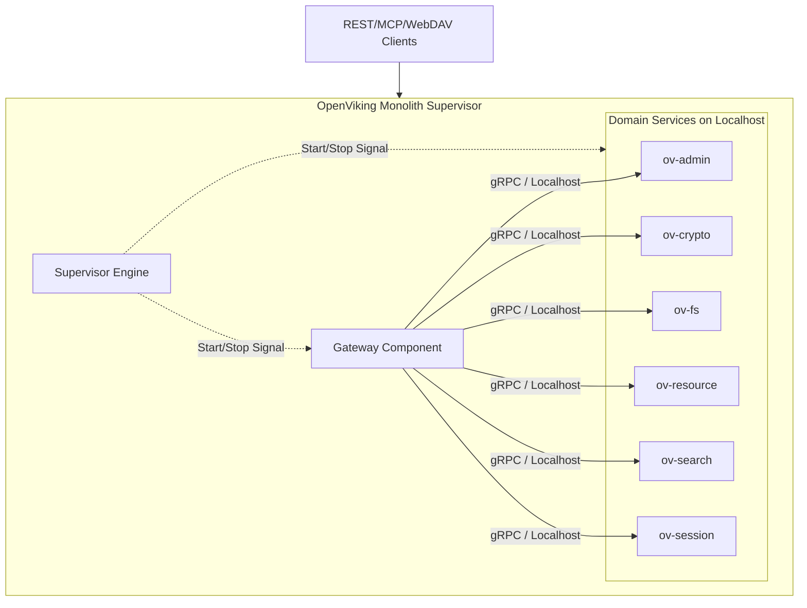

# Architecture: OpenViking Monolith

## 1. Module Structure Diagram

## 2. Key Design Decisions

- **Single Process / Multi-Goroutine:** Mỗi service (Gateway và 6 Domain Services) chạy như một tập hợp các Goroutines độc lập trong cùng một Go Process.
- **Zero Source Modification:** Tận dụng tối đa cách thức inject cấu hình (Environments `os.Setenv`) và package structure hiện tại của các dịch vụ để import chúng trực tiếp mà không cần sửa dòng code nào bên trong thư mục `services/` hoặc `gateway/`.
- **Localhost Networking:** Thay vì call in-memory (đòi hỏi phải chia sẻ interface), monolith vẫn duy trì việc giao tiếp gRPC qua network. Tuy nhiên, nó sẽ ghim vào `localhost` và một dải port tự chọn (vd: `9011-9030`).

## 3. Integration & Networking

Vì tất cả nằm trong một process, độ trễ mạng gần như bằng 0 (loopback interface).
- Gateway sẽ được cung cấp environment variables hướng luồng dữ liệu về loopback IP.
- NATS Jetstream (nếu được sử dụng làm async event bus) vẫn có thể là server ngoại vi, hoặc một NATS server được nhúng bằng Go-NATS.

## 4. Build & Deployment Notes

- Vì Go hỗ trợ compile tĩnh, file nhị phân `openviking` có thể được chứa trong một Docker container minimal như `alpine` hoặc `scratch` nhằm tối thiểu hoá dung lượng.
- Supervisor sẽ giám sát tiến trình và thực hiện Graceful Shutdown trong trường hợp một service con gặp lỗi nghiệm trọng.
