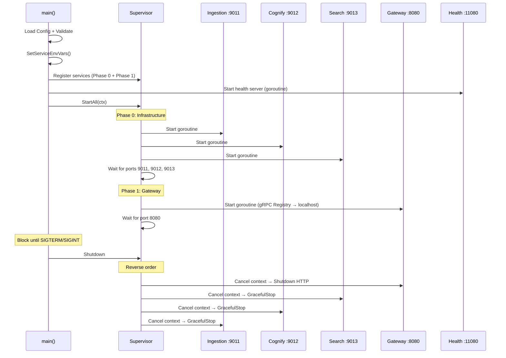

# Architecture — Cognee Monolith App

> **Pattern**: Embedded Service Supervisor | **Binary**: `cognee-app` | **Total new code**: ~600 lines

## 1. Design Philosophy

The cognee app is a **process supervisor** that runs existing microservices as goroutines within a single binary. Unlike a traditional monolith that merges all code, this approach:

- **Reuses 100%** of existing service code — zero modifications
- **Preserves** gRPC + NATS communication patterns
- **Deploys** as a single binary/container for operational simplicity

### How It Differs from Microservices

| Aspect | Microservices | Monolith |
|--------|--------------|----------|
| Deployment | 4 containers (3 services + gateway) | 1 container |
| Communication | gRPC via Kubernetes DNS | gRPC via localhost |
| Events | NATS (external) | NATS (external, unchanged) |
| Config | Per-service ENV vars | Unified Config → SetServiceEnvVars() |
| Health | Per-service probes | Aggregated /readyz endpoint |
| Service code | As-is | **As-is (ZERO changes)** |

## 2. Process Architecture

```
┌─────────────────────────────────────────────────────────────────┐
│                    cognee-app (single process)                   │
│                                                                  │
│  Supervisor                                                      │
│  ├── Phase 0: Infrastructure Services                            │
│  │   ├── goroutine: cognee-ingestion  (gRPC :9011)               │
│  │   ├── goroutine: cognee-cognify    (gRPC :9012)               │
│  │   └── goroutine: cognee-search     (gRPC :9013)               │
│  │                                                               │
│  └── Phase 1: Gateway (starts after Phase 0 ports ready)         │
│      └── goroutine: vnp-gateway       (HTTP :8080)               │
│          ├── gRPC Registry → localhost:9011,9012,9013             │
│          ├── Middleware: recovery → logging → CORS                │
│          └── Routes: /v1/cognee/* → gRPC proxy                   │
│                                                                  │
│  Health Server (goroutine :11080)                                │
│  ├── /healthz → liveness (always 200)                            │
│  └── /readyz  → polls supervisor HealthCheck()                   │
└──────────────────────────────────────────────────────────────────┘
         │                    │
         ▼                    ▼
    ┌─────────┐       ┌──────────────┐
    │  NATS   │       │ PostgreSQL   │
    │ :4222   │       │ Neo4j/Qdrant │
    └─────────┘       │ Redis/MinIO  │
                      └──────────────┘
```

## 3. Startup Sequence



## 4. Shutdown Sequence

1. SIGTERM received → context cancelled
2. **Phase 1 shutdown** (gateway): HTTP server drains connections (30s timeout)
3. **Phase 0 shutdown** (services): gRPC GracefulStop on each service
4. Health server stops
5. Process exits 0

## 5. Communication Patterns

### gRPC (localhost)

```
Gateway (HTTP :8080) → gRPC Registry → localhost:9011 (ingestion)
                                     → localhost:9012 (cognify)
                                     → localhost:9013 (search)
```

- Zero-copy loopback — negligible latency vs in-process calls
- Full gRPC health checking via `grpc.health.v1.Health`
- Connection pool managed by gRPC client library

### NATS (external)

```
cognee-ingestion → NATS → cognee-cognify (event: data.ingested)
```

- NATS server remains external (JetStream persistence required)
- Communication pattern identical to microservice deployment
- Config via unified `NATS_URL` ENV var

## 6. Key Design Decisions

| Decision | Rationale |
|----------|-----------|
| Supervisor pattern over import | Go `internal/` restriction prevents cross-module imports |
| gRPC localhost over in-process bus | Preserves existing service network code unchanged |
| External NATS (not embedded) | JetStream needs persistent storage; complex to embed |
| Phase-based startup | Gateway must wait for services to be accepting connections |
| ENV injection via SetServiceEnvVars() | Services read config via os.Getenv — we bridge unified config |

## 7. New Code Inventory

| File | Lines | Purpose |
|------|-------|---------|
| `internal/config/config.go` | ~400 | Unified config, ENV loading, service ENV injection |
| `internal/supervisor/supervisor.go` | ~240 | Goroutine lifecycle, phased startup/shutdown |
| `internal/embed/service.go` | ~120 | Generic gRPC service bootstrap (OTel + tenant) |
| `internal/gateway/grpc_proxy.go` | ~120 | gRPC client registry for localhost connections |
| `cmd/cognee/main.go` | ~110 | Entry point |
| `cmd/cognee/gateway.go` | ~250 | HTTP gateway with middleware |
| `cmd/cognee/services.go` | ~35 | Service start wrappers |
| `cmd/cognee/health.go` | ~65 | Aggregated health server |
| **Total** | **~1,340** | |
