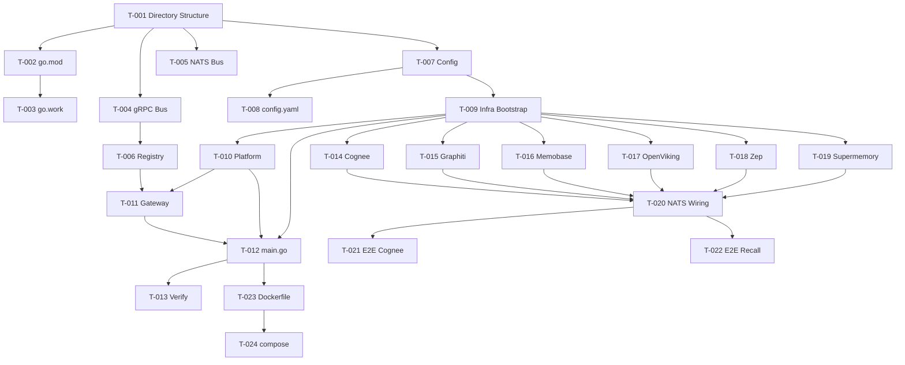

# SOL-005: Implementation Roadmap

## 1. Phased Approach

### Phase 1: Foundation (Week 1)

| Task | Description | Deps |
|------|-------------|------|
| T-001 | Create `apps/memory/` directory structure | — |
| T-002 | Setup `go.mod` with local module references | T-001 |
| T-003 | Create `go.work` at project root | T-002 |
| T-004 | Implement `internal/bus/grpc_bus.go` (bufconn) | T-001 |
| T-005 | Implement `internal/bus/nats_embedded.go` | T-001 |
| T-006 | Implement `internal/bus/registry.go` (InProcessRegistry) | T-004 |
| T-007 | Implement `internal/config/config.go` (unified config) | T-001 |
| T-008 | Create `configs/config.yaml` (defaults) | T-007 |

### Phase 2: Infrastructure & Platform (Week 2)

| Task | Description | Deps |
|------|-------------|------|
| T-009 | Implement `internal/bootstrap/infra.go` (shared pools) | T-007 |
| T-010 | Implement `internal/bootstrap/platform.go` (vnp-admin, vnp-event, vnp-search-hub) | T-009, T-004, T-005 |
| T-011 | Implement `internal/bootstrap/gateway.go` | T-006, T-010 |
| T-012 | Create `cmd/server/main.go` entry point | T-009, T-010, T-011 |
| T-013 | Verify Gateway → Platform services work | T-012 |

### Phase 3: Engine Bootstrappers (Week 3-4)

| Task | Description | Deps |
|------|-------------|------|
| T-014 | Implement `bootstrap/cognee.go` (3 services) | T-009 |
| T-015 | Implement `bootstrap/graphiti.go` (4 services) | T-009 |
| T-016 | Implement `bootstrap/memobase.go` (3 services) | T-009 |
| T-017 | Implement `bootstrap/openviking.go` (6 services) | T-009 |
| T-018 | Implement `bootstrap/zep.go` (6 services) | T-009 |
| T-019 | Implement `bootstrap/supermemory.go` (9 services) | T-009 |

### Phase 4: Integration & Deployment (Week 5)

| Task | Description | Deps |
|------|-------------|------|
| T-020 | Wire all NATS subscribers across engines | T-014..T-019 |
| T-021 | End-to-end test: store → cognify → search | T-020 |
| T-022 | End-to-end test: memory.recall() cross-engine | T-020 |
| T-023 | Create Dockerfile (multi-stage) | T-012 |
| T-024 | Create docker-compose.yml (compact) | T-023 |
| T-025 | Create docker-compose.infra.yml | — |
| T-026 | Create Makefile | T-023 |
| T-027 | MCP server integration test | T-011 |
| T-028 | Performance benchmarks (bufconn vs TCP) | T-020 |

### Phase 5: Polish (Week 6)

| Task | Description | Deps |
|------|-------------|------|
| T-029 | Health endpoint aggregation (all 35 services) | T-020 |
| T-030 | Graceful shutdown implementation | T-012 |
| T-031 | README.md with quickstart guide | T-024 |
| T-032 | CI pipeline (build + test) | T-026 |

---

## 2. Dependency Graph

---

## 3. Risk Matrix

| Risk | Impact | Mitigation |
|------|--------|-----------|
| Go `internal/` visibility restriction | High | Same module path or Go workspace resolves |
| Circular dependency between services | Medium | Services communicate only via gRPC/NATS, no direct import |
| Conflicting dependency versions | Medium | Go workspace ensures single version resolution |
| Memory overhead 35 services in 1 process | Low | Services are lightweight; shared pools reduce memory |
| Config collision between engines | Low | Namespaced config keys (cognee.*, graphiti.*, etc.) |

---

## 4. Success Metrics

| Metric | Target |
|--------|--------|
| Build time | < 60s |
| Startup time | < 5s |
| Memory at idle | < 256MB |
| All 35 services registered | 100% |
| API compatibility with microservices mode | 100% |
| Zero modifications to gateway/ and services/ | 0 files changed |

---

## 5. Traceability

| Solution | PRD Section | URD Section |
|----------|------------|------------|
| SOL-001 (Architecture) | §4, §7, §8 | UR-OPS-01, UR-OPS-02 |
| SOL-002 (Communication) | §7.3 | UR-MEM-01, UR-MEM-02 |
| SOL-003 (Bootstrap) | §4.2, §5 | UR-OPS-01 |
| SOL-004 (Config/Deploy) | §8 | UR-OPS-01, UR-OPS-02 |
| SOL-005 (Roadmap) | §14 | All |
