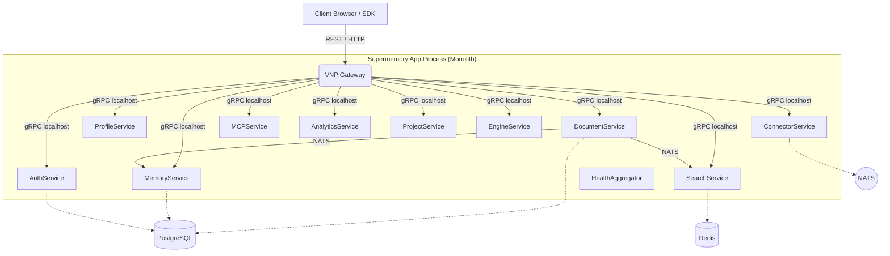

# Supermemory App Architecture

## Overview
Dự án Supermemory Monolith triển khai theo mẫu (pattern) **Embedded Service Supervisor**.
Ứng dụng thực chất không chứa business logic mới. Trách nhiệm của app này là làm "nhạc trưởng" gọi lệnh khởi tạo cho toàn bộ các services và expose các API qua một Gateway thống nhất.

## Module Structure Diagram

## Key Design Decisions
1. **Zero Modification to Services**: Tất cả code của services trong `services/sm-*` và `gateway/` không được sửa. Ứng dụng chỉ import code.
2. **Local gRPC Transport**: Các services giao tiếp với nhau bằng gRPC thông qua địa chỉ IP `127.0.0.1` với cổng khác nhau để tận dụng cơ chế Loopback cực nhanh mà không cần deploy sidecar.
3. **Phased Startup**: Hệ thống có Supervisor khởi chạy module theo đúng thứ tự logic để tránh lỗi race conditions.
4. **Unified Configuration**: Một tập hợp environment variable chung được map cho tất cả services thay vì từng config phân tán.
