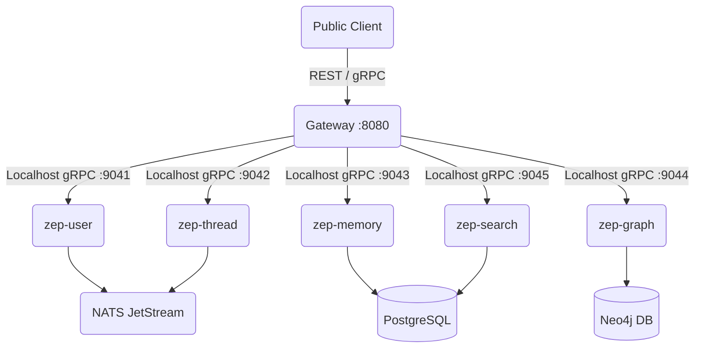

# Architecture Overview: Zep Monolith

## System Topology
Zep Monolith gom toàn bộ 7 services riêng biệt của platform thành một application duy nhất:
- `Gateway`
- `zep-admin`
- `zep-user`
- `zep-thread`
- `zep-memory`
- `zep-graph`
- `zep-search`

Mô hình này sử dụng **Embedded Supervisor Pattern**:
1. **Supervisor** khởi tạo và giữ các services dưới dạng goroutines.
2. Các service sẽ binding lên các cổng từ `9041` đến `9046` tại địa chỉ `localhost`.
3. Gateway khởi động sau cùng, hứng toàn bộ HTTP/REST và gRPC traffic từ public qua cổng `8080`/`8081` và map xuống các internal service via localhost gRPC.

## Data Flow

## Inter-Service Communication
Thay vì gọi gRPC qua mạng Kubernetes (e.g. `zep-user.svc.cluster.local:9090`), trong monolith, tất cả đều trỏ về `127.0.0.1` với các port riêng biệt. NATS JetStream tiếp tục được sử dụng làm message broker cho các tác vụ async (như background graph extraction).

## Zero-modification Rule
Monolith *hoàn toàn không sửa đổi mã nguồn* của `gateway` và `services/zep-*`. Thay vì vậy, nó import các package internal (hoặc wrapper) của từng service và truyền external config qua Unified Config để bootstrap hệ thống.
