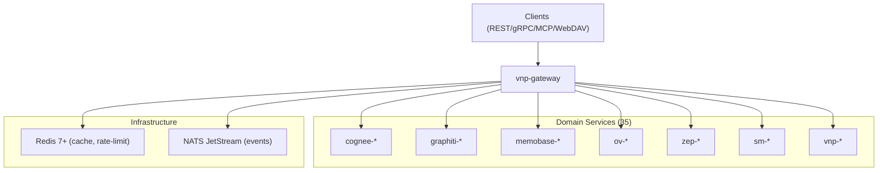
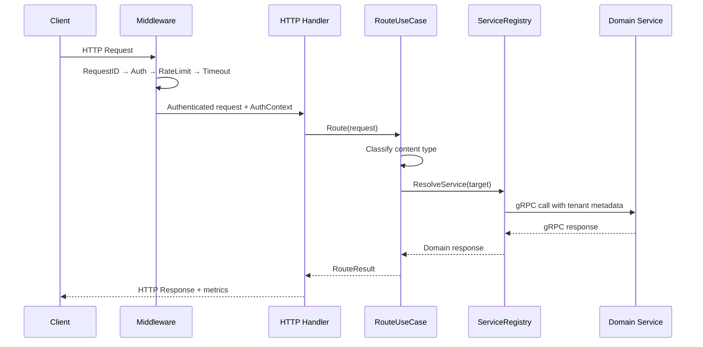

# vnp-gateway — Service Architecture

> **Pattern**: 4-layer Clean Architecture | **Multi-Protocol Ingress**

---

## 1. System Context



---

## 2. Layer Structure

```
gateway/
├── cmd/
│   └── main.go                        # Entry point, Wire init
├── internal/
│   ├── domain/                        # Layer 1: Domain
│   │   ├── entity.go                  #   RouteTarget, ProtocolType, AuthContext
│   │   ├── errors.go                  #   GatewayError types (ErrUnauth, ErrRateLimit)
│   │   └── event.go                   #   RequestReceived, RequestRouted events
│   ├── usecase/                       # Layer 2: Business Logic
│   │   ├── route.go                   #   RouteUseCase — classify + route
│   │   ├── auth.go                    #   AuthenticateUseCase — JWT/APIKey validation
│   │   ├── mcp.go                     #   MCPServerUseCase — tool dispatch
│   │   ├── ratelimit.go               #   RateLimitUseCase — sliding window check
│   │   ├── dashboard.go               #   DashboardUseCase — fan-out health/metrics
│   │   ├── session.go                 #   SessionUseCase — merge Zep+OV sessions
│   │   ├── debugger.go                #   DebuggerUseCase — context assembly trace
│   │   ├── graph.go                   #   GraphUseCase — multi-engine graph merge
│   │   └── port/                      #   Port interfaces
│   │       ├── input.go               #     Router, Authenticator, MCPHandler
│   │       └── output.go              #     ServiceRegistry, TenantStore, KeyStore
│   ├── adapter/                       # Layer 3: Interface Adapters
│   │   ├── http/                      #   REST handlers (chi/v5)
│   │   │   ├── router.go             #     Route registration
│   │   │   ├── memory_handler.go     #     /v1/memory/* — unified API
│   │   │   ├── cognee_handler.go     #     /v1/cognee/*
│   │   │   ├── graphiti_handler.go   #     /v1/graphiti/*
│   │   │   ├── memobase_handler.go   #     /v1/memobase/*
│   │   │   ├── openviking_handler.go #     /v1/ov/*
│   │   │   ├── zep_handler.go        #     /v1/zep/*
│   │   │   ├── sm_handler.go         #     /v1/sm/*
│   │   │   ├── admin_handler.go      #     /v1/admin/*
│   │   │   ├── dashboard_handler.go  #     /v1/console/dashboard/* (FEAT-006)
│   │   │   ├── explorer_handler.go   #     /v1/console/memory/* (FEAT-007)
│   │   │   ├── graph_handler.go      #     /v1/console/graph/* (FEAT-013)
│   │   │   ├── profile_handler.go    #     /v1/console/profiles/* (FEAT-008)
│   │   │   ├── adaptive_handler.go   #     /v1/console/adaptive/* (FEAT-009)
│   │   │   ├── debugger_handler.go   #     /v1/console/debugger/* (FEAT-010)
│   │   │   ├── session_handler.go    #     /v1/console/sessions/* (FEAT-014)
│   │   │   ├── governance_handler.go #     /v1/console/governance/* (FEAT-011)
│   │   │   ├── pipeline_handler.go   #     /v1/console/pipelines/* (FEAT-015)
│   │   │   ├── infra_handler.go      #     /v1/console/infra/* (FEAT-016)
│   │   │   └── observability_handler.go # /v1/console/observability/* (FEAT-017)
│   │   ├── grpc/                      #   gRPC-Web proxy
│   │   │   └── proxy.go              #     REST ↔ gRPC transcoding
│   │   ├── mcp/                       #   MCP server
│   │   │   ├── server.go             #     SSE/HTTP Streamable transport
│   │   │   └── tools.go              #     16 MCP tool definitions
│   │   ├── webdav/                    #   WebDAV proxy → ov-fs
│   │   │   └── handler.go
│   │   ├── ws/                        #   WebSocket handler
│   │   │   └── handler.go            #     Streaming memory updates
│   │   └── client/                    #   Outbound gRPC clients
│   │       ├── registry.go           #     ServiceRegistry with health tracking
│   │       ├── cognee.go             #     cognee-ingestion/cognify/search clients
│   │       ├── graphiti.go           #     graphiti-* clients
│   │       ├── memobase.go           #     memobase-* clients
│   │       ├── openviking.go         #     ov-* clients
│   │       ├── zep.go                #     zep-* clients
│   │       ├── supermemory.go        #     sm-* clients
│   │       └── platform.go           #     vnp-event/search-hub/admin clients
│   └── infra/                         # Layer 4: Infrastructure
│       ├── config/                    #   Viper configuration
│       │   └── config.go
│       ├── server/                    #   Server lifecycle
│       │   ├── http.go               #     HTTP server with graceful shutdown
│       │   ├── grpc.go               #     gRPC server
│       │   └── mcp.go                #     MCP server
│       ├── middleware/                #   Cross-cutting middleware
│       │   ├── auth.go               #     JWT/APIKey extraction
│       │   ├── cors.go               #     CORS configuration
│       │   ├── ratelimit.go          #     Redis sliding window
│       │   ├── circuit_breaker.go    #     sony/gobreaker per service
│       │   ├── request_id.go         #     UUID v7 generation
│       │   ├── timeout.go            #     Per-route timeout policy
│       │   ├── logging.go            #     Request/response structured logging
│       │   ├── metrics.go            #     Prometheus counters/histograms
│       │   └── recovery.go           #     Panic recovery
│       └── wire/                      #   Dependency injection
│           ├── wire.go               #     Wire provider sets
│           └── injector.go           #     Generated injector
├── docs/                              #   Service documentation
└── specs/                             #   Execution specs
```

---

## 3. Dependency Rule

```
Domain ← Usecase ← Adapter ← Infra
(inner)                      (outer)

- Domain: ZERO external dependencies — pure Go types + interfaces
- Usecase: Depends only on Domain port interfaces
- Adapter: Implements Domain ports, calls Usecase methods
- Infra: Provides concrete implementations (Redis, gRPC connections, config)
```

---

## 4. Request Flow



---

## 5. Auto-Routing (Content Classification)

```go
// internal/usecase/route.go
func (uc *RouteUseCase) ClassifyAndRoute(ctx context.Context, req *StoreRequest) (*RouteResult, error) {
    var target ServiceTarget
    switch req.Type {
    case "semantic":
        target = uc.registry.CogneeIngestion()
    case "episodic":
        target = uc.registry.GraphitiIngestion()
    case "conversational", "profile":
        target = uc.registry.MemobaseIngestion()
    case "procedural":
        target = uc.registry.OVResource()
    case "auto":
        classified, err := uc.classifier.Classify(ctx, req.Data)
        if err != nil {
            return nil, fmt.Errorf("classify: %w", err)
        }
        req.Type = classified
        return uc.ClassifyAndRoute(ctx, req)
    }
    return uc.forward(ctx, target, req)
}
```

---

## 6. Cross-Cutting Concerns

| Feature | Implementation | Config Key |
|---------|---------------|-----------|
| **Auth** | JWT RS256 + API Key → tenant_id extraction | `auth.jwt_public_key`, `auth.api_key_prefix` |
| **Rate Limit** | Redis sliding window, per-tenant per-endpoint | `ratelimit.default`, `ratelimit.tiers` |
| **Circuit Breaker** | sony/gobreaker per downstream service | `circuit.threshold`, `circuit.timeout` |
| **CORS** | Configurable origins, credentials | `cors.allowed_origins` |
| **Request ID** | UUID v7 generation, `X-Request-ID` header | Auto |
| **Timeout** | 30s default, 120s ingestion, 10s search | `timeout.default`, `timeout.routes` |
| **Metrics** | Prometheus: request count, latency, error rate | `metrics.port` |
| **Tracing** | OTel spans for every request | `otel.endpoint` |

---

## 7. External Dependencies

| Dependency | Purpose | Required |
|-----------|---------|----------|
| Redis 7+ | Rate limiting, session cache | Yes |
| NATS JetStream | Event publishing (RequestReceived) | Yes |
| All 35 services | gRPC backends | Yes (with circuit breaker fallback) |

---

## 8. Known Limitations

- **No request body caching**: Large file uploads are streamed directly, not buffered
- **MCP tool list is static**: Adding new MCP tools requires gateway redeployment
- **WebDAV**: Only proxied to ov-fs, not to other engines
- **Rate limit state**: Redis-dependent; Redis outage → open rate limiting (fail-open)

---

## 9. Design Decisions

| Decision | Rationale | ADR |
|----------|-----------|-----|
| chi/v5 over gin | Stdlib-compatible, composable middleware, net/http native | TBD |
| Per-service circuit breaker | Isolate failures: cognee down ≠ zep down | TBD |
| JWT RS256 over HS256 | Asymmetric: gateway validates without signing key | TBD |
| UUID v7 request IDs | Time-sortable, globally unique, no coordination | TBD |
| MCP as separate port | Protocol isolation; SSE long-lived connections don't block REST | TBD |
