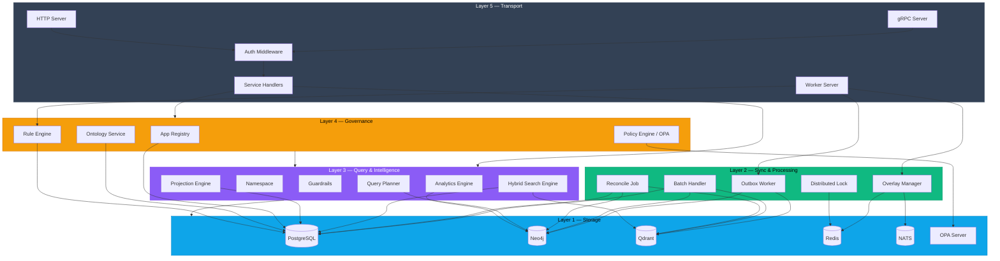

# KGS Platform — Layered Architecture (Code-based)

> Tài liệu này phản ánh kiến trúc phân lớp **dựa trên code thực tế** tại `kgs-platform/internal/`.

---

## Tổng quan 5 lớp

Dựa trên phân tích 14 packages trong `internal/`, KGS Platform được tổ chức thành **5 lớp logic**:

```
╔═══════════════════════════════════════════════════════════════════════╗
║                    Layer 5 — Transport (Giao vận)                     ║
║  server/       gRPC + HTTP servers, middleware (auth, tenant)         ║
║  service/      API handlers: Graph, Registry, Ontology, Rules,       ║
║                Policy, Health                                         ║
╠═══════════════════════════════════════════════════════════════════════╣
║                    Layer 4 — Governance (Quản trị)                    ║
║  biz/          Registry, Ontology, Rules, Policy, OPA client         ║
║                OntologyValidator, PolicySync, RuleRunner, EventRunner ║
╠═══════════════════════════════════════════════════════════════════════╣
║                    Layer 3 — Query & Intelligence (Truy vấn)          ║
║  biz/          QueryPlanner, Namespace, Guardrails, ViewResolver     ║
║  search/       HybridSearch engine (vector + text + centrality)      ║
║  analytics/    Coverage, Traceability, Cluster analysis              ║
║  projection/   View definitions, role-based field filtering, PII mask║
╠═══════════════════════════════════════════════════════════════════════╣
║                    Layer 2 — Sync & Processing (Đồng bộ)              ║
║  outbox/       OutboxWorker (PG→Neo4j+Qdrant sync), ReconcileJob     ║
║  batch/        BatchHandler, Neo4jWriter, PGWriter, VectorIndexer    ║
║  overlay/      Overlay graphs, commit/discard, conflict resolution   ║
║  lock/         Distributed locking (Redis-based)                     ║
╠═══════════════════════════════════════════════════════════════════════╣
║                    Layer 1 — Storage (Lưu trữ)                        ║
║  data/         PostgreSQL (GORM), Neo4j driver, Qdrant client,       ║
║                Redis client, NATS client, OPA connectivity           ║
║  version/      Graph versioning                                       ║
║  observability/ Prometheus metrics, OpenTelemetry tracing             ║
╚═══════════════════════════════════════════════════════════════════════╝
```

---

## Layer 1 — Storage (Lưu trữ)

**Package:** `data/`, `version/`, `observability/`

Quản lý tất cả kết nối tới external stores và infrastructure concerns.

### Actual Storage Engines (từ code)

| Engine     | Package/File            | Vai trò                                    | Khởi tạo trong       |
| ---------- | ----------------------- | ------------------------------------------ | --------------------- |
| PostgreSQL | `data/data.go`          | Source-of-truth cho entities, edges, config | `NewData()` via GORM  |
| Neo4j      | `data/data.go`          | Graph queries (context, impact, coverage)  | `NewData()` via driver|
| Qdrant     | `data/qdrant.go`        | Vector search, embeddings                  | `NewQdrantClient()`   |
| Redis      | `data/data.go`          | Cache, distributed lock, overlay store     | `NewData()` via client|
| NATS       | `data/nats.go`          | Event streaming, overlay notifications     | `NewNATSClient()`     |
| OPA        | `data/data.go`          | Policy evaluation connectivity             | `verifyOPAConnectivity()` |

### Data Models (PostgreSQL — GORM auto-migrate)

```go
// Từ data.go lines 76-93:
db.AutoMigrate(
    &biz.App{},              // App Registry
    &biz.APIKey{},            // API Key management
    &biz.Quota{},             // Quota per app
    &biz.AuditLog{},          // Audit trail
    &biz.EntityType{},        // Ontology entity types
    &biz.RelationType{},      // Ontology relation types
    &biz.Rule{},              // Rule definitions
    &biz.RuleExecution{},     // Rule execution history
    &biz.Policy{},            // OPA policies
    &KGEntity{},              // Knowledge graph entities (PG source-of-truth)
    &KGEdge{},                // Knowledge graph edges (PG source-of-truth)
    &KGSyncOutbox{},          // Outbox for async sync
    &version.GraphVersion{},  // Graph versioning
    &projection.ViewDefinitionRecord{}, // View definitions
)
```

### Key Design: PostgreSQL là Source-of-Truth

> Code cho thấy PostgreSQL là **primary write store**. Neo4j và Qdrant được sync **bất đồng bộ** qua Outbox pattern (Layer 2). Đây là quyết định kiến trúc quan trọng — đảm bảo ACID consistency.

---

## Layer 2 — Sync & Processing (Đồng bộ)

**Packages:** `outbox/`, `batch/`, `overlay/`, `lock/`

Lớp xử lý bất đồng bộ — sync dữ liệu từ PG sang Neo4j/Qdrant, batch processing, overlay graphs.

### Outbox Pattern (Trái tim đồng bộ)

```
PG (source-of-truth)
    │ write
    ▼
KGSyncOutbox table
    │ poll (500ms interval)
    ▼
OutboxWorker
    ├── neo4jSyncer.UpsertEntity()    → Neo4j
    ├── neo4jSyncer.UpsertEdge()      → Neo4j
    ├── qdrantSyncer.UpsertVector()   → Qdrant
    ├── neo4jSyncer.SoftDeleteEntity()→ Neo4j
    └── qdrantSyncer.DeleteVector()   → Qdrant
```

**Từ `outbox/worker.go`:** OutboxWorker poll `kg_sync_outbox` table, xử lý từng record, sync tới cả Neo4j và Qdrant. Có retry logic (maxAttempts=10), observability metrics.

### Batch Processing

| File                    | Chức năng                                    |
| ----------------------- | -------------------------------------------- |
| `batch/graph_handler.go`| Batch upsert entities/edges                 |
| `batch/neo4j_writer.go` | Bulk write to Neo4j                          |
| `batch/pg_writer.go`    | Bulk write to PostgreSQL                     |
| `batch/vector_indexer.go`| Batch index vectors to Qdrant              |
| `batch/dedup.go`        | Deduplication logic                          |

### Overlay Graphs

| File                    | Chức năng                                    |
| ----------------------- | -------------------------------------------- |
| `overlay/overlay.go`    | Create/commit/discard overlay sessions       |
| `overlay/commit.go`     | Commit overlay deltas to main graph          |
| `overlay/conflict.go`   | Conflict detection & resolution              |
| `overlay/delta.go`      | Delta tracking (entity + edge changes)       |
| `overlay/redis_store.go`| Overlay state stored in Redis (TTL=1h)       |
| `overlay/nats_listener.go`| Listen for session close events (NATS)    |

### Distributed Locking

| File               | Chức năng                                    |
| ------------------ | -------------------------------------------- |
| `lock/redis_lock.go`| Redis-based distributed locks               |

### Reconciliation

| File                    | Chức năng                                    |
| ----------------------- | -------------------------------------------- |
| `outbox/reconcile.go`   | Reconcile PG ↔ Neo4j ↔ Qdrant consistency   |
| `outbox/neo4j_sync.go`  | Neo4j sync operations                        |
| `outbox/qdrant_sync.go` | Qdrant sync operations                       |

---

## Layer 3 — Query & Intelligence (Truy vấn)

**Packages:** `biz/` (query_planner, guardrails, namespace, view_resolver), `search/`, `analytics/`, `projection/`

Lớp truy vấn thông minh — translate, plan, search, analyze, project.

### Query Planner

**File:** `biz/query_planner.go`

| Method                           | Mô tả                                      |
| -------------------------------- | ------------------------------------------- |
| `BuildContextQuery()`           | Truy vấn neighborhood (INCOMING/OUTGOING/BOTH) |
| `BuildImpactQuery()`            | Truy vấn downstream impact                 |
| `BuildCoverageQuery()`          | Truy vấn upstream coverage                  |
| `BuildSubgraphQuery()`          | Lấy subgraph từ danh sách node IDs         |
| `BuildBatchedTraversalQueries()`| Depth-windowed queries cho depth > 3        |

### Namespace Isolation

**File:** `biz/namespace.go`

```go
func ComputeNamespace(appID, tenantID string, orgID ...string) string {
    // Output: "graph/{orgID}/{appID}/{tenantID}" hoặc "graph/{appID}/{tenantID}"
}
```

> Namespace format: `graph/{appID}/{tenantID}` — dùng xuyên suốt mọi query.

### Guardrails

**File:** `biz/graph_guardrails.go`

```go
MaxAllowedDepth = 10    // Max traversal depth
MaxAllowedNodes = 10000 // Max nodes per query
```

### Hybrid Search Engine

**File:** `search/search.go`

```
Input: namespace + query string + options (topK, alpha, beta, filters)
    │
    ├── VectorRetriever.Search()  → Qdrant semantic results
    ├── TextRetriever.Search()    → PostgreSQL full-text results
    │
    ├── Blend() → Reciprocal Rank Fusion (alpha weight)
    │
    ├── CentralityScorer.Scores() → Neo4j graph centrality
    ├── RerankWithCentrality() → Boost by graph importance (beta weight)
    │
    └── ApplyFilters() → EntityTypes, Domains, MinConfidence, ProvenanceTypes
```

Embedding providers (`search/`): OpenAI, AIProxy, Air-VNP — factory pattern.

### Analytics Engine

**File:** `analytics/analytics.go`

| Method                   | Mô tả                                      |
| ------------------------ | ------------------------------------------- |
| `CoverageReport()`      | Tỷ lệ coverage theo entity type            |
| `TraceabilityMatrix()`  | Ma trận truy xuất source→target             |
| `ClusterAnalysis()`     | Community detection trên graph              |

### Projection Engine

**File:** `projection/projection.go`

| Feature                  | Mô tả                                      |
| ------------------------ | ------------------------------------------- |
| Role-based field filter  | Chỉ trả về fields mà role được phép xem    |
| Entity type filter       | Giới hạn entity types theo view definition  |
| PII masking              | Auto-mask sensitive fields (email, phone)   |
| View CRUD                | Create/get/list/delete view definitions     |

---

## Layer 4 — Governance (Quản trị)

**Package:** `biz/`

Lớp quản trị — quản lý tenant lifecycle, ontology schema, rules, policies.

### App Registry

**Files:** `biz/registry.go`, `biz/registry_usecase.go`

| Interface/Method          | Mô tả                                      |
| ------------------------- | ------------------------------------------- |
| `RegistryUsecase`        | CreateApp, GetApp, ListApps, IssueAPIKey, RevokeAPIKey |
| App lifecycle             | ACTIVE → SUSPENDED → DELETED               |
| API Key management        | Hash-based storage, prefix identification   |
| Quota management          | Rate limits, max_nodes per app              |

### Ontology Service

**Files:** `biz/ontology.go`, `biz/ontology_validator.go`, `biz/ontology_sync.go`

| Feature                  | Mô tả                                      |
| ------------------------ | ------------------------------------------- |
| EntityType CRUD          | Tạo/xem entity types per app                |
| RelationType CRUD        | Tạo/xem relation types per app              |
| JSON Schema validation   | Validate node properties theo schema        |
| Relation whitelist       | Enforce source_type → target_type pairs     |
| Neo4j constraint sync    | Auto-create constraints khi ontology thay đổi|

### Rule Engine

**Files:** `biz/rules.go`, `biz/rule_runner.go`, `biz/event_runner.go`

| Component          | Mô tả                                      |
| ------------------ | ------------------------------------------- |
| `RulesUsecase`    | CRUD rules per app                           |
| `RuleRunner`      | Scheduled execution (cron-based)             |
| `EventRunner`     | Event-driven execution (on-write triggers)   |
| `RuleExecution`   | Execution history tracking                   |

### Policy Engine

**Files:** `biz/policy.go`, `biz/opa_client.go`, `biz/policy_sync.go`

| Component          | Mô tả                                      |
| ------------------ | ------------------------------------------- |
| `PolicyUsecase`   | CRUD OPA policies per app                    |
| `OPAClient`       | Evaluate access via OPA REST API             |
| `PolicySyncRunner`| Sync policies to OPA server on changes       |

---

## Layer 5 — Transport (Giao vận)

**Packages:** `server/`, `service/`

Lớp giao tiếp — gRPC/HTTP servers, API handlers, background workers.

### API Servers

| File              | Mô tả                                      |
| ----------------- | ------------------------------------------- |
| `server/grpc.go`  | gRPC server setup (port 9000)               |
| `server/http.go`  | HTTP server setup (port 8000)               |
| `server/middleware/` | Auth middleware (API key → tenant context)|

### Service Handlers (gRPC/HTTP)

| Service              | File                          | APIs                                |
| -------------------- | ----------------------------- | ----------------------------------- |
| RegistryService      | `service/registry.go`         | CreateApp, GetApp, ListApps, IssueKey, RevokeKey |
| OntologyService      | `service/ontology.go`         | EntityType CRUD, RelationType CRUD  |
| GraphService         | `service/graph.go`            | Node/Edge CRUD, Context, Impact, Coverage, Subgraph, Search, Analytics |
| RulesService         | `service/rules.go`            | Rule CRUD                           |
| PolicyService        | `service/policy.go`           | Policy CRUD                         |
| HealthService        | `service/health.go`           | Health checks, readiness probes     |
| KG Namespace HTTP    | `service/kg_namespace_http.go`| Namespace-aware REST endpoints      |

### Background Workers

**File:** `server/worker.go`

```go
type WorkerServer struct {
    scheduler       *biz.RuleRunner        // Scheduled rules
    events          *biz.EventRunner        // Event-driven rules
    policySync      *biz.PolicySyncRunner   // Policy → OPA sync
    overlayListener *overlay.SessionCloseListener // Overlay cleanup
    outboxWorker    *outbox.OutboxWorker    // PG → Neo4j/Qdrant sync
    reconcileJob    *outbox.ReconcileJob    // Nightly reconciliation
}
```

---

## Sơ đồ tổng thể (Mermaid)



---

## So sánh: Đề xuất 5 lớp vs Đề xuất 3 lớp trước đó

| Đề xuất cũ (3 lớp)         | Đề xuất mới (5 lớp)                  | Lý do thay đổi                                   |
| --------------------------- | ------------------------------------- | ------------------------------------------------- |
| Management Layer            | **L4 Governance** + **L5 Transport**  | Transport (server/service) tách biệt khỏi business logic |
| Query Planner Layer         | **L3 Query & Intelligence**           | Bao gồm cả search, analytics, projection — không chỉ query planning |
| Storage Layer               | **L1 Storage** + **L2 Sync**          | Outbox/batch/overlay là processing logic, không phải storage |

### Lý do 5 lớp phù hợp hơn

1. **Outbox pattern** là lớp xử lý riêng biệt, không nên gộp vào Storage hay Governance
2. **Search/Analytics/Projection** là intelligence layer, khác biệt với pure query planning
3. **Transport** (gRPC/HTTP/middleware) cần tách khỏi business logic để dễ test và maintain
4. **Overlay graphs** + **distributed locking** là processing concerns, không phải storage
5. Phản ánh đúng Kratos architecture: `server → service → biz → data`

---

## Mapping code packages → Layers

| Package          | Layer | Vai trò                                    |
| ---------------- | ----- | ------------------------------------------ |
| `server/`        | L5    | gRPC/HTTP servers, workers, middleware     |
| `service/`       | L5    | API handlers                               |
| `biz/registry*`  | L4    | App lifecycle, API keys, quotas            |
| `biz/ontology*`  | L4    | Schema management, validation              |
| `biz/rules*`     | L4    | Rule definitions, scheduled/event runners  |
| `biz/policy*`    | L4    | OPA policy CRUD and sync                   |
| `biz/query_planner*` | L3 | Cypher query generation                   |
| `biz/namespace*` | L3    | Namespace computation                      |
| `biz/guardrails*`| L3    | Depth/node limits                          |
| `biz/view_resolver*` | L3 | Response view resolution                  |
| `search/`        | L3    | Hybrid search (vector + text + centrality) |
| `analytics/`     | L3    | Coverage, traceability, clustering         |
| `projection/`    | L3    | Role-based views, PII masking              |
| `outbox/`        | L2    | PG→Neo4j/Qdrant async sync                |
| `batch/`         | L2    | Bulk write operations                      |
| `overlay/`       | L2    | Overlay graphs, commit/conflict            |
| `lock/`          | L2    | Redis distributed locks                    |
| `data/`          | L1    | All DB connections & repos                 |
| `version/`       | L1    | Graph version tracking                     |
| `observability/` | L1    | Metrics & tracing (cross-cutting)          |
| `conf/`          | —     | Configuration (cross-cutting)              |

---

## Storage Engines — Vai trò thực tế

| Engine     | Source of Truth? | Sync mechanism          | Vai trò thực                       |
| ---------- | ---------------- | ----------------------- | ---------------------------------- |
| PostgreSQL | ✅ Yes           | Direct writes           | Primary store, ACID, source of truth|
| Neo4j      | ❌ Read replica  | Outbox Worker (async)   | Graph traversal queries            |
| Qdrant     | ❌ Read replica  | Outbox Worker (async)   | Vector similarity search           |
| Redis      | — (cache/lock)   | Direct                  | Cache, overlay store, locks        |
| NATS       | — (messaging)    | Direct                  | Event streaming, overlay events    |
| OPA        | — (policy eval)  | PolicySyncRunner        | Access control evaluation          |

> **Insight:** Architecture thực tế là **Write to PG → Async fan-out to Neo4j + Qdrant**. Đây là **Event-Driven CQRS** pattern — PG là command side, Neo4j + Qdrant là query side.

---

## Dual-Mode Storage (Specialized ↔ SurrealDB)

Code hiện tại đã define **7 port interfaces** trong `biz/` (`GraphRepo`, `GraphWriteRepo`, `EntityReader`, `RegistryRepo`, `RulesRepo`, `PolicyRepo`, `OntologyRepo`) + **8 implicit ports** ở L2/L3. Kiến trúc Port/Adapter cho phép thêm SurrealDB adapters mà không thay đổi L3–L5.

> Chi tiết thiết kế: [DUAL_STORAGE_DESIGN.md](DUAL_STORAGE_DESIGN.md)
