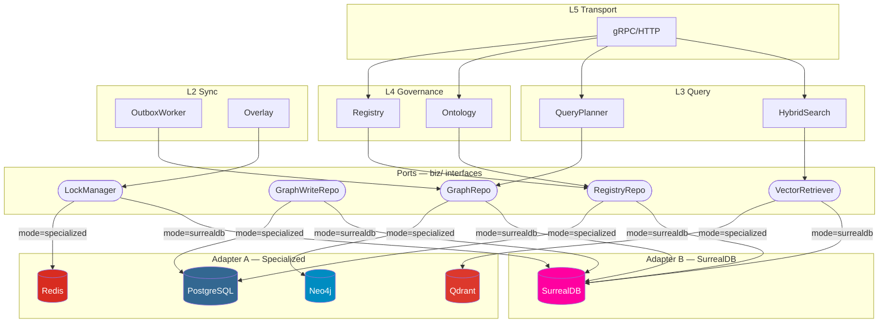

# KGS Dual-Mode Storage — Thiết kế Port/Adapter

> Giải pháp hỗ trợ 2 mode storage: **(1) Specialized Stack** (PG+Neo4j+Qdrant+Redis+NATS) và **(2) Unified Stack** (SurrealDB), chuyển đổi qua config.

---

## 1. Tổng quan giải pháp

### Nguyên tắc: Port/Adapter (Hexagonal Architecture)

```
  L4 Governance ─┐
  L3 Query       ├── sử dụng PORTS (interfaces trong biz/)
  L2 Sync        ─┘
                      │
              ┌───────┴────────┐
              │  StorageMode   │  ← config: "specialized" | "surrealdb"
              └───────┬────────┘
         ┌────────────┼────────────┐
    ADAPTER A              ADAPTER B
    data/specialized/      data/surrealdb/
    PG+Neo4j+Qdrant+Redis  SurrealDB only
```

**Ý tưởng:** Các layers L2–L4 chỉ giao tiếp qua interfaces (ports) đã có sẵn trong `biz/`. Ta thêm SurrealDB adapters implement đúng các interfaces đó. Factory function chọn adapter theo config.

---

## 2. Inventory các Port hiện tại (từ code)

Code hiện tại đã define **7 port interfaces** trong `biz/`:

| Port Interface    | File                    | Methods                                    | Adapter hiện tại       |
|-------------------|-------------------------|--------------------------------------------|------------------------|
| `GraphRepo`       | `biz/graph.go:26`       | CreateNode, GetNode, CreateEdge, ExecuteQuery, GetFullGraph, DeleteNode, DeleteEdge, BatchDeleteNodes | `data/graph_node.go` (Neo4j) |
| `GraphWriteRepo`  | `biz/graph_write.go:58` | UpsertEntity, UpsertEdge, SoftDeleteEntity, SoftDeleteEdge, EnqueueOutbox, WithTx | `data/graph_write_pg.go` (PG) |
| `EntityReader`    | `biz/graph_write.go:67` | GetEntity, EnrichWithFreshVersions         | `data/entity_reader.go` (PG+Neo4j) |
| `RegistryRepo`    | `biz/registry_usecase.go:20` | CreateApp, GetApp, ListApps, CreateAPIKey, GetAPIKeyByHash, RevokeAPIKey, GetQuota | `data/registry.go` (PG+Neo4j) |
| `RulesRepo`       | `biz/rules.go:69`       | CreateRule, GetRule, ListRules              | `data/rules.go` (PG)   |
| `PolicyRepo`      | `biz/policy.go:10`      | CreatePolicy, GetPolicy, ListPolicies      | `data/policy.go` (PG)  |
| `OntologyRepo`    | (implicit via validator) | GetEntityType, GetRelationType             | `data/ontology.go` (PG+Redis) |

**Ngoài biz/, còn có các implicit ports ở L2/L3:**

| Port Interface       | Package        | Methods                              | Adapter hiện tại       |
|----------------------|----------------|---------------------------------------|------------------------|
| `VectorRetriever`    | `search/`      | Search(namespace, query, topK)       | `search/vector.go` (Qdrant) |
| `TextRetriever`      | `search/`      | Search(namespace, query, topK)       | `search/text.go` (PG full-text) |
| `CentralityScorer`   | `search/`      | Scores(namespace, nodeIDs)           | (Neo4j) |
| `QueryExecutor`      | `analytics/`   | ExecuteQuery(cypher, params)         | (Neo4j via GraphRepo) |
| `entityEdgeSyncer`   | `outbox/`      | UpsertEntity, UpsertEdge, SoftDelete | `outbox/neo4j_sync.go` |
| `vectorSyncer`       | `outbox/`      | UpsertVector, DeleteVector           | `outbox/qdrant_sync.go` |
| `lock.LockManager`   | `lock/`        | AcquireNodeLock, Release             | `lock/redis_lock.go` |
| `overlay.Store`      | `overlay/`     | Save, Get, Delete, BindSession       | `overlay/redis_store.go` |
| `EventPublisher`     | `overlay/`     | Publish(subject, payload)            | (NATS) |

---

## 3. Thay đổi cần thiết

### 3.1 Config: Thêm `storage_mode` vào protobuf

```protobuf
// conf.proto — thêm vào message Data
message Data {
  string storage_mode = 20;  // "specialized" (default) | "surrealdb"
  
  // SurrealDB config (chỉ dùng khi mode = "surrealdb")
  message SurrealDB {
    string url = 1;         // ws://surrealdb:8000
    string namespace = 2;   // "kgs"
    string database = 3;    // "production"
    string user = 4;
    string password = 5;
  }
  SurrealDB surrealdb = 21;
  
  // ... existing fields giữ nguyên
}
```

```yaml
# config.yaml — mode surrealdb
data:
  storage_mode: surrealdb
  surrealdb:
    url: ws://surrealdb:8000
    namespace: kgs
    database: production
    user: root
    password: secret
```

### 3.2 Tạo package `data/surrealdb/` — SurrealDB Adapters

```
internal/data/surrealdb/
├── client.go          # SurrealDB connection manager
├── graph_repo.go      # implements biz.GraphRepo
├── graph_write.go     # implements biz.GraphWriteRepo (no outbox needed)
├── entity_reader.go   # implements biz.EntityReader
├── registry_repo.go   # implements biz.RegistryRepo
├── ontology_repo.go   # implements OntologyRepo
├── rules_repo.go      # implements biz.RulesRepo
├── policy_repo.go     # implements biz.PolicyRepo
├── search.go          # implements search.VectorRetriever + TextRetriever
├── lock.go            # implements lock.LockManager (SurrealDB live queries)
├── overlay_store.go   # implements overlay.Store
└── provider.go        # wire.NewSet for all SurrealDB adapters
```

### 3.3 Factory Pattern trong `data/data.go`

```go
// data/factory.go — NEW FILE
package data

func NewStorageFactory(c *conf.Data, logger log.Logger) (StorageBundle, func(), error) {
    mode := c.GetStorageMode()
    if mode == "" {
        mode = "specialized"
    }
    switch mode {
    case "surrealdb":
        return newSurrealDBBundle(c.GetSurrealdb(), logger)
    default:
        return newSpecializedBundle(c, logger) // existing NewData() logic
    }
}

// StorageBundle groups all storage adapters
type StorageBundle struct {
    GraphRepo    biz.GraphRepo
    WriteRepo    biz.GraphWriteRepo
    Reader       biz.EntityReader
    RegistryRepo biz.RegistryRepo
    RulesRepo    biz.RulesRepo
    PolicyRepo   biz.PolicyRepo
    OntologyRepo *OntologyRepo
    LockMgr      lock.LockManager
    // Search adapters
    VectorRetriever search.VectorRetriever
    TextRetriever   search.TextRetriever
    Centrality      search.CentralityScorer
    // Sync adapters (nil for surrealdb mode)
    Neo4jSyncer  *outbox.Neo4jSyncer
    QdrantSyncer *outbox.QdrantSyncer
}
```

---

## 4. Mapping: Specialized → SurrealDB

### Mỗi storage engine map sang SurrealDB feature nào?

| Specialized      | SurrealDB equivalent          | Ghi chú                              |
|-------------------|-------------------------------|--------------------------------------|
| PostgreSQL (GORM) | SurrealDB tables + SurrealQL  | `CREATE app:uuid SET ...` thay GORM  |
| Neo4j (Cypher)    | SurrealDB graph (`RELATE`)    | `SELECT ->rel->target FROM node`     |
| Qdrant (vector)   | SurrealDB vector search       | `DEFINE INDEX ... MTREE DIMENSION`   |
| Redis (cache)     | SurrealDB live queries + TTL  | Hoặc giữ Redis cho cache (hybrid)    |
| Redis (locks)     | SurrealDB transactions        | ACID transactions thay distributed lock |
| NATS (events)     | SurrealDB live queries        | `LIVE SELECT FROM kg_entities`       |

### Quan trọng: L2 Sync layer đơn giản hóa

Trong **Specialized mode:** PG → Outbox → Neo4j + Qdrant (CQRS, phức tạp)

Trong **SurrealDB mode:** Ghi trực tiếp — **không cần Outbox, không cần Reconcile** vì SurrealDB là unified store. L2 layer hầu như bị bypass:

```
Specialized mode:                    SurrealDB mode:
  Write → PG                           Write → SurrealDB
  Outbox poll → Neo4j sync              (done — single store)
  Outbox poll → Qdrant sync
  Reconcile → check consistency
```

---

## 5. SurrealDB Adapter — Thiết kế chi tiết

### 5.1 GraphRepo (thay Neo4j)

```go
// data/surrealdb/graph_repo.go
type surrealGraphRepo struct {
    db *surrealdb.DB
}

func (r *surrealGraphRepo) CreateNode(ctx context.Context, appID, tenantID, label string, props map[string]any) (map[string]any, error) {
    // SurrealQL: CREATE type::thing($table, $id) SET app_id=$app_id, ...
    table := namespaceTable(appID, tenantID, label) // e.g. "kg_Customer"
    props["app_id"] = appID
    props["tenant_id"] = tenantID
    result, err := r.db.Create(table, props)
    return result, err
}

func (r *surrealGraphRepo) ExecuteQuery(ctx context.Context, cypher string, params map[string]any) (map[string]any, error) {
    // Translate Cypher → SurrealQL via QueryTranslator
    surql := TranslateCypherToSurrealQL(cypher, params)
    result, err := r.db.Query(surql, params)
    return normalizeResult(result), err
}

func (r *surrealGraphRepo) CreateEdge(ctx context.Context, appID, tenantID, relType, src, dst string, props map[string]any) (map[string]any, error) {
    // SurrealQL: RELATE $src->$relType->$dst SET ...
    query := fmt.Sprintf("RELATE %s->%s->%s SET app_id=$app_id, tenant_id=$tenant_id", src, relType, dst)
    result, err := r.db.Query(query, mergeParams(props, appID, tenantID))
    return result, err
}
```

### 5.2 GraphWriteRepo (thay PG write + outbox)

```go
// data/surrealdb/graph_write.go
type surrealGraphWriteRepo struct {
    db *surrealdb.DB
}

func (r *surrealGraphWriteRepo) UpsertEntity(ctx context.Context, entity biz.WriteEntity) (biz.UpsertOp, error) {
    // Ghi trực tiếp, không cần outbox vì SurrealDB là single store
    query := "UPDATE type::thing('kg_entities', $id) MERGE $data"
    _, err := r.db.Query(query, map[string]any{"id": entity.EntityID, "data": entityToMap(entity)})
    if err != nil { return "", err }
    return biz.UpsertOpCreated, nil
}

func (r *surrealGraphWriteRepo) EnqueueOutbox(ctx context.Context, rec biz.OutboxRecord) error {
    return nil // NO-OP: SurrealDB mode không cần outbox
}

func (r *surrealGraphWriteRepo) WithTx(ctx context.Context, fn func(biz.GraphWriteRepo) error) error {
    // SurrealDB supports ACID transactions natively
    return r.db.Transaction(func(txDB *surrealdb.DB) error {
        txRepo := &surrealGraphWriteRepo{db: txDB}
        return fn(txRepo)
    })
}
```

### 5.3 VectorRetriever (thay Qdrant)

```go
// data/surrealdb/search.go
type surrealVectorRetriever struct {
    db        *surrealdb.DB
    embedder  search.EmbedProvider
}

func (r *surrealVectorRetriever) Search(ctx context.Context, namespace, query string, topK int) ([]search.Result, error) {
    embedding, err := r.embedder.Embed(ctx, query)
    if err != nil { return nil, err }
    
    // SurrealDB vector search
    surql := `SELECT *, vector::similarity::cosine(embedding, $vec) AS score 
              FROM kg_entities 
              WHERE app_id = $app_id AND tenant_id = $tenant_id
              ORDER BY score DESC LIMIT $topk`
    appID, tenantID := parseNamespace(namespace)
    results, err := r.db.Query(surql, map[string]any{
        "vec": embedding, "app_id": appID, "tenant_id": tenantID, "topk": topK,
    })
    return mapToSearchResults(results), err
}
```

### 5.4 Lock Manager (thay Redis locks)

```go
// data/surrealdb/lock.go — dùng SurrealDB transaction isolation
type surrealLockManager struct {
    db *surrealdb.DB
}

func (m *surrealLockManager) AcquireNodeLock(ctx context.Context, ns, nodeID string, ttl time.Duration) (string, error) {
    token := uuid.NewString()
    query := `CREATE type::thing('kg_locks', $key) SET 
              token=$token, expires_at=time::now()+$ttl, owner=$owner
              ON DUPLICATE KEY UPDATE token=$token WHERE expires_at < time::now()`
    _, err := m.db.Query(query, map[string]any{
        "key": ns+":"+nodeID, "token": token, "ttl": ttl.String(), "owner": lock.OwnerFromCtx(ctx),
    })
    return token, err
}
```

---

## 6. Query Translation Layer

### QueryPlanner cần thay đổi gì?

**Không thay đổi `QueryPlanner`** — nó chỉ generate Cypher strings. Thay vào đó, thêm `QueryTranslator` ở L1:

```go
// data/surrealdb/query_translator.go
func TranslateCypherToSurrealQL(cypher string, params map[string]any) string {
    // Pattern matching cho các query patterns mà QueryPlanner generate:
    
    // Context query:
    // MATCH (n {app_id:$app_id})-[r]->(m) → SELECT ->*->* FROM n WHERE app_id=$app_id
    
    // Impact query (depth):
    // MATCH p=(n)-[*1..3]->(m) → SELECT ->*[1..3]->* FROM n
    
    // Subgraph query:
    // MATCH (n)-[r]->(m) WHERE n.id IN $ids → SELECT * FROM kg_entities WHERE id IN $ids
}
```

Các patterns cần translate (từ `query_planner.go`):

| QueryPlanner method          | Cypher pattern                          | SurrealQL equivalent                    |
|------------------------------|-----------------------------------------|----------------------------------------|
| `BuildContextQuery`         | `MATCH (n)-[r]-(m)`                    | `SELECT *, ->rel.*, <-rel.* FROM $id` |
| `BuildImpactQuery`          | `MATCH p=(n)-[*1..N]->(m)`             | `SELECT ->rel[1..N]->* FROM $id`      |
| `BuildCoverageQuery`        | `MATCH p=(n)<-[*1..N]-(m)`             | `SELECT <-rel[1..N]<-* FROM $id`      |
| `BuildSubgraphQuery`        | `MATCH (n)-[r]->(m) WHERE n.id IN $ids`| `SELECT *, ->rel->* FROM $ids`        |

---

## 7. Wire/DI Integration

### Hiện tại: `cmd/server/wire.go`

```go
// Hiện tại — hard-coded specialized stack
wire.Build(
    data.ProviderSet,     // PG + Neo4j + Qdrant + Redis + NATS
    biz.ProviderSet,
    service.ProviderSet,
    server.ProviderSet,
)
```

### Đề xuất: Conditional wire sets

```go
// cmd/server/wire_specialized.go — build tag: specialized
//go:build !surrealdb

var dataProviders = data.SpecializedProviderSet

// cmd/server/wire_surrealdb.go — build tag: surrealdb  
//go:build surrealdb

var dataProviders = surrealdb.ProviderSet
```

**Hoặc** runtime factory (không cần build tags):

```go
// cmd/server/main.go
func newApp(cfg *conf.Bootstrap, logger log.Logger) (*kratos.App, func(), error) {
    bundle, cleanup, err := data.NewStorageFactory(cfg.Data, logger)
    if err != nil { return nil, nil, err }
    
    // Inject bundle vào biz/service layers
    graphUC := biz.NewGraphUsecaseWithStorage(
        bundle.GraphRepo, bundle.WriteRepo, bundle.Reader, ...)
    registryUC := biz.NewRegistryUsecase(bundle.RegistryRepo, logger)
    // ...
}
```

---

## 8. Migration Strategy — Phased Rollout

```
Phase 1 (hiện tại):  Specialized only — PG+Neo4j+Qdrant+Redis+NATS
                      ✅ Production ready
                      
Phase 2 (next):       Thêm SurrealDB adapters
                      - Implement 7 port interfaces cho SurrealDB
                      - Unit test từng adapter
                      - Integration test với SurrealDB container
                      
Phase 3 (validate):   Shadow mode — ghi cả 2, so sánh kết quả
                      - storage_mode: "shadow"
                      - Write: Specialized (primary) + SurrealDB (secondary)
                      - Read: so sánh output, log diffs
                      
Phase 4 (switch):     SurrealDB primary
                      - storage_mode: "surrealdb"  
                      - Simplified ops: 1 DB thay vì 5
                      - L2 Sync layer gần như disabled
```

---

## 9. Tác động lên từng Layer

| Layer | Specialized mode             | SurrealDB mode                | Thay đổi cần làm         |
|-------|------------------------------|-------------------------------|---------------------------|
| L5    | Không đổi                    | Không đổi                     | Không                     |
| L4    | Không đổi (dùng ports)       | Không đổi (dùng ports)        | Không                     |
| L3    | QueryPlanner → Cypher        | QueryPlanner → Cypher → SurrealQL | Thêm QueryTranslator    |
| L3    | Search: Qdrant+PG+Neo4j      | Search: SurrealDB vector+text | Thêm SurrealDB adapters  |
| L2    | Outbox+Batch+Overlay+Lock    | Overlay+Lock (simplified)     | Outbox/Batch = no-op      |
| L1    | PG+Neo4j+Qdrant+Redis+NATS   | SurrealDB                     | Thêm package `data/surrealdb/` |

### Key insight: L2 đơn giản hóa đáng kể

Trong SurrealDB mode, **Outbox Worker và Reconcile Job không cần chạy** vì không có CQRS fan-out. Overlay vẫn cần (graph staging), nhưng dùng SurrealDB thay Redis. Lock Manager dùng SurrealDB transactions thay Redis locks.

---

## 10. Diagram tổng thể



---

## 11. Checklist Implementation

- [ ] Thêm `storage_mode` + `SurrealDB` vào `conf.proto`
- [ ] Tạo `data/surrealdb/client.go` — connection manager
- [ ] Implement `GraphRepo` cho SurrealDB (thay Neo4j)
- [ ] Implement `GraphWriteRepo` cho SurrealDB (thay PG, no outbox)
- [ ] Implement `EntityReader` cho SurrealDB
- [ ] Implement `RegistryRepo` cho SurrealDB
- [ ] Implement `RulesRepo` + `PolicyRepo` cho SurrealDB
- [ ] Implement `VectorRetriever` + `TextRetriever` cho SurrealDB
- [ ] Implement `LockManager` cho SurrealDB
- [ ] Implement `overlay.Store` cho SurrealDB
- [ ] Tạo `QueryTranslator` (Cypher → SurrealQL)
- [ ] Tạo `StorageFactory` với mode switching
- [ ] Unit tests cho từng SurrealDB adapter
- [ ] Integration tests với SurrealDB container
- [ ] Shadow mode implementation (Phase 3)
