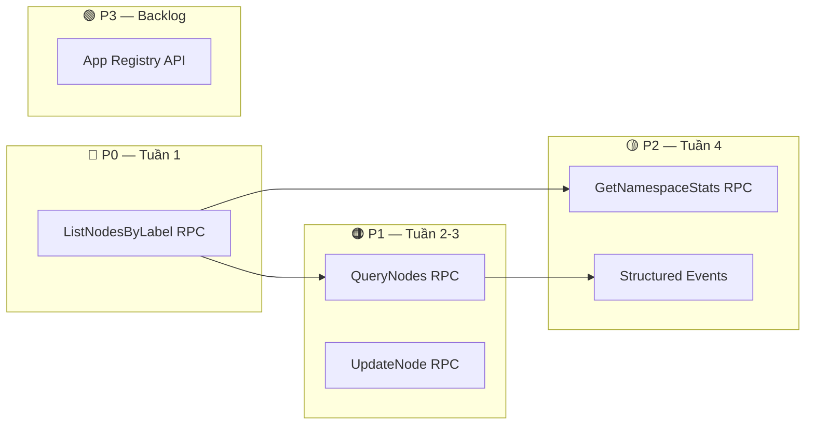

# Đề Xuất Nâng Cấp KGS Platform

## Bối cảnh

Sau khi audit toàn bộ:
- **KGS proto API**: [graph.proto](file:///Users/binhnt/Work/blockchain/vnp-design-platform/services/kgs-platform/api/graph/v1/graph.proto) (599 dòng, 22 RPCs)
- **KGS data model**: [models_kg.go](file:///Users/binhnt/Work/blockchain/vnp-design-platform/services/kgs-platform/internal/data/models_kg.go) (`kg_entities` + `kg_edges` tables)
- **Consumer workarounds**: 50+ lần gọi `GetNodesByLabel` hack trong UIKS/UX-KS/kg-to-dog
- **ID mapping mismatch** vừa fix (thiếu DB-backed namespace resolution)

## Tổng quan các vấn đề hiện tại

| # | Vấn đề | Impact | Consumer bị ảnh hưởng |
|---|---|---|---|
| 1 | **Không có Label Scan API** | Inventory luôn trả 0 | UIKS, UX-KS, kg-to-dog |
| 2 | **Không có Query/Filter API** | Không lọc node theo property | UIKS pipeline_assess, approaches |
| 3 | **Không có UpdateNode API** | Phải dùng CreateNode với "@merge" hack | kg-to-dog |
| 4 | **Không có Statistics/Count API** | Pipeline assess phải fetch ALL nodes để đếm | UIKS |
| 5 | **Event stream thiếu structured data** | Redis stream `kgs:events:nodes` thiếu label/app_id | UIKS event listener |
| 6 | **Multi-tenant namespace** thiếu chuẩn hóa | 5 strategies khác nhau để tạo app_id | Toàn bộ |

---

## P0 — Label Scan API (Critical, unblock pipeline assess)

### Vấn đề
Consumers hiện dùng hack: `GetContext(nodeId="UseCase", depth=0)` — treat label name as node ID → KGS tìm node có `entity_id = "UseCase"` → trả 0 nodes.

**50+ calls** across 3 services depend on this pattern.

### Đề xuất: Thêm `ListNodesByLabel` RPC

```protobuf
// List all nodes of a specific label within an app namespace
rpc ListNodesByLabel (ListNodesByLabelRequest) returns (ListNodesByLabelReply) {
  option (google.api.http) = {
    get: "/v1/graph/nodes"
  };
}

message ListNodesByLabelRequest {
  string label = 1;                          // e.g. "UseCase", "Entity", "UI_SCREEN"
  map<string, string> property_filters = 2;  // optional: {"project_id": "abc"}
  int32 page_size = 3;                       // default 100
  string page_token = 4;
}

message ListNodesByLabelReply {
  repeated GraphNode nodes = 1;
  int32 total_count = 2;         // total matching (for pagination)
  string next_page_token = 3;
}
```

### Implementation (PostgreSQL)
```sql
-- Already has index: idx_entity_type on kg_entities(entity_type)
SELECT * FROM kg_entities 
WHERE entity_type = $1 
  AND app_id = $2 
  AND tenant_id = $3 
  AND is_deleted = false
ORDER BY created_at DESC
LIMIT $4 OFFSET $5;
```

> [!IMPORTANT]
> Đây là **tính năng quan trọng nhất** — unblock toàn bộ pipeline assess, inventory scan, và approach extraction.

---

## P1 — Query/Filter API (High, enable smart pipelines)

### Vấn đề
Consumers cần lọc nodes theo property (e.g. `project_id`, `job_id`, `doc_type`) nhưng KGS không có API filter. Phải fetch ALL nodes rồi filter client-side.

### Đề xuất: Thêm `QueryNodes` RPC

```protobuf
rpc QueryNodes (QueryNodesRequest) returns (QueryNodesReply) {
  option (google.api.http) = {
    post: "/v1/graph/query"
    body: "*"
  };
}

message QueryNodesRequest {
  repeated string labels = 1;                   // filter by entity_type(s)
  map<string, string> property_eq = 2;          // exact match: key=value
  repeated string property_exists = 3;          // property key exists
  string property_json_path = 4;                // PostgreSQL jsonpath query (advanced)
  string order_by = 5;                          // "created_at DESC" | "name ASC"
  int32 limit = 6;
  int32 offset = 7;
  bool include_edges = 8;                       // optionally return edges between matched nodes
}

message QueryNodesReply {
  repeated GraphNode nodes = 1;
  repeated GraphEdge edges = 2;                 // only if include_edges=true
  int32 total_count = 3;
}
```

### Implementation (PostgreSQL)
```sql
SELECT * FROM kg_entities 
WHERE entity_type = ANY($1)
  AND app_id = $2 
  AND properties @> $3::jsonb    -- JSONB containment for property_eq
  AND is_deleted = false
ORDER BY created_at DESC
LIMIT $4 OFFSET $5;
```

> [!TIP]
> PostgreSQL JSONB GIN index (`CREATE INDEX idx_entity_props ON kg_entities USING gin(properties)`) sẽ tăng performance đáng kể.

---

## P1 — UpdateNode API (High, replace "@merge" hack)

### Vấn đề
Consumers phải dùng `CreateNode(label="@merge", properties={node_id: "..."})` để update — unreliable, không có error handling tốt.

### Đề xuất: Thêm `UpdateNode` RPC

```protobuf
rpc UpdateNode (UpdateNodeRequest) returns (UpdateNodeReply) {
  option (google.api.http) = {
    patch: "/v1/graph/nodes/{node_id}"
    body: "*"
  };
}

message UpdateNodeRequest {
  string node_id = 1;
  string properties_json = 2;    // partial update — MERGE into existing
  string label = 3;              // optional: update label
}

message UpdateNodeReply {
  string node_id = 1;
  string label = 2;
  string properties_json = 3;
  int32 version = 4;             // new version after update
}
```

---

## P2 — Statistics/Count API (Medium, optimize assess)

### Vấn đề
`pipeline_assess.go` fetch ALL nodes of 15+ labels chỉ để đếm → ~15 gRPC calls × N nodes per label. Rất chậm với project lớn.

### Đề xuất: Thêm `GetNamespaceStats` RPC

```protobuf
rpc GetNamespaceStats (GetNamespaceStatsRequest) returns (GetNamespaceStatsReply) {
  option (google.api.http) = {
    get: "/v1/graph/stats"
  };
}

message GetNamespaceStatsRequest {
  repeated string labels = 1;    // optional: only count these labels (empty = all)
}

message LabelCount {
  string label = 1;
  int32 count = 2;
}

message GetNamespaceStatsReply {
  int32 total_nodes = 1;
  int32 total_edges = 2;
  repeated LabelCount by_label = 3;
}
```

### Implementation (PostgreSQL)
```sql
SELECT entity_type AS label, COUNT(*) AS count 
FROM kg_entities 
WHERE app_id = $1 AND tenant_id = $2 AND is_deleted = false
GROUP BY entity_type;
```

> [!TIP]
> **1 query thay thế 15+ gRPC calls** — pipeline assess sẽ giảm latency từ ~2s xuống ~50ms.

---

## P2 — Enhanced Event Streaming (Medium)

### Vấn đề
UIKS `KGSEventListener` subscribe Redis stream `kgs:events:nodes` nhưng event payload thiếu:
- `entity_type` / `label`
- `app_id`
- `operation` (create/update/delete)

Listener phải infer từ `node_id` format → fragile.

### Đề xuất: Structured Event Payload

```json
{
  "event_type": "ENTITY_UPSERTED",
  "entity_id": "uc_001",
  "entity_type": "UseCase",
  "app_id": "20074eb3-...",
  "tenant_id": "default",
  "properties_changed": ["description", "status"],
  "version": 3,
  "timestamp": "2026-05-24T10:00:00Z"
}
```

---

## P3 — Namespace / Multi-tenant Chuẩn Hóa

### Vấn đề hiện tại
- `app_id` là UUID do KGS provisioner tạo (e.g. `20074eb3-...`)
- Consumers không biết UUID → hardcode `default__projectID`
- Vừa fix bằng DB lookup nhưng overhead thêm query

### Đề xuất: App Registry API

```protobuf
// Trong registry.proto đã có sẵn:
service Registry {
  rpc CreateApp (CreateAppRequest) returns (CreateAppReply);
}

// THÊM:
rpc GetApp (GetAppRequest) returns (GetAppReply) {
  option (google.api.http) = {
    get: "/v1/apps/{app_id}"
  };
}

rpc ListApps (ListAppsRequest) returns (ListAppsReply) {
  option (google.api.http) = {
    get: "/v1/apps"
  };
}

// Cho phép lookup by external_id (project UUID):
rpc GetAppByExternalID (GetAppByExternalIDRequest) returns (GetAppReply) {
  option (google.api.http) = {
    get: "/v1/apps/by-external-id/{external_id}"
  };
}
```

Giúp consumers gọi `GetAppByExternalID(projectID)` → nhận `app_id` trực tiếp từ KGS, không cần DB lookup riêng.

---

## Tóm tắt Priority Matrix



| Priority | Feature | LOE | Impact |
|---|---|---|---|
| **P0** | `ListNodesByLabel` | 2-3 ngày | Unblock inventory, assess, approaches |
| **P1** | `QueryNodes` | 3-5 ngày | Enable smart filtering |
| **P1** | `UpdateNode` | 1-2 ngày | Replace @merge hack |
| **P2** | `GetNamespaceStats` | 1 ngày | 30x faster assess |
| **P2** | Structured Events | 2 ngày | Reliable event-driven |
| **P3** | App Registry lookup | 2 ngày | Eliminate DB lookup |

---

## Existing Features (Đã Có, Cần Kiểm Tra Hoạt Động)

KGS proto **đã define** nhưng có thể chưa implement đầy đủ:

| RPC | Status | Notes |
|---|---|---|
| `GetFullGraph` | ✅ Proto defined | Cần verify implementation |
| `BatchUpsertGraph` | ✅ Proto defined | Có overlay support |
| `HybridSearch` | ✅ Proto defined | Vector + full-text |
| `GetCoverageReport` | ✅ Proto defined | Domain coverage |
| `GetTraceabilityMatrix` | ✅ Proto defined | Source→target tracing |
| Overlay/Version/Rollback | ✅ Proto defined | Session-scoped writes |
| View Definitions | ✅ Proto defined | Role-based projection |

> [!WARNING]
> Nhiều RPCs đã define trong proto nhưng có thể **chưa implement** hoặc **trả Unimplemented**. Cần verify từng RPC trước khi consumers sử dụng.
