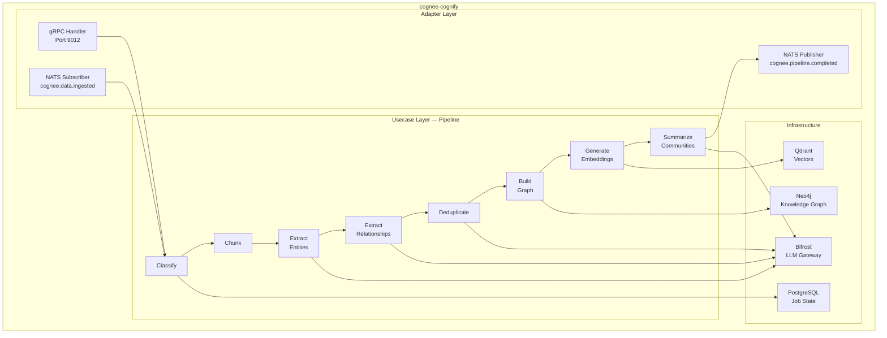

# cognee-cognify — Service Architecture

> **Group**: Cognee | **Pattern**: 4-layer Clean Architecture

## Layer Structure

```
services/cognee-cognify/
├── cmd/server/main.go                 # Entry point, Wire injection
├── internal/
│   ├── domain/                        # Layer 1: Domain entities
│   │   ├── entity.go                  #   CognifyJob, PipelineStage, Entity, Relationship
│   │   ├── value_object.go            #   JobStatus, ChunkingStrategy, EntityType
│   │   ├── event.go                   #   PipelineCompleted, StageAdvanced
│   │   └── errors.go                  #   JobNotFoundError, PipelineFailedError
│   ├── usecase/                       # Layer 2: Business logic
│   │   ├── cognify.go                 #   Main cognify pipeline orchestrator
│   │   ├── classify.go                #   Content classification stage
│   │   ├── chunk.go                   #   Text chunking stage
│   │   ├── extract_entities.go        #   LLM-based entity extraction
│   │   ├── extract_relationships.go   #   LLM-based relationship extraction
│   │   ├── deduplicate.go             #   Entity resolution / deduplication
│   │   ├── build_graph.go             #   Neo4j graph construction
│   │   ├── embed.go                   #   Vector embedding generation
│   │   ├── summarize.go               #   Community summarization
│   │   ├── port/
│   │   │   ├── input.go              #   CognifyUseCase, JobManager
│   │   │   └── output.go             #   GraphRepo, VectorRepo, LLMClient, EmbedderClient
│   │   └── dto/
│   │       ├── request.go
│   │       └── response.go
│   ├── adapter/                       # Layer 3: Interface adapters
│   │   ├── grpc/                      #   gRPC handlers (inbound)
│   │   │   ├── handler.go            #   CogneeCognifyServiceServer impl
│   │   │   └── mapper.go             #   Proto ↔ Domain mapping
│   │   ├── nats/                      #   NATS subscriber (inbound)
│   │   │   └── subscriber.go         #   cognee.data.ingested listener
│   │   ├── event/                     #   NATS publisher (outbound)
│   │   │   └── publisher.go          #   cognee.pipeline.completed publisher
│   │   └── client/                    #   External gRPC clients
│   │       └── ingestion_client.go   #   cognee-ingestion client (fetch data items)
│   └── infra/                         # Layer 4: Infrastructure
│       ├── persistence/
│       │   ├── postgres/              #   Job status, pipeline state
│       │   ├── neo4j/                 #   Graph node/edge operations
│       │   └── qdrant/                #   Vector embedding storage
│       ├── llm/                       #   Bifrost LLM adapter
│       ├── embedder/                  #   Embedding model adapter
│       ├── config/config.go
│       ├── server/grpc.go
│       ├── telemetry/
│       └── wire/wire.go
├── docs/                              # Service documentation
└── specs/                             # Execution specs
```

## Component Diagram



## Pipeline Flow

```
[Input: DataIngested event from cognee-ingestion]
        ↓
1. CLASSIFY — Detect content type → select chunking strategy
        ↓
2. CHUNK — Split content into semantic chunks (recursive/AST/paragraph)
        ↓
3. EXTRACT ENTITIES — LLM NER: identify nodes (Person, Concept, etc.)
        ↓
4. EXTRACT RELATIONSHIPS — LLM: identify edges between entities
        ↓
5. DEDUPLICATE — LLM entity resolution: merge duplicate nodes
        ↓
6. BUILD GRAPH — Persist nodes + edges to Neo4j with tenant namespace
        ↓
7. EMBED — Generate vector embeddings for chunks + entities → Qdrant
        ↓
8. SUMMARIZE — Generate community summaries via graph clustering
        ↓
[Output: cognee.pipeline.completed event → cognee-search]
```

## External Dependencies

| Dependency | Type | Purpose |
|-----------|------|---------|
| Neo4j | Graph DB | Knowledge graph storage (nodes + edges) |
| Qdrant | Vector DB | Entity/chunk embeddings for semantic search |
| PostgreSQL | Relational DB | Job status and pipeline state tracking |
| Bifrost | LLM Gateway | Entity extraction, dedup, summarization |
| NATS JetStream | Message Bus | Subscribe to ingestion events, publish completion |

## Design Decisions

- **Pipeline as state machine**: Each stage persists progress to PostgreSQL, enabling resume on failure
- **Cold-path LLM**: All LLM calls are async pipeline stages, never on hot path
- **Bulkhead pattern**: Concurrent LLM calls limited via channel semaphore to prevent overload
- **Idempotent stages**: Each stage can be safely retried without data corruption

## Known Limitations

- Pipeline processing is sequential per dataset (no parallel stage execution)
- Large datasets (>10K items) may require extended processing time
- Community summarization requires minimum 3 entities per community
