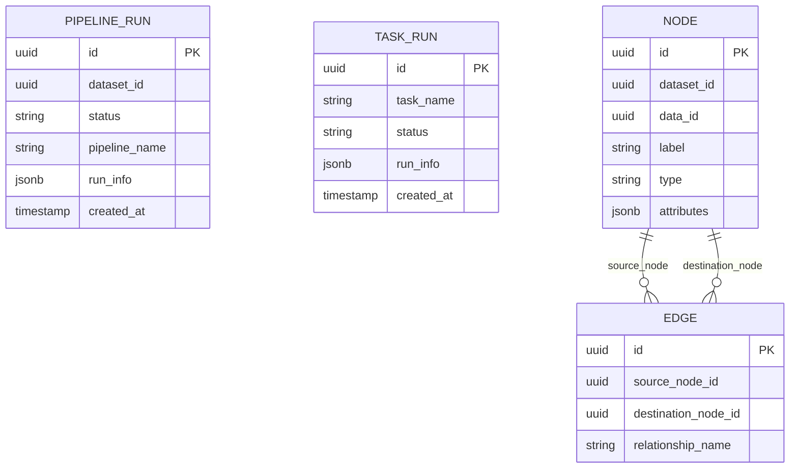

# cognee-cognify — Data Model

> **Database**: PostgreSQL (pipeline runs, graph topology), Qdrant (vectors)

## PostgreSQL Tables

### `pipeline_runs`

| Column | Type | Constraints | Description |
|--------|------|------------|-------------|
| `id` | UUID | PK | Pipeline run unique identifier |
| `pipeline_id` | UUID | INDEX | Target pipeline ID |
| `pipeline_run_id` | UUID | INDEX | Run ID |
| `pipeline_name` | VARCHAR(255) | | Name of the pipeline |
| `dataset_id` | UUID | INDEX | Target dataset ID |
| `status` | VARCHAR(50) | | INITIATED, STARTED, COMPLETED, ERRORED |
| `run_info` | JSONB | | Additional run info |
| `created_at` | TIMESTAMPTZ | DEFAULT NOW() | Record creation time |

### `task_runs`

| Column | Type | Constraints | Description |
|--------|------|------------|-------------|
| `id` | UUID | PK | Task run unique identifier |
| `task_name` | VARCHAR(255) | | Task name |
| `status` | VARCHAR(50) | | Task status |
| `run_info` | JSONB | | Additional run info |
| `created_at` | TIMESTAMPTZ | DEFAULT NOW() | Record creation time |

### `nodes`

| Column | Type | Constraints | Description |
|--------|------|------------|-------------|
| `id` | UUID | PK | Node unique identifier |
| `slug` | UUID | NOT NULL | Slug |
| `user_id` | UUID | NOT NULL | User identifier |
| `data_id` | UUID | NOT NULL, INDEX | Source data identifier |
| `dataset_id` | UUID | NOT NULL, INDEX | Target dataset identifier |
| `label` | VARCHAR(255) | | Node label |
| `type` | VARCHAR(255) | NOT NULL | Node type |
| `indexed_fields`| JSONB | NOT NULL | Indexed fields |
| `attributes` | JSONB | | Additional attributes |
| `created_at` | TIMESTAMPTZ | DEFAULT NOW() | Record creation time |

### `edges`

| Column | Type | Constraints | Description |
|--------|------|------------|-------------|
| `id` | UUID | PK | Edge unique identifier |
| `slug` | UUID | NOT NULL | Slug |
| `user_id` | UUID | NOT NULL | User identifier |
| `data_id` | UUID | NOT NULL, INDEX | Source data identifier |
| `dataset_id` | UUID | NOT NULL, INDEX | Target dataset identifier |
| `source_node_id`| UUID | NOT NULL | Source node identifier |
| `destination_node_id`| UUID | NOT NULL | Destination node identifier |
| `relationship_name` | TEXT | NOT NULL | Name of the relationship |
| `label` | TEXT | | Edge label |
| `attributes` | JSONB | | Additional attributes |
| `created_at` | TIMESTAMPTZ | DEFAULT NOW() | Record creation time |

## Entity-Relationship Diagram

