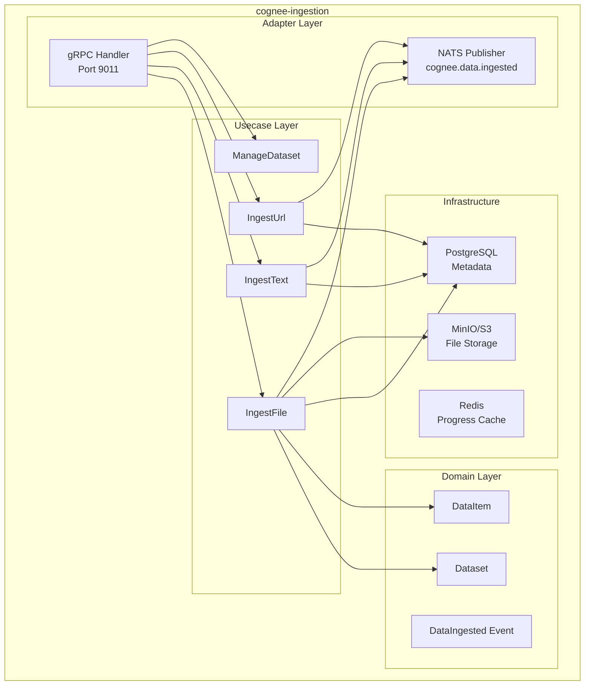

# cognee-ingestion — Service Architecture

> **Group**: Cognee | **Pattern**: 4-layer Clean Architecture

## Layer Structure

```
services/cognee-ingestion/
├── cmd/server/main.go                 # Entry point, Wire injection
├── internal/
│   ├── domain/                        # Layer 1: Domain entities, value objects
│   │   ├── entity.go                  #   Dataset, DataItem, DataSource
│   │   ├── value_object.go            #   DatasetStatus, MimeType
│   │   ├── event.go                   #   DataIngested event
│   │   └── errors.go                  #   DatasetNotFound, DuplicateDataset
│   ├── usecase/                       # Layer 2: Business logic
│   │   ├── ingest_file.go             #   File upload + text extraction
│   │   ├── ingest_text.go             #   Direct text ingestion
│   │   ├── ingest_url.go              #   URL scraping + extraction
│   │   ├── manage_dataset.go          #   Dataset CRUD operations
│   │   ├── port/
│   │   │   ├── input.go              #   FileIngester, TextIngester, UrlIngester
│   │   │   └── output.go             #   DatasetRepo, FileStorage, EventPublisher
│   │   └── dto/
│   │       ├── request.go
│   │       └── response.go
│   ├── adapter/                       # Layer 3: Interface adapters
│   │   ├── grpc/                      #   gRPC handlers (inbound)
│   │   │   ├── handler.go            #   CogneeIngestionServiceServer impl
│   │   │   └── mapper.go             #   Proto ↔ Domain mapping
│   │   ├── event/                     #   NATS publisher
│   │   │   └── publisher.go          #   cognee.data.ingested publisher
│   │   └── client/                    #   External service clients (if any)
│   └── infra/                         # Layer 4: Infrastructure
│       ├── persistence/
│       │   ├── postgres/              #   Dataset + DataItem repositories
│       │   └── minio/                 #   MinIO/S3 file storage adapter
│       ├── scraper/                   #   URL scraping implementation
│       ├── extractor/                 #   PDF/DOCX/PPTX text extraction
│       ├── config/config.go
│       ├── server/grpc.go
│       ├── telemetry/
│       └── wire/wire.go
├── docs/                              # Service documentation
└── specs/                             # Execution specs
```

## Component Diagram



## Dependency Rule

```
Domain ← Usecase ← Adapter ← Infra
(inner)                      (outer)

- Domain knows NOTHING about outer layers
- Usecase depends only on Domain interfaces (ports)
- Adapter implements Domain interfaces, calls Usecase
- Infra provides concrete implementations (PostgreSQL, MinIO, NATS)
```

## External Dependencies

| Dependency | Type | Purpose |
|-----------|------|---------|
| PostgreSQL | Database | Dataset metadata, data item records |
| MinIO/S3 | Object Store | Raw file binary storage |
| Redis | Cache | Upload progress tracking |
| NATS JetStream | Message Bus | Event publishing to cognee-cognify |

## Design Decisions

- **Streaming upload**: Uses gRPC server-streaming for large file uploads to avoid memory pressure
- **Content extraction**: Text extraction from PDF/DOCX/PPTX happens during ingestion, not during cognify
- **Dataset isolation**: Each tenant has isolated datasets with PostgreSQL RLS
- **Async pipeline trigger**: After ingestion completes, publishes NATS event to trigger cognee-cognify pipeline

## Known Limitations

- URL scraping does not support JavaScript-rendered pages (SPA)
- Maximum file size is 100MB per upload
- No deduplication of data items within a dataset (planned for v1.1)
