# cognee-ingestion — Data Model

> **Database**: PostgreSQL (metadata), MinIO/S3 (file storage), Redis (cache)

## PostgreSQL Tables

### `datasets`

| Column | Type | Constraints | Description |
|--------|------|------------|-------------|
| `id` | UUID | PK, DEFAULT gen_random_uuid() | Dataset unique identifier |
| `name` | VARCHAR(255) | | Dataset display name |
| `tenant_id` | UUID | INDEX | Tenant isolation key |
| `owner_id` | UUID | INDEX | Owner of the dataset |
| `created_at` | TIMESTAMPTZ | DEFAULT NOW() | Creation timestamp |
| `updated_at` | TIMESTAMPTZ | DEFAULT NOW() | Last update timestamp |

### `data`

| Column | Type | Constraints | Description |
|--------|------|------------|-------------|
| `id` | UUID | PK, DEFAULT gen_random_uuid() | Item unique identifier |
| `name` | VARCHAR(255) | | Item name |
| `label` | VARCHAR(255) | | Item label |
| `extension` | VARCHAR(50) | | File extension |
| `mime_type` | VARCHAR(128) | | MIME type |
| `original_extension` | VARCHAR(50) | | Original extension |
| `original_mime_type` | VARCHAR(128) | | Original MIME type |
| `loader_engine` | VARCHAR(50) | | Loader engine |
| `raw_data_location` | VARCHAR(1024) | | Raw data location |
| `original_data_location` | VARCHAR(1024) | | Original data location |
| `tenant_id` | UUID | INDEX | Tenant isolation key |
| `owner_id` | UUID | INDEX | Owner of the data item |
| `content_hash` | VARCHAR(255) | | Content hash |
| `raw_content_hash` | VARCHAR(255) | | Raw content hash |
| `external_metadata` | JSONB | | External metadata |
| `node_set` | JSONB | | Node set |
| `pipeline_status` | JSONB | | Pipeline status |
| `token_count` | INT | | Token count |
| `data_size` | INT | | File size in bytes |
| `importance_weight` | FLOAT | | Importance weight |
| `last_accessed` | TIMESTAMPTZ | | Last accessed timestamp |
| `created_at` | TIMESTAMPTZ | DEFAULT NOW() | Creation timestamp |
| `updated_at` | TIMESTAMPTZ | DEFAULT NOW() | Last update timestamp |

### `dataset_data` (Association)

| Column | Type | Constraints | Description |
|--------|------|------------|-------------|
| `dataset_id` | UUID | FK → datasets.id | Dataset identifier |
| `data_id` | UUID | FK → data.id | Data item identifier |

## Entity-Relationship Diagram

```mermaid
erDiagram
    DATASET ||--o{ DATASET_DATA : contains
    DATA ||--o{ DATASET_DATA : included_in
    DATASET {
        uuid id PK
        uuid tenant_id
        uuid owner_id
        string name
        timestamp created_at
        timestamp updated_at
    }
    DATA {
        uuid id PK
        uuid tenant_id
        uuid owner_id
        string name
        string mime_type
        string raw_data_location
        jsonb pipeline_status
        int data_size
        timestamp created_at
    }
```

