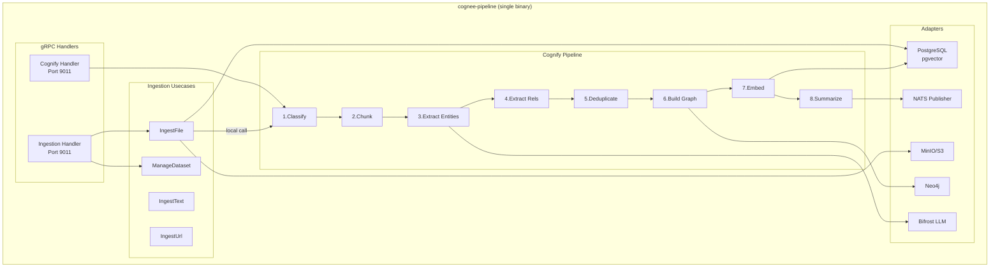

# cognee-pipeline — Service Architecture

> **Pattern**: Pipeline Merge (Ingestion + Cognify → Single Binary) | **4-Layer Clean Architecture**

## Layer Structure

```
services/cognee-pipeline/
├── cmd/server/main.go                     # Entry point, Wire injection
├── internal/
│   ├── domain/                            # Layer 1: Domain entities
│   │   ├── ingestion/
│   │   │   ├── entity.go                 #   Dataset, DataItem, DataSource
│   │   │   ├── value_object.go           #   DatasetStatus, MimeType
│   │   │   ├── event.go                  #   (none — local trigger)
│   │   │   └── errors.go                 #   DatasetNotFoundError
│   │   └── cognify/
│   │       ├── entity.go                 #   CognifyJob, Chunk, Entity, Relationship, Community
│   │       ├── value_object.go           #   JobStatus, ChunkingStrategy, EntityType
│   │       ├── event.go                  #   PipelineCompletedEvent
│   │       └── errors.go                 #   JobNotFoundError, PipelineFailedError
│   ├── usecase/                           # Layer 2: Business logic
│   │   ├── ingest/
│   │   │   ├── ingest_file.go           #   File upload + extraction + local cognify trigger
│   │   │   ├── ingest_text.go           #   Text input
│   │   │   ├── ingest_url.go            #   URL scraping
│   │   │   └── manage_dataset.go        #   Dataset CRUD
│   │   ├── cognify/
│   │   │   ├── orchestrator.go          #   8-stage pipeline runner
│   │   │   ├── classify.go             #   Stage 1: Content type detection
│   │   │   ├── chunk.go                #   Stage 2: Text segmentation
│   │   │   ├── extract_entities.go     #   Stage 3: LLM NER
│   │   │   ├── extract_rels.go         #   Stage 4: LLM relationships
│   │   │   ├── deduplicate.go          #   Stage 5: Entity resolution
│   │   │   ├── build_graph.go          #   Stage 6: Neo4j write
│   │   │   ├── embed.go               #   Stage 7: pgvector write
│   │   │   └── summarize.go           #   Stage 8: Community summaries
│   │   └── port/
│   │       └── interfaces.go           #   Combined port interfaces
│   ├── adapter/                           # Layer 3: Interface adapters
│   │   ├── grpc/
│   │   │   ├── ingestion_handler.go     #   CogneeIngestionService impl
│   │   │   ├── cognify_handler.go       #   CogneeCognifyService impl
│   │   │   └── mapper.go               #   Proto ↔ Domain mapping
│   │   ├── repository/
│   │   │   ├── postgres/
│   │   │   │   ├── dataset_repo.go     #   Dataset + DataItem tables
│   │   │   │   └── job_repo.go         #   CognifyJob state
│   │   │   ├── neo4j/
│   │   │   │   ├── graph_repo.go       #   Knowledge graph CRUD
│   │   │   │   └── queries.go          #   Cypher templates
│   │   │   └── pgvector/
│   │   │       └── vector_repo.go      #   Entity/chunk embeddings
│   │   ├── storage/
│   │   │   └── minio_adapter.go        #   MinIO/S3 file storage
│   │   ├── extractor/
│   │   │   ├── registry.go             #   MimeType → Extractor routing
│   │   │   ├── pdf.go, docx.go, etc.  #   Format-specific extractors
│   │   ├── event/nats/
│   │   │   └── publisher.go           #   cognee.pipeline.completed
│   │   └── client/
│   │       ├── llm_client.go          #   Bifrost LLM
│   │       └── embedder_client.go     #   Bifrost Embedder
│   └── infra/                            # Layer 4: Infrastructure
│       ├── config/config.go              #   Viper config
│       ├── server/grpc.go                #   Dual service registration
│       ├── telemetry/                    #   OTel traces + Prometheus
│       └── wire/wire.go                  #   Google Wire DI
├── Dockerfile                             # Multi-stage build
├── Makefile
└── go.mod
```

## Component Diagram



## Key Design Decisions

1. **Pipeline merge**: `cognee.data.ingested` NATS event eliminated — ingestion triggers cognify via local function call
2. **Dual gRPC services**: Single binary exposes both services — proto backward compatible
3. **Shared DB connections**: PostgreSQL, Neo4j connections shared across domains
4. **pgvector over Qdrant**: Consolidated service uses pgvector (same DB) instead of separate Qdrant
5. **Pipeline state machine**: Each stage persists to PostgreSQL, enabling resume on failure
6. **Bulkhead pattern**: Concurrent LLM calls limited via channel semaphore

## External Dependencies

| Dependency | Type | Purpose |
|-----------|------|---------|
| PostgreSQL + pgvector | Relational + Vector DB | Metadata + entity embeddings |
| Neo4j 5+ | Graph DB | Knowledge graph (entities, relationships, communities) |
| MinIO/S3 | Object Storage | Raw uploaded files |
| NATS JetStream | Message Bus | Emit `cognee.pipeline.completed` → cognee-search |
| Bifrost | LLM Gateway | Entity extraction, deduplication, summarization |

## Known Limitations

- Pipeline processing is sequential per dataset (no parallel stage execution)
- Large datasets (>10K items) may require extended processing time
- Community summarization requires minimum 3 entities per community
- pgvector requires explicit dimension configuration per embedding model
