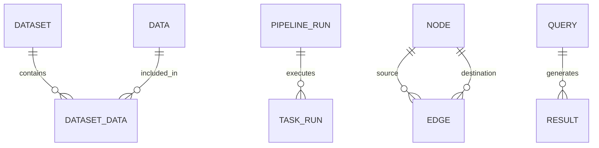

# cognee-pipeline — Data Model

> **Database**: PostgreSQL (metadata, pipeline state, graph, search), Qdrant (vectors), Redis (cache), MinIO/S3 (files)

## PostgreSQL Tables

### `datasets`

| Column | Type | Constraints | Description |
|--------|------|------------|-------------|
| `id` | UUID | PK | Dataset unique identifier |
| `name` | VARCHAR(255) | | Dataset display name |
| `tenant_id` | UUID | INDEX | Tenant isolation key |
| `owner_id` | UUID | INDEX | Owner of the dataset |
| `created_at` | TIMESTAMPTZ | DEFAULT NOW() | Creation timestamp |
| `updated_at` | TIMESTAMPTZ | DEFAULT NOW() | Last update timestamp |

### `data`

| Column | Type | Constraints | Description |
|--------|------|------------|-------------|
| `id` | UUID | PK | Item unique identifier |
| `name` | VARCHAR(255) | | Item name |
| `label` | VARCHAR(255) | | Item label |
| `extension` | VARCHAR(50) | | File extension |
| `mime_type` | VARCHAR(128) | | MIME type |
| `tenant_id` | UUID | INDEX | Tenant isolation key |
| `owner_id` | UUID | INDEX | Owner of the data item |
| `raw_data_location` | VARCHAR(1024) | | Raw data location |
| `pipeline_status` | JSONB | | Pipeline status |
| `data_size` | INT | | File size in bytes |
| `created_at` | TIMESTAMPTZ | DEFAULT NOW() | Creation timestamp |
| `updated_at` | TIMESTAMPTZ | DEFAULT NOW() | Last update timestamp |

### `dataset_data` (Association)

| Column | Type | Constraints | Description |
|--------|------|------------|-------------|
| `dataset_id` | UUID | FK → datasets.id | Dataset identifier |
| `data_id` | UUID | FK → data.id | Data item identifier |

### `pipeline_runs`

| Column | Type | Constraints | Description |
|--------|------|------------|-------------|
| `id` | UUID | PK | Pipeline run unique identifier |
| `pipeline_id` | UUID | INDEX | Target pipeline ID |
| `pipeline_run_id` | UUID | INDEX | Run ID |
| `pipeline_name` | VARCHAR(255) | | Name of the pipeline |
| `dataset_id` | UUID | INDEX | Target dataset ID |
| `status` | VARCHAR(50) | | INITIATED, STARTED, COMPLETED, ERRORED |
| `run_info` | JSONB | | Additional run info |
| `created_at` | TIMESTAMPTZ | DEFAULT NOW() | Record creation time |

### `task_runs`

| Column | Type | Constraints | Description |
|--------|------|------------|-------------|
| `id` | UUID | PK | Task run unique identifier |
| `task_name` | VARCHAR(255) | | Task name |
| `status` | VARCHAR(50) | | Task status |
| `run_info` | JSONB | | Additional run info |
| `created_at` | TIMESTAMPTZ | DEFAULT NOW() | Record creation time |

### `nodes` (Graph Storage)

| Column | Type | Constraints | Description |
|--------|------|------------|-------------|
| `id` | UUID | PK | Node unique identifier |
| `slug` | UUID | NOT NULL | Slug |
| `user_id` | UUID | NOT NULL | User identifier |
| `data_id` | UUID | NOT NULL, INDEX | Source data identifier |
| `dataset_id` | UUID | NOT NULL, INDEX | Target dataset identifier |
| `label` | VARCHAR(255) | | Node label |
| `type` | VARCHAR(255) | NOT NULL | Node type |
| `indexed_fields`| JSONB | NOT NULL | Indexed fields |
| `attributes` | JSONB | | Additional attributes |
| `created_at` | TIMESTAMPTZ | DEFAULT NOW() | Record creation time |

### `edges` (Graph Storage)

| Column | Type | Constraints | Description |
|--------|------|------------|-------------|
| `id` | UUID | PK | Edge unique identifier |
| `slug` | UUID | NOT NULL | Slug |
| `user_id` | UUID | NOT NULL | User identifier |
| `data_id` | UUID | NOT NULL, INDEX | Source data identifier |
| `dataset_id` | UUID | NOT NULL, INDEX | Target dataset identifier |
| `source_node_id`| UUID | NOT NULL | Source node identifier |
| `destination_node_id`| UUID | NOT NULL | Destination node identifier |
| `relationship_name` | TEXT | NOT NULL | Name of the relationship |
| `label` | TEXT | | Edge label |
| `attributes` | JSONB | | Additional attributes |
| `created_at` | TIMESTAMPTZ | DEFAULT NOW() | Record creation time |

### `queries`

| Column | Type | Constraints | Description |
|--------|------|------------|-------------|
| `id` | UUID | PK | Query unique identifier |
| `text` | VARCHAR | | Search query text |
| `query_type` | VARCHAR | | Type of search (similarity, graph, etc.) |
| `user_id` | UUID | INDEX | User who performed the query |
| `created_at` | TIMESTAMPTZ | INDEX, DEFAULT NOW()| Query execution time |
| `updated_at` | TIMESTAMPTZ | | Query update time |

### `results`

| Column | Type | Constraints | Description |
|--------|------|------------|-------------|
| `id` | UUID | PK | Result unique identifier |
| `value` | TEXT | | Result payload or value |
| `query_id` | UUID | FK → queries.id | Associated query |
| `user_id` | UUID | INDEX | User who owns the result |
| `created_at` | TIMESTAMPTZ | INDEX, DEFAULT NOW()| Result creation time |
| `updated_at` | TIMESTAMPTZ | | Result update time |

## Entity-Relationship Diagram

