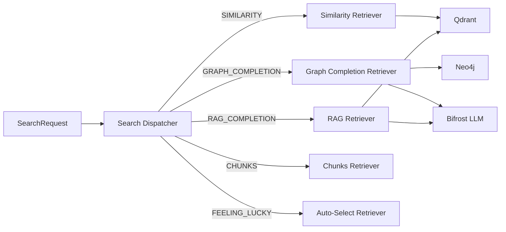

# cognee-search — Service Architecture

> **Group**: Cognee | **Pattern**: 4-layer Clean Architecture

## Layer Structure

```
services/cognee-search/
├── cmd/server/main.go
├── internal/
│   ├── domain/
│   │   ├── entity.go              # SearchQuery, SearchResult, SearchStrategy
│   │   ├── value_object.go        # SearchType enum (15 types), ScoreType
│   │   └── errors.go              # NoDataError, InvalidStrategyError
│   ├── usecase/
│   │   ├── search.go              # Main search dispatcher
│   │   ├── retriever/             # Strategy implementations
│   │   │   ├── similarity.go      #   Vector cosine similarity
│   │   │   ├── graph_completion.go #  Graph + LLM reasoning
│   │   │   ├── rag_completion.go  #   Traditional RAG
│   │   │   ├── chunks.go          #   Raw chunk retrieval
│   │   │   ├── lexical.go         #   BM25/Jaccard lexical search
│   │   │   ├── summaries.go       #   Hierarchical summaries
│   │   │   ├── natural_language.go #  NL → Cypher
│   │   │   ├── temporal.go        #   Temporal-aware search
│   │   │   ├── cypher.go          #   Direct Cypher execution
│   │   │   └── feeling_lucky.go   #   Auto-strategy selection
│   │   └── port/
│   │       ├── input.go           # SearchUseCase interface
│   │       └── output.go          # VectorRepo, GraphRepo, LLMClient, CacheRepo
│   ├── adapter/
│   │   ├── grpc/handler.go
│   │   └── nats/subscriber.go     # cognee.pipeline.completed listener
│   └── infra/
│       ├── persistence/
│       │   ├── qdrant/            # Vector search adapter
│       │   ├── neo4j/             # Graph traversal adapter
│       │   └── redis/             # Result cache adapter
│       ├── llm/                   # Bifrost LLM client
│       └── wire/wire.go
```

## Retriever Pattern



## External Dependencies

| Dependency | Purpose |
|-----------|---------|
| Qdrant | Vector similarity search |
| Neo4j | Graph traversal queries |
| Redis | Search result cache (TTL 5min) |
| Bifrost | LLM completion for graph/RAG strategies |

## Design Decisions

- **Strategy pattern**: Each search type is a separate retriever implementing a common interface
- **Result caching**: Redis caches results with 5min TTL for identical queries
- **Parallel retrieval**: FEELING_LUCKY runs multiple strategies in parallel, returns best
