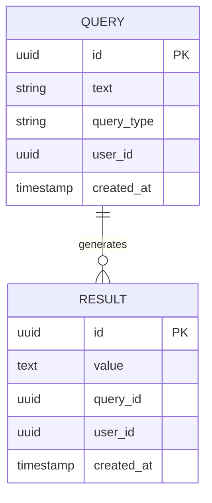

# cognee-search — Data Model

> **Database**: PostgreSQL (queries, results), Qdrant (vectors), Redis (cache)

## PostgreSQL Tables

### `queries`

| Column | Type | Constraints | Description |
|--------|------|------------|-------------|
| `id` | UUID | PK | Query unique identifier |
| `text` | VARCHAR | | Search query text |
| `query_type` | VARCHAR | | Type of search (similarity, graph, etc.) |
| `user_id` | UUID | INDEX | User who performed the query |
| `created_at` | TIMESTAMPTZ | INDEX, DEFAULT NOW()| Query execution time |
| `updated_at` | TIMESTAMPTZ | | Query update time |

### `results`

| Column | Type | Constraints | Description |
|--------|------|------------|-------------|
| `id` | UUID | PK | Result unique identifier |
| `value` | TEXT | | Result payload or value |
| `query_id` | UUID | FK → queries.id | Associated query |
| `user_id` | UUID | INDEX | User who owns the result |
| `created_at` | TIMESTAMPTZ | INDEX, DEFAULT NOW()| Result creation time |
| `updated_at` | TIMESTAMPTZ | | Result update time |

## Qdrant Collections (Read-Only)

cognee-search reads from vector collections populated by the cognify/pipeline processes:

- `DocumentChunk` / `Chunk` / `Entity` embeddings (1536-dim)

## Redis Cache

| Key Pattern | TTL | Description |
|------------|-----|-------------|
| `search:{tenant_id}:{query_hash}:{type}` | 5min | Cached search results |
| `rag:{tenant_id}:{query_hash}` | 10min | Cached RAG completions |

## Entity-Relationship Diagram

