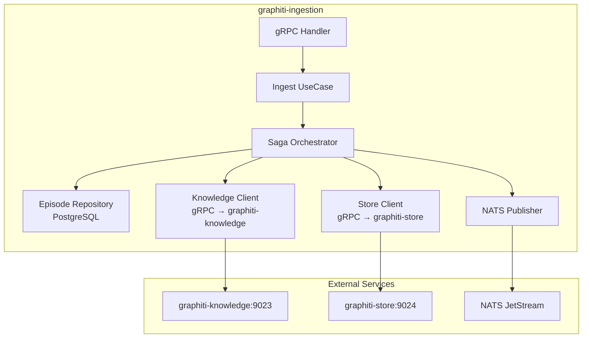
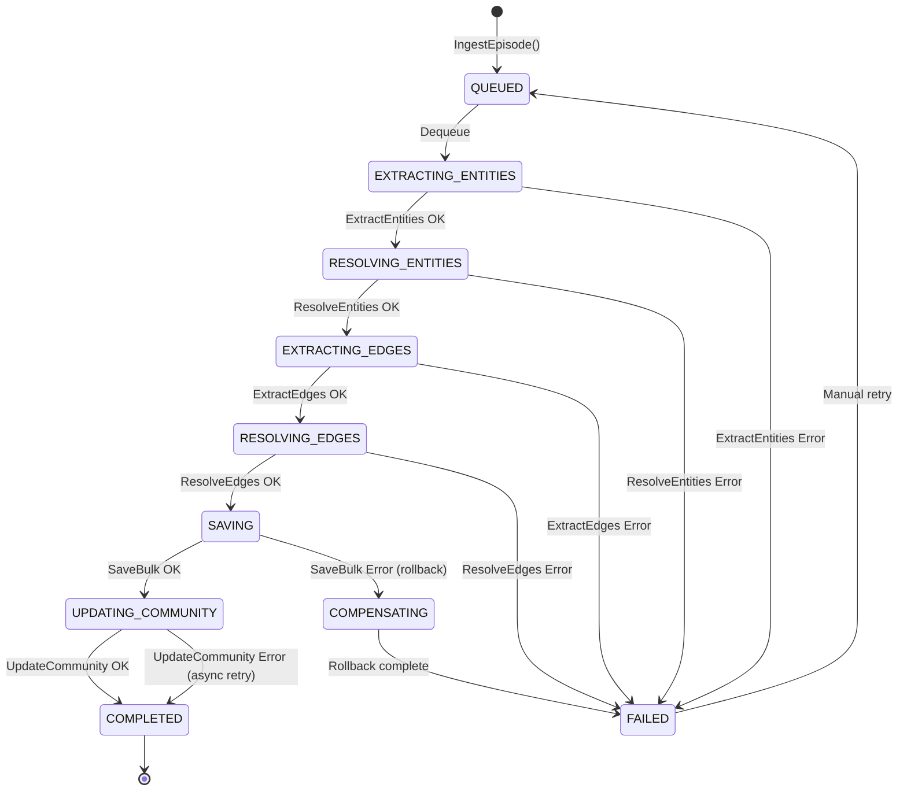

# graphiti-ingestion — Service Architecture

> **Group**: Graphiti | **Pattern**: 4-layer Clean Architecture | **Saga Orchestrator**

## Layer Structure

```
services/graphiti-ingestion/
├── cmd/server/main.go
├── internal/
│   ├── domain/                        # Layer 1: ZERO external imports
│   │   ├── entity.go                  #   Episode, EpisodeType, SagaState
│   │   ├── value_object.go            #   GroupID, EpisodeID, PipelineStep
│   │   ├── event.go                   #   EpisodeIngested, EpisodeFailed
│   │   └── errors.go                  #   ErrDuplicateEpisode, ErrPipelineFailed
│   ├── usecase/                       # Layer 2: imports domain only
│   │   ├── ingest_episode.go          #   Single episode ingestion saga
│   │   ├── bulk_ingest.go             #   Bulk episode ingestion (batch dedup)
│   │   ├── get_status.go              #   Episode status query
│   │   ├── saga_orchestrator.go       #   Saga state machine + compensations
│   │   ├── port/
│   │   │   ├── input.go              #   IngestUseCase, BulkIngestUseCase
│   │   │   └── output.go             #   EpisodeRepo, KnowledgeClient, StoreClient, EventPublisher
│   │   └── dto/
│   │       ├── request.go
│   │       └── response.go
│   ├── adapter/                       # Layer 3: implements ports
│   │   ├── grpc/                      #   gRPC handlers (inbound)
│   │   │   ├── handler.go            #     IngestEpisode, BulkIngest, GetEpisodeStatus
│   │   │   └── mapper.go             #     Proto ↔ Domain mapping
│   │   ├── client/                    #   gRPC clients (outbound)
│   │   │   ├── knowledge_client.go   #     graphiti-knowledge gRPC client
│   │   │   └── store_client.go       #     graphiti-store gRPC client
│   │   ├── repository/                #   Persistence adapters
│   │   │   └── postgres/
│   │   │       └── episode_repo.go   #     Saga state + episode metadata
│   │   └── event/                     #   NATS publisher
│   │       └── nats_publisher.go     #     graphiti.episode.ingested
│   └── infra/                         # Layer 4: Frameworks & Drivers
│       ├── config/config.go
│       ├── server/grpc.go
│       ├── telemetry/
│       └── wire/wire.go
├── Dockerfile
└── README.md
```

## Component Diagram



## Saga State Machine



## External Dependencies

| Dependency | Purpose |
|-----------|---------|
| PostgreSQL | Saga state persistence, episode metadata |
| graphiti-knowledge (gRPC) | Entity/edge extraction and resolution |
| graphiti-store (gRPC) | Graph database CRUD operations |
| NATS JetStream | Event publishing for downstream consumers |

## Design Decisions

- **Saga pattern over choreography**: Centralized orchestration for complex 7-step pipeline ensures visibility into pipeline state and enables compensating actions
- **Per-group serialization**: Uses a mutex/queue per `group_id` to prevent concurrent ingestion corrupting entity resolution within the same tenant partition
- **Async community updates**: Community rebuilds are non-critical and queued for async retry on failure to avoid blocking the main pipeline
- **Idempotent ingestion**: Episode deduplication by (name, group_id, valid_at) hash prevents duplicate processing

## Known Limitations / Technical Debt

- [ ] Saga state currently stored in PostgreSQL; consider moving to NATS KV for reduced latency
- [ ] Bulk ingestion deduplication is in-memory; may need distributed dedup for multi-replica deployments
- [ ] No dead-letter queue for permanently failed episodes
