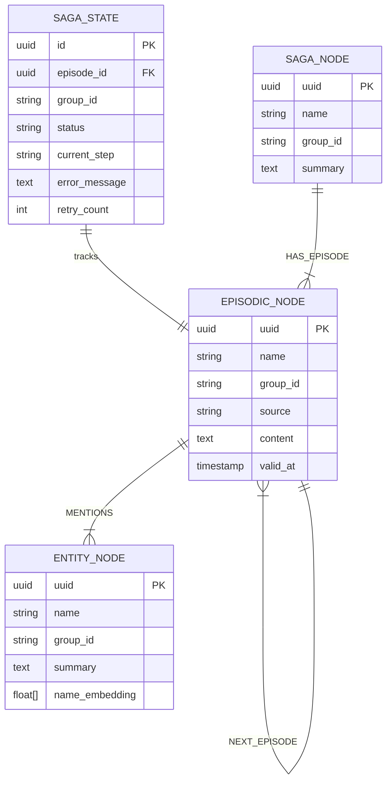

# graphiti-ingestion — Data Model

## Domain Entities

### EpisodicNode (Episode)

Core ingestion entity representing a unit of knowledge input.

| Field | Type | Constraints | Description |
|-------|------|-------------|-------------|
| `uuid` | UUID | PK, auto-generated | Unique episode identifier |
| `name` | string | NOT NULL | Episode name/label |
| `group_id` | string | NOT NULL, indexed | Partition/tenant isolation key |
| `source` | EpisodeType | ENUM | Content type: message, json, text, fact_triple |
| `source_description` | string | NOT NULL | Description of data source |
| `content` | text | NOT NULL | Raw episode data |
| `valid_at` | timestamp | NOT NULL | When the original event occurred |
| `created_at` | timestamp | auto | Record creation time |
| `entity_edges` | string[] | | UUIDs of entity edges referenced |
| `episode_metadata` | jsonb | nullable | Custom metadata key-value pairs |
| `labels` | string[] | | Additional classification labels |

### SagaState (Pipeline Tracking)

Tracks the processing state of each ingestion saga.

| Field | Type | Constraints | Description |
|-------|------|-------------|-------------|
| `id` | UUID | PK | Saga instance ID |
| `episode_id` | UUID | FK → episode, indexed | Associated episode |
| `group_id` | string | NOT NULL, indexed | Tenant partition |
| `status` | string | ENUM | QUEUED, PROCESSING, COMPLETED, FAILED |
| `current_step` | string | | Current saga step name |
| `error_message` | text | nullable | Error details if FAILED |
| `retry_count` | int | default 0 | Number of retries attempted |
| `created_at` | timestamp | auto | Saga creation time |
| `updated_at` | timestamp | auto | Last status update |

### SagaNode

Groups related episodes into a named sequence (conversation thread, document set).

| Field | Type | Constraints | Description |
|-------|------|-------------|-------------|
| `uuid` | UUID | PK | Saga node ID |
| `name` | string | NOT NULL | Saga name |
| `group_id` | string | NOT NULL, indexed | Partition key |
| `summary` | text | nullable | LLM-generated summary of saga episodes |
| `first_episode_uuid` | UUID | nullable | First episode in sequence |
| `last_episode_uuid` | UUID | nullable | Most recent episode |
| `last_summarized_at` | timestamp | nullable | Last summary generation time |
| `created_at` | timestamp | auto | Creation time |

## Entity-Relationship Diagram

## Index Strategy

| Table/Label | Index | Type | Purpose |
|------------|-------|------|---------|
| `saga_state` | `(group_id, status)` | B-tree | Queue processing by group |
| `saga_state` | `(episode_id)` | B-tree unique | Status lookup |
| `EpisodicNode` | `(group_id)` | Graph index | Tenant-scoped queries |
| `EpisodicNode` | `(uuid)` | Unique constraint | Node lookup |

## Migration History

| Version | Date | Description |
|---------|------|-------------|
| 001 | 2026-05-09 | Initial schema: saga_state table, EpisodicNode graph label |
