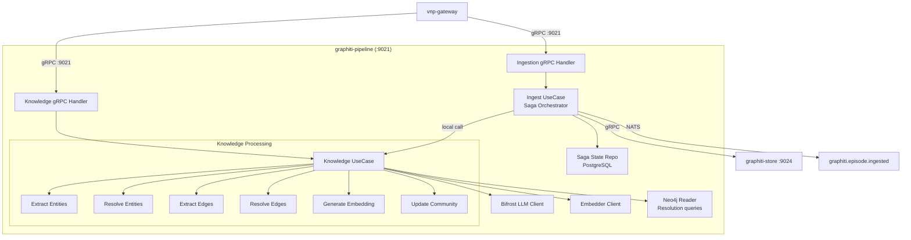
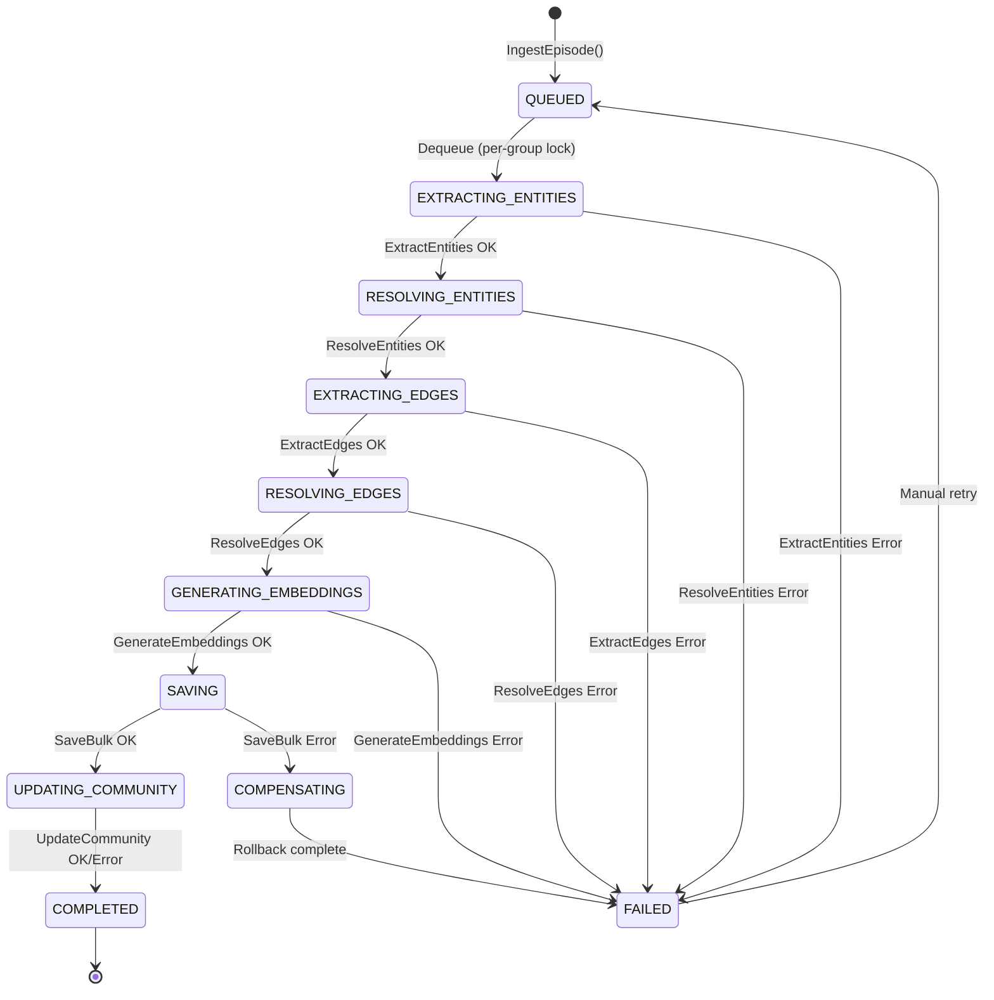

# graphiti-pipeline — Service Architecture

> **Pattern**: Consolidated Service (Saga Orchestrator + Knowledge Engine) | **4-Layer Clean Architecture**

## Internal Layer Structure

```
services/graphiti-pipeline/
├── cmd/server/main.go                         # Entry point, Wire injector
├── internal/
│   ├── domain/                                # Layer 1: ZERO external imports
│   │   ├── ingestion/
│   │   │   ├── entity.go                     #   Episode, EpisodeType, Saga, SagaState
│   │   │   ├── value_object.go               #   GroupID, EpisodeID, ContentHash, PipelineStep
│   │   │   ├── event.go                      #   EpisodeIngested, EpisodeFailed
│   │   │   └── errors.go                     #   ErrDuplicateEpisode, ErrPipelineFailed
│   │   └── knowledge/
│   │       ├── entity.go                     #   ExtractedEntity, ExtractedEdge, Resolution
│   │       ├── value_object.go               #   PromptTemplate, TokenUsage, ModelConfig
│   │       ├── embedding.go                  #   EmbeddingVector, EmbeddingRequest
│   │       ├── community.go                  #   CommunityNode, CommunityEdge
│   │       └── errors.go                     #   ErrLLMTimeout, ErrPromptTooLong
│   ├── usecase/                               # Layer 2: imports domain only
│   │   ├── ingest/
│   │   │   ├── ingest_episode.go             #   Single episode saga orchestration
│   │   │   ├── bulk_ingest.go                #   Batch ingestion with dedup
│   │   │   ├── get_status.go                 #   Episode status query
│   │   │   └── saga_orchestrator.go          #   Generic saga state machine
│   │   ├── knowledge/
│   │   │   ├── extract_entities.go           #   LLM entity extraction
│   │   │   ├── resolve_entities.go           #   Entity deduplication
│   │   │   ├── extract_edges.go              #   LLM edge extraction
│   │   │   ├── resolve_edges.go              #   Edge conflict detection
│   │   │   ├── generate_embedding.go         #   Vector embedding generation
│   │   │   ├── update_community.go           #   Community detection + summarization
│   │   │   └── rerank.go                     #   Cross-encoder reranking
│   │   ├── port/
│   │   │   ├── ingest_input.go              #   IngestUseCase, BulkIngestUseCase
│   │   │   ├── ingest_output.go             #   SagaStateRepo, EventPublisher
│   │   │   ├── knowledge_input.go           #   ExtractUseCase, ResolveUseCase
│   │   │   └── knowledge_output.go          #   LLMClient, EmbedderClient, StoreClient
│   │   └── dto/
│   │       ├── ingest_dto.go
│   │       └── knowledge_dto.go
│   ├── adapter/                               # Layer 3: implements ports
│   │   ├── grpc/
│   │   │   ├── ingestion_handler.go          #   GraphitiIngestionService impl
│   │   │   ├── knowledge_handler.go          #   GraphitiKnowledgeService impl
│   │   │   └── mapper.go                     #   Proto ↔ Domain bidirectional mapping
│   │   ├── repository/
│   │   │   ├── postgres/
│   │   │   │   ├── episode_repo.go          #   Saga state + episode metadata
│   │   │   │   └── migrations/              #   SQL migration files
│   │   │   └── neo4j/
│   │   │       ├── entity_repo.go           #   Entity reads for resolution
│   │   │       └── community_repo.go        #   Community detection queries
│   │   ├── client/
│   │   │   └── store_client.go              #   gRPC → graphiti-store:9024
│   │   ├── llm/
│   │   │   ├── bifrost_client.go            #   Bifrost HTTP adapter
│   │   │   ├── prompt_registry.go           #   Prompt template management
│   │   │   └── response_parser.go           #   LLM response parsing
│   │   ├── embedder/
│   │   │   └── openai_embedder.go           #   Embedding generation adapter
│   │   └── event/
│   │       └── nats_publisher.go            #   NATS JetStream publisher
│   └── infra/                                 # Layer 4: Frameworks & Drivers
│       ├── config/config.go                   #   Viper configuration + validation
│       ├── server/grpc.go                     #   gRPC server setup with interceptors
│       ├── telemetry/                         #   OTel tracer + Prometheus registry
│       └── wire/wire.go                       #   Google Wire DI providers
├── docs/                                       # Service documentation (this dir)
├── specs/                                      # Service specs
├── Dockerfile
└── go.mod
```

## Component Diagram



## Saga State Machine



## External Dependencies

| Dependency | Purpose | Failure Mode |
|-----------|---------|-------------|
| PostgreSQL + pgvector | Saga state, episode metadata, embeddings | Circuit breaker → FAILED |
| Neo4j (via graphiti-store) | Graph persistence (entities, edges, communities) | Circuit breaker → COMPENSATING |
| Bifrost (LLM gateway) | Entity/edge extraction, resolution, summarization | Retry 3x → FAILED |
| NATS JetStream | Event publishing (non-blocking) | Async retry queue |

## Design Decisions

1. **Consolidated service**: Ingestion + knowledge in single binary eliminates 5 gRPC round-trips per episode (previously: ingestion → knowledge for each saga step). P95 latency reduction ~40%.
2. **Saga pattern preserved**: Despite local calls, the saga state machine and compensating actions are maintained for observability and failure recovery.
3. **Per-group serialization**: Advisory lock (PostgreSQL) + in-memory semaphore prevents concurrent ingestion within same `group_id`, ensuring entity resolution consistency.
4. **Bifrost LLM abstraction**: All LLM calls go through Bifrost multi-provider gateway for provider-agnostic failover (OpenAI → Anthropic → Local).
5. **graphiti-store stays separate**: Graph DB abstraction is shared with graphiti-search, justifying separate deployment.

## Known Limitations / Technical Debt

- [ ] LLM calls dominate pipeline latency (80%+ of wall time); need streaming extraction for long documents
- [ ] Community detection uses simple label propagation; should migrate to Louvain/Leiden for better quality
- [ ] Neo4j connection pool shared between saga reads and knowledge resolution queries — need separate pools under heavy load
- [ ] Bi-temporal queries (valid_at/invalid_at ranges) need composite index optimization
- [ ] Prompt templates are hardcoded; should migrate to external prompt registry
