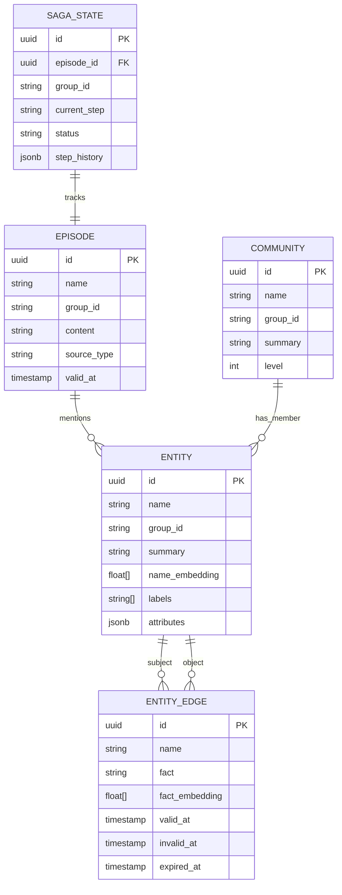

# graphiti-pipeline — Data Model

## PostgreSQL Tables

### `graphiti_saga_state`

Tracks saga pipeline execution state per episode.

| Column | Type | Constraints | Description |
|--------|------|-------------|-------------|
| `id` | `UUID` | PK, DEFAULT gen_random_uuid() | Saga execution ID |
| `episode_id` | `UUID` | NOT NULL, FK → episodes | Episode being processed |
| `group_id` | `VARCHAR(255)` | NOT NULL, INDEX | Tenant partition |
| `current_step` | `VARCHAR(50)` | NOT NULL | Current pipeline step |
| `status` | `VARCHAR(20)` | NOT NULL | QUEUED/PROCESSING/COMPLETED/FAILED/COMPENSATING |
| `step_history` | `JSONB` | DEFAULT '[]' | Array of completed steps with timestamps |
| `retry_count` | `INT` | DEFAULT 0 | Number of retries for current step |
| `error_message` | `TEXT` | NULLABLE | Last error description |
| `started_at` | `TIMESTAMPTZ` | NOT NULL | Saga start time |
| `completed_at` | `TIMESTAMPTZ` | NULLABLE | Saga completion time |
| `updated_at` | `TIMESTAMPTZ` | NOT NULL | Last update time |

**Indexes:**
- `idx_saga_group_status` ON (group_id, status) — Active saga lookup per tenant
- `idx_saga_episode` ON (episode_id) — Status query by episode

### `graphiti_episodes`

Episode metadata and deduplication.

| Column | Type | Constraints | Description |
|--------|------|-------------|-------------|
| `id` | `UUID` | PK | Episode UUID |
| `name` | `VARCHAR(500)` | NOT NULL | Episode identifier |
| `group_id` | `VARCHAR(255)` | NOT NULL, INDEX | Tenant partition |
| `source_type` | `VARCHAR(20)` | NOT NULL | message/text/json/fact_triple |
| `content_hash` | `VARCHAR(64)` | NOT NULL, UNIQUE per group | SHA-256 for dedup |
| `reference_time` | `TIMESTAMPTZ` | NOT NULL | When episode occurred |
| `saga_id` | `UUID` | NULLABLE, FK | Parent saga grouping |
| `created_at` | `TIMESTAMPTZ` | NOT NULL | Ingestion timestamp |

**Indexes:**
- `idx_episodes_dedup` UNIQUE ON (group_id, content_hash) — Dedup index
- `idx_episodes_group_time` ON (group_id, reference_time DESC) — Listing query

### `graphiti_episode_dedup`

Fast deduplication lookup cache.

| Column | Type | Constraints | Description |
|--------|------|-------------|-------------|
| `content_hash` | `VARCHAR(64)` | PK | SHA-256 of (name, group_id, valid_at) |
| `episode_id` | `UUID` | NOT NULL | Resolved episode UUID |
| `group_id` | `VARCHAR(255)` | NOT NULL | Tenant partition |
| `created_at` | `TIMESTAMPTZ` | NOT NULL | Cache entry creation |

## Graph Data Model (Neo4j — via graphiti-store)

### Node Labels

| Label | Properties | Description |
|-------|-----------|-------------|
| `Episodic` | uuid, name, group_id, content, source, valid_at, entity_edges | Source episode node |
| `Entity` | uuid, name, group_id, summary, name_embedding[], labels[], attributes{} | Extracted entity |
| `Community` | uuid, name, group_id, summary, name_embedding[], level | Community cluster |

### Edge Types

| Type | Source → Target | Properties | Description |
|------|----------------|-----------|-------------|
| `RELATES_TO` | Entity → Entity | uuid, name, fact, fact_embedding[], valid_at, invalid_at, expired_at | Temporal fact triple |
| `MENTIONS` | Episodic → Entity | — | Episode mentions entity |
| `HAS_MEMBER` | Community → Entity | — | Community membership |
| `EPISODE_EDGE` | Episodic → Entity | — | Episode-entity association |

### Bi-Temporal Model

```
                created_at
                    │
    ────────────────┼──────────────────────────►
                    │                          time
    valid_at ──────►│◄────── invalid_at
                    │
                    │  expired_at (edge was superseded)
                    │
```

- **valid_at**: When the fact became true in the real world
- **invalid_at**: When the fact stopped being true (NULL = still valid)
- **expired_at**: When the edge was superseded by a newer extraction
- **created_at**: System ingestion timestamp

## Entity-Relationship Diagram



## Migration History

| Version | Date | Description |
|---------|------|-------------|
| `001` | 2026-05-10 | Initial schema: episodes, saga_state, dedup |
