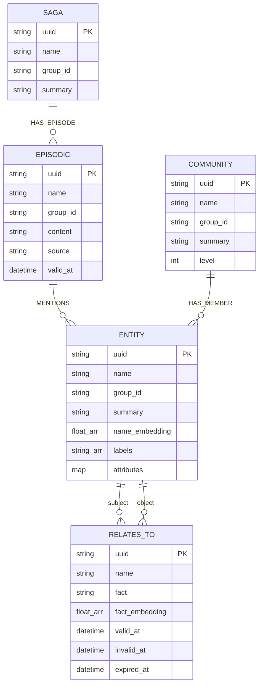

# graphiti-store — Data Model

> **Group**: Graphiti | **Storage**: Neo4j 5.x (primary) | **Pluggable**: FalkorDB, Kuzu, Neptune

## Graph Data Model (Neo4j)

### Node Labels

| Label | Description | Key Properties |
|-------|-------------|---------------|
| `Entity` | Named entity extracted from episodes | uuid, name, group_id, summary, name_embedding[], labels[], attributes{}, created_at, updated_at |
| `Episodic` | Source episode content node | uuid, name, group_id, content, source, valid_at, entity_edges[], created_at |
| `Community` | Community cluster summary | uuid, name, group_id, summary, name_embedding[], level, created_at |
| `Saga` | Episode grouping for conversations | uuid, name, group_id, summary, first_episode_uuid, last_episode_uuid, created_at |

### Edge Types (Relationships)

| Relationship | Source → Target | Properties | Description |
|-------------|----------------|-----------|-------------|
| `RELATES_TO` | Entity → Entity | uuid, name, group_id, fact, fact_embedding[], valid_at, invalid_at, expired_at, episode_id, attributes{}, created_at | Bi-temporal fact triple |
| `MENTIONS` | Episodic → Entity | uuid, group_id, created_at | Episode references entity |
| `HAS_MEMBER` | Community → Entity | uuid, group_id, created_at | Community membership |
| `HAS_EPISODE` | Saga → Episodic | uuid, group_id, created_at | Saga contains episode |
| `NEXT_EPISODE` | Episodic → Episodic | uuid, group_id, created_at | Temporal ordering |

### Bi-Temporal Edge Model (RELATES_TO)

```
                    created_at (system ingestion time)
                        │
    ────────────────────┼──────────────────────────────►
                        │                              time
    valid_at ──────────►│◄──────────── invalid_at
                        │
                        │  expired_at (superseded by newer edge)
```

| Property | Type | Nullable | Description |
|----------|------|----------|-------------|
| `valid_at` | `datetime` | **No** | When the fact became true in the real world |
| `invalid_at` | `datetime` | Yes | When the fact stopped being true (NULL = still valid) |
| `expired_at` | `datetime` | Yes | When the edge was superseded by newer extraction |
| `created_at` | `datetime` | **No** | System timestamp when edge was ingested |

**Validation Rules:**
- `valid_at` is always required
- `invalid_at > valid_at` (when set)
- `expired_at > created_at` (when set)
- Edge with `invalid_at = NULL` is "currently valid"

### Index Strategy

| Index Name | Type | Target | Properties | Purpose |
|-----------|------|--------|-----------|---------|
| `entity_name_embedding` | Vector (cosine, 1536d) | Entity | name_embedding | Semantic entity search |
| `edge_fact_embedding` | Vector (cosine, 1536d) | RELATES_TO | fact_embedding | Semantic edge search |
| `entity_name_fulltext` | Fulltext (BM25) | Entity | name, summary | Text entity search |
| `edge_fact_fulltext` | Fulltext (BM25) | RELATES_TO | name, fact | Text edge search |
| `entity_group_id` | Range | Entity | group_id | Tenant scoping |
| `edge_temporal` | Composite | RELATES_TO | group_id, valid_at, invalid_at | Temporal queries |

### Entity-Relationship Diagram



## Migration History

| Version | Date | Description |
|---------|------|-------------|
| `001` | 2026-05-09 | Initial graph schema: Entity, Episodic, Community, Saga labels |
| `002` | 2026-05-10 | Vector + fulltext + composite indexes |
