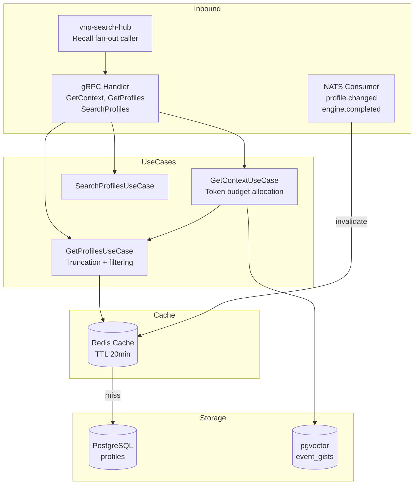

# memobase-context — Service Architecture

> **Group**: Memobase | **Pattern**: 4-layer Clean Architecture

## Layer Structure

```
services/memobase-context/
├── cmd/
│   └── main.go                    # Entry point, Wire init
├── internal/
│   ├── domain/                    # Layer 1: ZERO external imports
│   │   ├── model/
│   │   │   ├── profile.go        #   Profile entity (read-only view)
│   │   │   ├── event_gist.go     #   EventGist value object
│   │   │   └── context.go        #   ContextResult, PromptTemplate
│   │   └── repository/
│   │       ├── profile_repo.go   #   ProfileReadRepository interface
│   │       └── event_repo.go     #   EventGistSearchRepository interface
│   ├── usecase/                   # Layer 2: imports domain only
│   │   ├── get_context.go        #   GetContextUseCase (main assembly)
│   │   ├── get_profiles.go       #   GetProfilesUseCase (with truncation)
│   │   ├── search_profiles.go    #   SearchProfilesUseCase (semantic)
│   │   ├── port/
│   │   │   ├── input.go          #   ContextAssembler, ProfileFetcher
│   │   │   └── output.go         #   ProfileCache, EventGistSearcher
│   │   └── dto/
│   │       ├── request.go
│   │       └── response.go
│   ├── adapter/                   # Layer 3: implements ports
│   │   ├── grpc/
│   │   │   ├── handler.go
│   │   │   └── mapper.go
│   │   ├── repository/
│   │   │   ├── postgres/
│   │   │   │   ├── profile_repo.go  # Profile queries
│   │   │   │   └── event_gist_repo.go # pgvector search
│   │   │   └── redis/
│   │   │       └── profile_cache.go  # Redis profile cache
│   │   └── event/
│   │       └── nats_subscriber.go # Subscribe to profile.changed
│   └── infra/
│       ├── config/config.go
│       ├── server/grpc.go
│       ├── telemetry/
│       └── wire/wire.go
├── docs/
└── specs/
```

## Component Diagram



## Context Assembly Flow

```
GetContext(user_id, max_token_size)
  │
  ├── profile_budget = max_token_size × profile_event_ratio (0.7)
  │
  ├── Parallel:
  │   ├── profiles = getProfiles(user_id)
  │   │   ├── Redis.Get(key)
  │   │   ├── if miss: DB query → Redis.Set(key, TTL=1200s)
  │   │   └── truncate_profiles(prefer_topics, only_topics, budget)
  │   │
  │   └── events = searchEventGists(user_id, chats_context)
  │       └── pgvector cosine_similarity > 0.2, limit 21 days
  │
  ├── profile_section = "- {topic}::{sub_topic}: {content}" per profile
  │
  ├── event_budget = max_token_size - profile_tokens
  │
  └── return prompt_template(profile_section, event_section)
```

## Key Design Decisions

1. **Read-Optimized**: Pure read-path service, no write operations
2. **Cache-First**: Redis cache eliminates DB round-trip for 90%+ of profile requests
3. **Event-Driven Invalidation**: Cache invalidated via NATS events, not via TTL polling
4. **Token Budget Splitting**: Configurable ratio between profile and event sections
5. **Profile Truncation**: Sorted by updated_at DESC, with topic priority ordering

## External Dependencies

- **PostgreSQL + pgvector**: Profile retrieval + event gist semantic search
- **Redis**: Profile caching with 20-minute TTL
- **NATS JetStream**: Subscribe to cache invalidation events

## Known Limitations

- Chat-aware profile filtering requires additional LLM call (optional, disabled by default)
- Event gist search limited to 21-day window
- No result pagination for GetProfiles (entire profile set returned)
