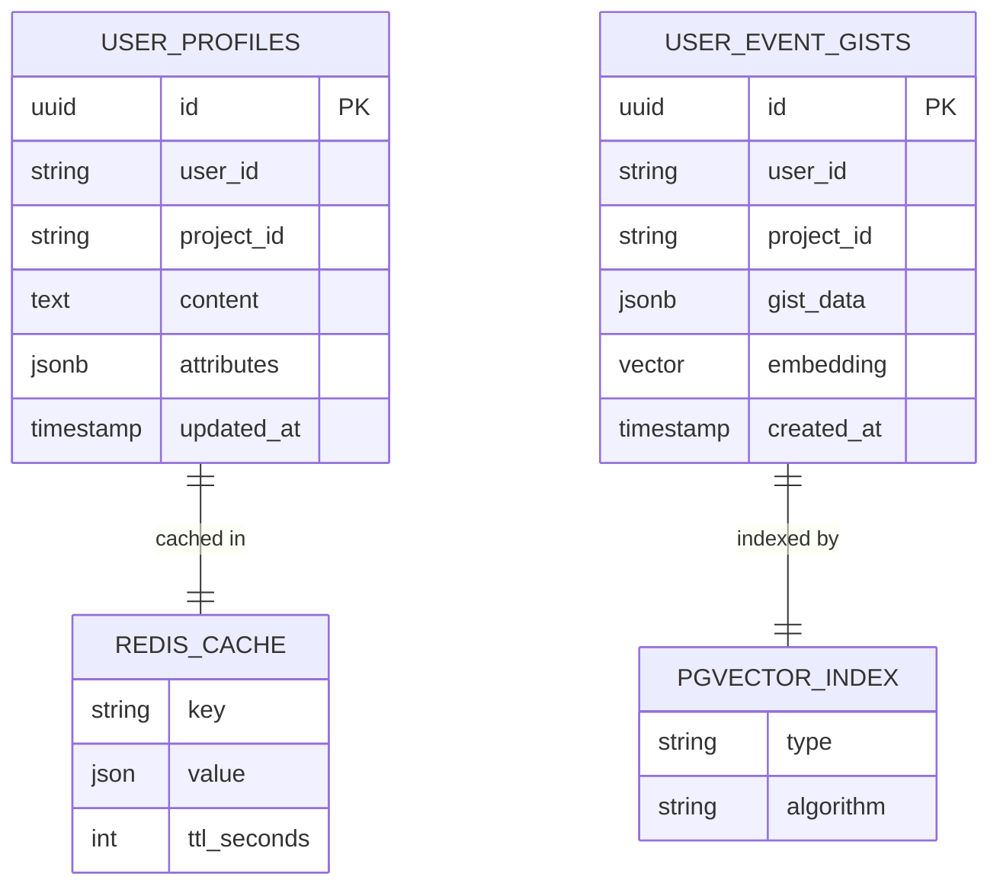

# memobase-context — Data Model

> **Database**: PostgreSQL + pgvector (read-only) + Redis (cache)

## Read-Only Views

memobase-context is a pure read-path service. It reads from tables owned by `memobase-engine` and caches results in Redis.

### user_profiles (read-only)

| Column | Type | Read Usage |
|--------|------|------------|
| id | UUID | Profile identifier |
| user_id | VARCHAR(255) | Filter by user |
| project_id | VARCHAR(255) | Tenant isolation |
| content | TEXT | Profile slot value |
| attributes | JSONB | `{topic, sub_topic}` for filtering |
| updated_at | TIMESTAMPTZ | Sort by recency for truncation |

### user_event_gists (read-only, vector search)

| Column | Type | Read Usage |
|--------|------|------------|
| id | UUID | Gist identifier |
| user_id | VARCHAR(255) | Filter by user |
| project_id | VARCHAR(255) | Tenant isolation |
| gist_data | JSONB | Gist content for context assembly |
| embedding | VECTOR(dim) | pgvector cosine similarity search |
| created_at | TIMESTAMPTZ | 21-day time window filter |

## Redis Cache Schema

```
Key:    user_profiles::{project_id}::{user_id}
Value:  JSON-serialized ProfilesResponse
TTL:    1200 seconds (20 minutes)

Operations:
  GET  → cache hit → return profiles
  SET  → cache miss → query DB, store result
  DEL  → on memobase.profile.changed event → invalidate
```

## Entity-Relationship Diagram



## Index Strategy (Read-Path Queries)

| Query | Index Used | Expected Performance |
|-------|-----------|---------------------|
| Get profiles by user | idx_profiles_user (user_id, project_id) | < 5ms |
| Search event gists | idx_gists_embedding (HNSW) | < 50ms |
| Time-filter gists | idx_gists_created (created_at) | < 10ms |

## Migration History

| Version | Date | Description |
|---------|------|-------------|
| 1.0.0 | 2026-05-09 | Read-only consumer of memobase-engine schema |
