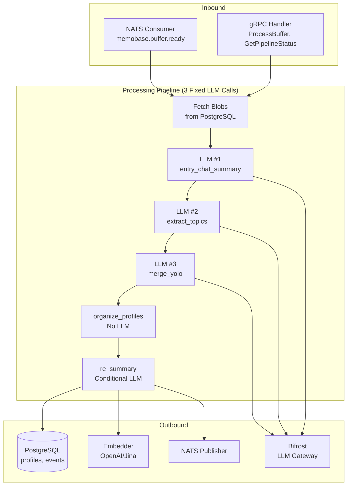

# memobase-engine — Service Architecture

> **Group**: Memobase | **Pattern**: 4-layer Clean Architecture

## Layer Structure

```
services/memobase-engine/
├── cmd/
│   └── main.go                    # Entry point, Wire init
├── internal/
│   ├── domain/                    # Layer 1: ZERO external imports
│   │   ├── model/
│   │   │   ├── profile.go        #   Profile entity (Topic/SubTopic/Content)
│   │   │   ├── event.go          #   UserEvent, EventGist entities
│   │   │   ├── blob.go           #   Blob value objects
│   │   │   ├── pipeline.go       #   PipelineResult, MergeDecision
│   │   │   └── config.go         #   ProfileConfig, EventTagDef
│   │   └── repository/
│   │       ├── profile_repo.go   #   ProfileRepository interface
│   │       ├── event_repo.go     #   EventRepository interface
│   │       └── blob_repo.go      #   BlobRepository interface (read)
│   ├── usecase/                   # Layer 2: imports domain only
│   │   ├── process_buffer.go     #   ProcessBufferUseCase (main pipeline)
│   │   ├── extract_profile.go    #   ExtractProfileUseCase (LLM #2)
│   │   ├── merge_profile.go      #   MergeProfileUseCase (LLM #3 — YOLO)
│   │   ├── process_event.go      #   ProcessEventUseCase
│   │   ├── port/
│   │   │   ├── input.go          #   BufferProcessor, ProfileExtractor
│   │   │   └── output.go         #   LLMClient, EmbedderClient, ProfileStore
│   │   └── dto/
│   │       ├── request.go
│   │       └── response.go
│   ├── adapter/                   # Layer 3: implements ports
│   │   ├── grpc/
│   │   │   ├── handler.go
│   │   │   └── mapper.go
│   │   ├── repository/
│   │   │   └── postgres/
│   │   │       ├── profile_repo.go
│   │   │       └── event_repo.go
│   │   ├── client/
│   │   │   ├── bifrost_llm.go    #   LLM client via Bifrost gateway
│   │   │   └── embedder.go       #   Embedding client (OpenAI/Jina/Ollama)
│   │   └── event/
│   │       └── nats_publisher.go  #   Publish engine.completed, profile.changed
│   └── infra/
│       ├── config/config.go
│       ├── server/grpc.go
│       ├── prompt/                #   Prompt template loader (EN/ZH)
│       │   ├── summary_entry_chats.go
│       │   ├── extract_profile.go
│       │   └── merge_profile_yolo.go
│       ├── telemetry/
│       └── wire/wire.go
├── docs/
└── specs/
```

## Component Diagram



## Key Design Decisions

1. **Fixed 3 LLM Calls**: YOLO merge replaced multi-step (3-10 calls) with single-call merge decision
2. **Cold-Path Processing**: All LLM processing is async (NATS-triggered), never in the hot request path
3. **Profile Schema**: Structured `topic::sub_topic: content` format instead of free-form memories
4. **Parallel Processing**: Profile extraction and event processing run concurrently after entry summary
5. **Multi-Language Prompts**: Separate EN/ZH prompt templates selected per project config

## External Dependencies

- **PostgreSQL**: Profile, event, event_gist persistence
- **Bifrost (LLM Gateway)**: Multi-provider LLM abstraction
- **Embedder**: Vector embedding generation for events
- **NATS JetStream**: Consume buffer.ready, publish engine.completed + profile.changed + event.created

## Known Limitations

- YOLO merge quality depends on LLM model capability
- No circuit breaker on LLM calls (relies on Bifrost-level resilience)
- Profile organize/re_summary steps use conditional LLM calls beyond the "fixed 3"
