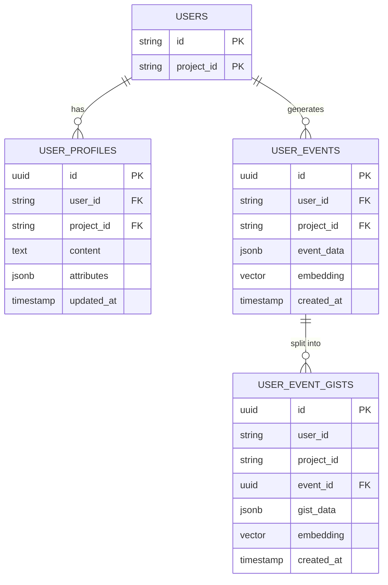

# memobase-engine — Data Model

> **Database**: PostgreSQL + pgvector | **Isolation**: Composite PK `(id, project_id)`

## Tables

### user_profiles

| Column | Type | Constraints | Description |
|--------|------|-------------|-------------|
| id | UUID | PK | Profile entry identifier |
| user_id | VARCHAR(255) | NOT NULL, FK(users) | Owner user |
| project_id | VARCHAR(255) | NOT NULL, FK(projects) | Tenant isolation key |
| content | TEXT | NOT NULL | Profile slot value |
| attributes | JSONB | NOT NULL | `{topic, sub_topic}` structured metadata |
| created_at | TIMESTAMPTZ | NOT NULL, DEFAULT NOW() | Creation time |
| updated_at | TIMESTAMPTZ | NOT NULL | Last update time |

### user_events

| Column | Type | Constraints | Description |
|--------|------|-------------|-------------|
| id | UUID | PK | Event identifier |
| user_id | VARCHAR(255) | NOT NULL, FK(users) | Owner user |
| project_id | VARCHAR(255) | NOT NULL, FK(projects) | Tenant isolation key |
| event_data | JSONB | NOT NULL | Event payload (event_tip, tags) |
| embedding | VECTOR(dim) | | pgvector embedding for semantic search |
| created_at | TIMESTAMPTZ | NOT NULL, DEFAULT NOW() | Event timestamp |

### user_event_gists

| Column | Type | Constraints | Description |
|--------|------|-------------|-------------|
| id | UUID | PK | Gist identifier |
| user_id | VARCHAR(255) | NOT NULL | Owner user |
| project_id | VARCHAR(255) | NOT NULL | Tenant isolation key |
| event_id | UUID | FK(user_events.id) | Parent event reference |
| gist_data | JSONB | NOT NULL | Fine-grained event description |
| embedding | VECTOR(dim) | | pgvector embedding for gist search |
| created_at | TIMESTAMPTZ | NOT NULL, DEFAULT NOW() | Creation time |

## Entity-Relationship Diagram

## Index Strategy

| Table | Index | Columns | Purpose |
|-------|-------|---------|---------|
| user_profiles | idx_profiles_user | (user_id, project_id) | Profile retrieval per user |
| user_events | idx_events_user | (user_id, project_id) | Event listing per user |
| user_events | idx_events_embedding | embedding (HNSW/IVFFlat) | pgvector semantic search |
| user_event_gists | idx_gists_event | (user_id, project_id, event_id) | Gist by event lookup |
| user_event_gists | idx_gists_embedding | embedding (HNSW/IVFFlat) | pgvector gist search |

## Migration History

| Version | Date | Description |
|---------|------|-------------|
| 1.0.0 | 2026-05-09 | Initial schema (user_profiles, user_events, user_event_gists) |
