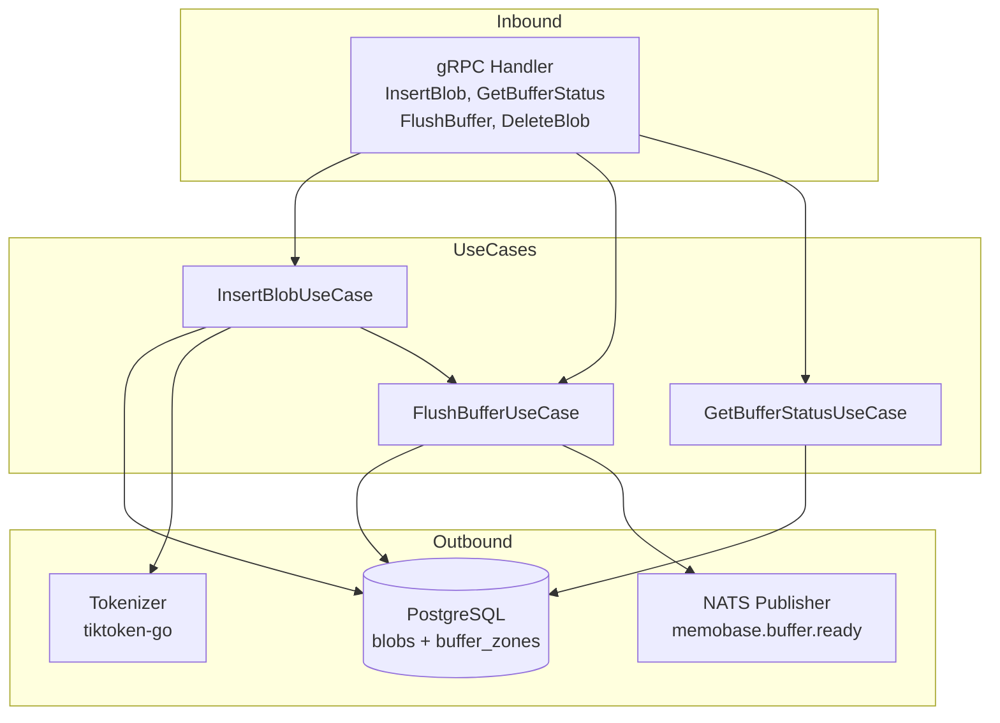

# memobase-ingestion — Service Architecture

> **Group**: Memobase | **Pattern**: 4-layer Clean Architecture

## Layer Structure

```
services/memobase-ingestion/
├── cmd/
│   └── main.go                    # Entry point, Wire init
├── internal/
│   ├── domain/                    # Layer 1: ZERO external imports
│   │   ├── model/
│   │   │   ├── blob.go            #   BlobType enum, ChatBlob, DocBlob, SummaryBlob
│   │   │   ├── buffer.go          #   BufferZone entity, BufferStatus FSM
│   │   │   └── event.go           #   BufferReadyEvent domain event
│   │   └── repository/
│   │       ├── blob_repo.go       #   BlobRepository interface
│   │       └── buffer_repo.go     #   BufferZoneRepository interface
│   ├── usecase/                   # Layer 2: imports domain only
│   │   ├── insert_blob.go        #   InsertBlobUseCase
│   │   ├── flush_buffer.go       #   FlushBufferUseCase
│   │   ├── get_buffer_status.go  #   GetBufferStatusUseCase
│   │   ├── port/
│   │   │   ├── input.go          #   BlobInserter, BufferFlusher interfaces
│   │   │   └── output.go         #   BlobStore, BufferStore, EventPublisher
│   │   └── dto/
│   │       ├── request.go
│   │       └── response.go
│   ├── adapter/                   # Layer 3: implements ports
│   │   ├── grpc/
│   │   │   ├── handler.go        #   gRPC service implementation
│   │   │   └── mapper.go         #   Proto ↔ Domain mapping
│   │   ├── repository/
│   │   │   └── postgres/
│   │   │       ├── blob_repo.go  #   PostgreSQL blob persistence
│   │   │       └── buffer_repo.go #  PostgreSQL buffer zone persistence
│   │   └── event/
│   │       └── nats_publisher.go  #   NATS: memobase.buffer.ready publisher
│   └── infra/                     # Layer 4: Frameworks & Drivers
│       ├── config/config.go       #   Viper configuration
│       ├── server/grpc.go         #   gRPC server setup
│       ├── telemetry/             #   OTel + Prometheus
│       └── wire/wire.go           #   Google Wire DI
├── docs/                          # Service documentation
└── specs/                         # Execution specs
```

## Dependency Rule

```
Domain ← Usecase ← Adapter ← Infra
(inner)                      (outer)

- Domain: BlobType, BufferStatus FSM states — ZERO imports
- Usecase: InsertBlobUseCase orchestrates blob storage + buffer check + flush trigger
- Adapter: gRPC handler maps proto→domain; PostgreSQL repos implement interfaces
- Infra: Wire wires everything; Viper loads config
```

## Component Diagram



## Key Design Decisions

1. **Token-Aware Batching**: Buffer zone accumulates blobs until `token_sum ≥ 1024`, avoiding hot-path LLM calls
2. **Status-Based Locking**: Optimistic concurrency via FSM status (`WHERE status=idle`) instead of DB locks
3. **Fire-and-Forget Flush**: Flush runs as background goroutine after InsertBlob returns
4. **Non-Persistent Blobs**: Raw blobs deleted after successful engine processing (configurable)

## External Dependencies

- **PostgreSQL**: Blob and buffer zone storage
- **NATS JetStream**: Publish `memobase.buffer.ready` events
- **tiktoken-go**: Token counting for buffer threshold check

## Known Limitations

- Parallel flush may cause duplicate processing (mitigated by status check)
- No dead-letter queue for permanently failed buffer entries
- Buffer idle timeout (1h) not yet implemented as cron/ticker
