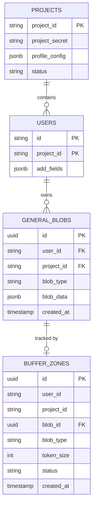

# memobase-ingestion — Data Model

> **Database**: PostgreSQL | **Isolation**: Composite PK `(id, project_id)`

## Tables

### general_blobs

| Column | Type | Constraints | Description |
|--------|------|-------------|-------------|
| id | UUID | PK | Blob unique identifier |
| user_id | VARCHAR(255) | NOT NULL, FK(users) | Owner user |
| project_id | VARCHAR(255) | NOT NULL, FK(projects) | Tenant isolation key |
| blob_type | VARCHAR(20) | NOT NULL | `chat`, `doc`, `summary` |
| blob_data | JSONB | NOT NULL | Blob payload (messages/content) |
| add_fields | JSONB | | Additional metadata |
| created_at | TIMESTAMPTZ | NOT NULL, DEFAULT NOW() | Creation time |
| updated_at | TIMESTAMPTZ | NOT NULL | Last update time |

### buffer_zones

| Column | Type | Constraints | Description |
|--------|------|-------------|-------------|
| id | UUID | PK | Buffer entry identifier |
| user_id | VARCHAR(255) | NOT NULL | Owner user |
| project_id | VARCHAR(255) | NOT NULL | Tenant isolation key |
| blob_id | UUID | FK(general_blobs.id) | Reference to stored blob |
| blob_type | VARCHAR(20) | NOT NULL | Blob type for processing routing |
| token_size | INTEGER | NOT NULL | tiktoken token count of blob |
| status | VARCHAR(20) | NOT NULL, DEFAULT 'idle' | FSM state: `idle`, `processing`, `done`, `failed` |
| created_at | TIMESTAMPTZ | NOT NULL, DEFAULT NOW() | Entry creation time |
| updated_at | TIMESTAMPTZ | NOT NULL | Last status change time |

## Entity-Relationship Diagram

## Index Strategy

| Table | Index | Columns | Purpose |
|-------|-------|---------|---------|
| general_blobs | idx_blobs_user_type | (user_id, project_id, blob_type) | Filter blobs by user and type |
| buffer_zones | idx_buffer_user_status | (user_id, project_id, blob_type, status) | Buffer query with status filter |
| buffer_zones | idx_buffer_status_idle | (status) WHERE status='idle' | Partial index for flush queries |

## Migration History

| Version | Date | Description |
|---------|------|-------------|
| 1.0.0 | 2026-05-09 | Initial schema (general_blobs, buffer_zones) |
