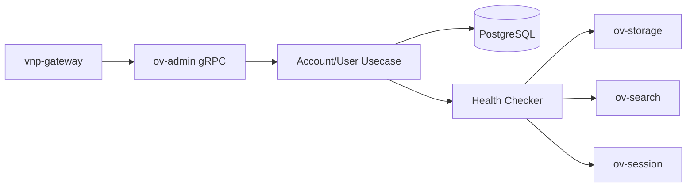

# ov-admin — Service Architecture

> **Group**: OpenViking | **Pattern**: 4-layer Clean Architecture

## Layer Structure

```
services/ov-admin/
├── cmd/server/main.go
├── internal/
│   ├── domain/
│   │   ├── model/
│   │   │   ├── account.go               # Account, AccountConfig
│   │   │   ├── user.go                  # User, Role enum (ROOT/ADMIN/USER/AGENT)
│   │   │   ├── agent.go                 # Agent, AgentConfig
│   │   │   ├── api_key.go              # APIKey, KeyStatus, ValidateResult
│   │   │   └── namespace.go            # NamespacePolicy, NamespaceURI
│   │   ├── repository/
│   │   │   ├── account_repo.go          # AccountRepository interface
│   │   │   ├── user_repo.go             # UserRepository interface
│   │   │   └── api_key_repo.go          # APIKeyRepository interface
│   │   ├── event.go                     # AccountCreated, UserDeleted events
│   │   └── errors.go                    # AccountNotFound, DuplicateUser, InvalidKey
│   ├── usecase/
│   │   ├── account_ops.go              # Account CRUD
│   │   ├── user_ops.go                 # User CRUD within accounts
│   │   ├── api_key_ops.go             # Key lifecycle: create → hash → validate → revoke
│   │   ├── health_ops.go              # Health aggregation fan-out
│   │   ├── port/
│   │   │   ├── input.go               # AccountUseCase, UserUseCase, APIKeyUseCase
│   │   │   └── output.go             # HashPort, HealthCheckerPort
│   │   └── dto/
│   ├── adapter/
│   │   ├── grpc/handler.go             # OvAdminService gRPC
│   │   ├── client/
│   │   │   └── health_client.go        # gRPC health check fan-out to 5 OV services
│   │   └── hasher/
│   │       └── argon2_hasher.go        # Argon2id hashing (delegates to ov-crypto)
│   └── infra/
│       ├── persistence/
│       │   ├── account_repo.go         # PostgreSQL account repository
│       │   ├── user_repo.go            # User persistence
│       │   └── api_key_repo.go         # API key hash persistence
│       ├── config/config.go
│       └── wire/wire.go
```

## Key Design Decisions

### Auth Mode Resolution (from `server/auth.py`)

```go
func resolveIdentity(ctx context.Context, mode AuthMode) (*Identity, error) {
    switch mode {
    case DEV:
        return &Identity{Role: ROOT, Account: "default"}, nil
    case TRUSTED:
        return extractFromHeaders(ctx), nil // Trust X-OpenViking-* headers
    case API_KEY:
        return validateAndResolve(ctx), nil  // Argon2id verify → identity
    }
}
```

### Namespace Isolation

URI-based namespace: `viking://{account_id}/{user_id}/{agent_id}/...`

Each API key is scoped to an account. Users cannot access resources outside their namespace unless they have ADMIN+ role within that account.

### Health Aggregation

Fan-out gRPC health checks to the active OV services using `errgroup`:

```go
services := []string{"ov-storage:9051", "ov-search:9052", "ov-session:9053"}
// Parallel health check → aggregate → return unified status
```

## External Dependencies

- **PostgreSQL**: Account, user, API key persistence
- **ov-storage**: Argon2id hashing (if delegated) or direct `crypto/argon2`
- **OV services**: Health aggregation via gRPC Health v1 (`ov-storage`, `ov-search`, `ov-session`)

## Component Diagram



## Known Limitations

- Health aggregation timeout: 5s per service (configurable)
- Argon2id hashing: ~100ms per key validation (CPU-intensive)
- No agent self-registration yet — agents created by users
