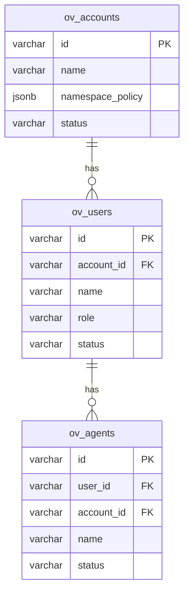

# ov-admin — Data Model

> **Database**: PostgreSQL

## Tables

### `ov_accounts`

| Column | Type | Constraints | Description |
|--------|------|-------------|-------------|
| `id` | VARCHAR(64) | PK | Account ID (human-readable, e.g., "acme-corp") |
| `name` | VARCHAR(256) | NOT NULL | Display name |
| `namespace_policy` | JSONB | DEFAULT '{}' | Isolation policy (max_users, storage_quota_mb) |
| `status` | VARCHAR(16) | NOT NULL DEFAULT 'active' | active / suspended / deleted |
| `metadata` | JSONB | | Custom account metadata |
| `created_at` | TIMESTAMPTZ | NOT NULL | |
| `updated_at` | TIMESTAMPTZ | NOT NULL | |

### `ov_users`

| Column | Type | Constraints | Description |
|--------|------|-------------|-------------|
| `id` | VARCHAR(64) | PK | User ID |
| `account_id` | VARCHAR(64) | FK → ov_accounts, NOT NULL | Parent account |
| `name` | VARCHAR(256) | NOT NULL | Display name |
| `role` | VARCHAR(16) | NOT NULL | root / admin / user / agent |
| `status` | VARCHAR(16) | NOT NULL DEFAULT 'active' | active / suspended |
| `metadata` | JSONB | | Custom user metadata |
| `created_at` | TIMESTAMPTZ | NOT NULL | |
| `updated_at` | TIMESTAMPTZ | NOT NULL | |

### `ov_agents`

| Column | Type | Constraints | Description |
|--------|------|-------------|-------------|
| `id` | VARCHAR(64) | PK | Agent ID |
| `user_id` | VARCHAR(64) | FK → ov_users, NOT NULL | Parent user |
| `account_id` | VARCHAR(64) | FK → ov_accounts, NOT NULL | Parent account |
| `name` | VARCHAR(256) | NOT NULL | Agent display name |
| `config` | JSONB | DEFAULT '{}' | Agent configuration |
| `status` | VARCHAR(16) | NOT NULL DEFAULT 'active' | active / disabled |
| `created_at` | TIMESTAMPTZ | NOT NULL | |

## Entity-Relationship Diagram

**Note**: API key hashes are managed by `ov-crypto` (see `ov_api_key_hashes` table in ov-crypto data model).

## Index Strategy

| Index | Columns | Type | Purpose |
|-------|---------|------|---------|
| `idx_users_account` | (account_id) | BTREE | Users per account |
| `idx_users_role` | (account_id, role) | BTREE | Role-based lookup |
| `idx_agents_user` | (user_id) | BTREE | Agents per user |
| `idx_agents_account` | (account_id) | BTREE | All agents in account |

## Migration History

| Version | Date | Description |
|---------|------|-------------|
| 1.0.0 | 2026-05-09 | Initial schema — accounts, users, agents |
