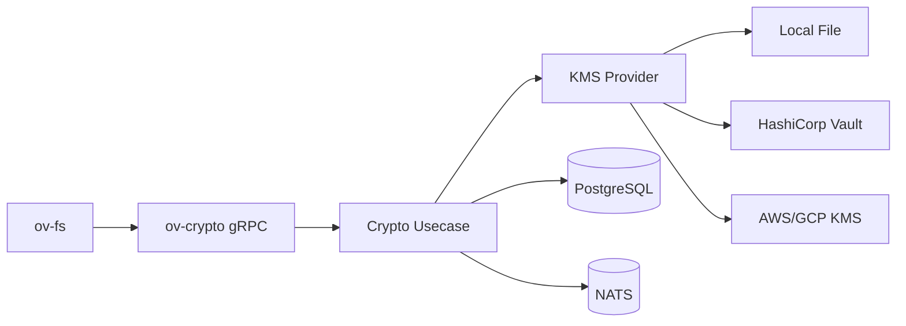

# ov-crypto — Service Architecture

> **Group**: OpenViking | **Pattern**: 4-layer Clean Architecture

## Layer Structure

```
services/ov-crypto/
├── cmd/server/main.go
├── internal/
│   ├── domain/
│   │   ├── model/
│   │   │   ├── envelope.go              # Envelope, EnvelopeHeader, ProviderType
│   │   │   ├── key.go                   # KeyMaterial, KeyVersion, KeyStatus
│   │   │   └── kms.go                   # KMSProvider interface
│   │   ├── repository/
│   │   │   └── key_repo.go              # KeyRepository interface (metadata)
│   │   ├── event.go                     # KeyRotated domain event
│   │   └── errors.go                    # AuthenticationFailed, CorruptedCiphertext, etc.
│   ├── usecase/
│   │   ├── encrypt.go                   # Envelope encryption pipeline
│   │   ├── decrypt.go                   # Envelope parsing + decryption
│   │   ├── key_rotation.go             # Key rotation orchestration
│   │   ├── key_status.go               # Key status queries
│   │   ├── port/
│   │   │   ├── input.go                # CryptoUseCase interface
│   │   │   └── output.go              # KMSProviderPort, EventPublisherPort
│   │   └── dto/
│   ├── adapter/
│   │   ├── grpc/handler.go              # OvCryptoService gRPC
│   │   ├── event/publisher.go           # NATS ov.crypto.key.rotated publisher
│   │   └── kms/
│   │       ├── local_provider.go        # Local file-based KMS (dev)
│   │       ├── vault_provider.go        # HashiCorp Vault KMS
│   │       └── cloud_provider.go        # AWS KMS / GCP KMS
│   └── infra/
│       ├── persistence/key_repo.go      # PostgreSQL key metadata
│       ├── config/config.go
│       └── wire/wire.go
```

## Key Design Decisions

### Envelope Encryption (from `encryptor.py`)

```
Encrypt:
  1. Generate random 32-byte File Key
  2. Generate random 12-byte Data IV
  3. AES-256-GCM encrypt plaintext with (File Key, Data IV)
  4. Encrypt File Key with Account Key (via KMS provider)
  5. Build OVE1 envelope: Magic + Version + Header + EFK + KIV + DIV + Ciphertext

Decrypt:
  1. Check OVE1 magic (files without magic → return as-is)
  2. Parse envelope header
  3. Decrypt File Key via KMS provider
  4. AES-256-GCM decrypt content
```

### Provider Abstraction (from `providers.py`)

All KMS providers implement `RootKeyProvider` interface:

```go
type KMSProvider interface {
    EncryptFileKey(fileKey []byte, accountID string) (encryptedKey, iv []byte, err error)
    DecryptFileKey(encryptedKey, iv []byte, accountID string) (fileKey []byte, err error)
    RotateRootKey() error
}
```

### Error Hierarchy (from `exceptions.py`)

- `EncryptionError` — base
- `InvalidMagicError` — not an OVE1 envelope
- `CorruptedCiphertextError` — envelope parse failure
- `AuthenticationFailedError` — AES-GCM auth tag mismatch
- `KeyMismatchError` — File Key decryption failed

## External Dependencies

- **KMS Backend**: Local/Vault/AWS/GCP for root key management
- **PostgreSQL**: Key metadata, rotation audit log
- **NATS**: Publish key rotation events

## Component Diagram



## Known Limitations

- Local file provider: single-machine only, not HA
- Key rotation re-wraps only — does not re-encrypt all file content
- Argon2id API key hashing is CPU-intensive (~100ms per verification)
