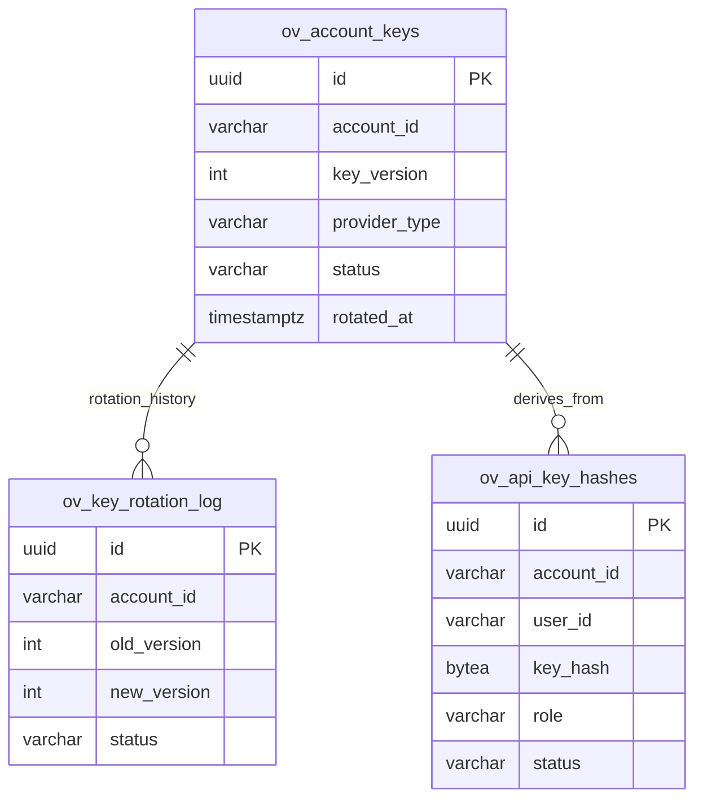

# ov-crypto — Data Model

> **Database**: PostgreSQL

## Tables

### `ov_account_keys`

| Column | Type | Constraints | Description |
|--------|------|-------------|-------------|
| `id` | UUID | PK | Key entry ID |
| `account_id` | VARCHAR(64) | NOT NULL, INDEX | Account (tenant) |
| `key_version` | INT | NOT NULL DEFAULT 1 | Key version (increments on rotation) |
| `provider_type` | VARCHAR(16) | NOT NULL | local / vault / aws_kms / gcp_kms |
| `encrypted_root_key` | BYTEA | | Provider-encrypted root key material (local only) |
| `key_reference` | TEXT | | KMS key ARN/path (Vault/Cloud) |
| `status` | VARCHAR(16) | NOT NULL DEFAULT 'active' | active / expired / revoked |
| `created_at` | TIMESTAMPTZ | NOT NULL | Key creation |
| `rotated_at` | TIMESTAMPTZ | | Last rotation timestamp |
| `expires_at` | TIMESTAMPTZ | | Optional expiration |

### `ov_key_rotation_log`

| Column | Type | Constraints | Description |
|--------|------|-------------|-------------|
| `id` | UUID | PK | Log entry ID |
| `account_id` | VARCHAR(64) | NOT NULL | Account |
| `old_version` | INT | NOT NULL | Previous key version |
| `new_version` | INT | NOT NULL | New key version |
| `reason` | TEXT | | Rotation reason |
| `initiated_by` | VARCHAR(64) | | User/system that triggered rotation |
| `status` | VARCHAR(16) | NOT NULL | completed / failed / in_progress |
| `files_re_wrapped` | INT | DEFAULT 0 | Number of file keys re-wrapped |
| `duration_ms` | INT | | Rotation duration |
| `created_at` | TIMESTAMPTZ | NOT NULL | |

### `ov_api_key_hashes`

| Column | Type | Constraints | Description |
|--------|------|-------------|-------------|
| `id` | UUID | PK | Key ID |
| `account_id` | VARCHAR(64) | NOT NULL, INDEX | Account scope |
| `user_id` | VARCHAR(64) | | User scope (optional) |
| `key_hash` | BYTEA | NOT NULL | Argon2id hash of raw API key |
| `key_prefix` | VARCHAR(8) | NOT NULL | First 8 chars for lookup |
| `role` | VARCHAR(16) | NOT NULL | root / admin / user / agent |
| `label` | VARCHAR(128) | | Human-readable label |
| `status` | VARCHAR(16) | NOT NULL DEFAULT 'active' | active / revoked |
| `last_used_at` | TIMESTAMPTZ | | Last validation timestamp |
| `created_at` | TIMESTAMPTZ | NOT NULL | |
| `expires_at` | TIMESTAMPTZ | | Optional expiration |

## Entity-Relationship Diagram

## Index Strategy

| Index | Columns | Type | Purpose |
|-------|---------|------|---------|
| `idx_keys_account_active` | (account_id, status) WHERE status='active' | BTREE | Active key lookup |
| `idx_keys_version` | (account_id, key_version DESC) | BTREE | Latest version |
| `idx_rotation_account` | (account_id, created_at DESC) | BTREE | Rotation audit log |
| `idx_api_prefix` | (key_prefix) | BTREE | Fast key prefix scan |
| `idx_api_account` | (account_id, status) | BTREE | Active keys per account |

## Migration History

| Version | Date | Description |
|---------|------|-------------|
| 1.0.0 | 2026-05-09 | Initial schema — keys, rotation log, API key hashes |
