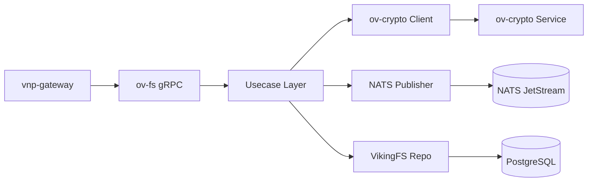

# ov-fs — Service Architecture

> **Group**: OpenViking | **Pattern**: 4-layer Clean Architecture

## Layer Structure

```
services/ov-fs/
├── cmd/server/main.go                  # Entry point, Wire init
├── internal/
│   ├── domain/                         # Layer 1: Domain entities, value objects
│   │   ├── model/
│   │   │   ├── file.go                 #   File, FileMetadata, DirEntry
│   │   │   ├── tree.go                 #   TreeNode, TreeOptions
│   │   │   ├── relation.go             #   FileRelation, RelationType
│   │   │   ├── context_level.go        #   L0/L1/L2 ContextLevel enum
│   │   │   └── lock.go                 #   LockType (point/subtree/mv)
│   │   ├── repository/
│   │   │   ├── file_repo.go            #   FileRepository interface
│   │   │   ├── relation_repo.go        #   RelationRepository interface
│   │   │   └── abstract_repo.go        #   AbstractRepository (tiered)
│   │   ├── event.go                    #   ContentWritten, ContentDeleted events
│   │   └── errors.go                   #   PathNotFound, PathExists, LockContention
│   ├── usecase/                        # Layer 2: Business logic
│   │   ├── file_ops.go                 #   ReadFile, WriteFile, DeleteFile
│   │   ├── dir_ops.go                  #   MkDir, ListDir, Tree
│   │   ├── search_ops.go              #   Grep, Glob
│   │   ├── move_ops.go                 #   Move (with mv lock)
│   │   ├── relation_ops.go             #   GetRelations, AddRelation
│   │   ├── port/
│   │   │   ├── input.go               #   FileUseCase, DirUseCase interfaces
│   │   │   └── output.go              #   EncryptionPort, EventPublisher
│   │   └── dto/
│   │       └── file_dto.go             #   Request/Response DTOs
│   ├── adapter/                        # Layer 3: Interface adapters
│   │   ├── grpc/
│   │   │   ├── handler.go              #   gRPC OvFsService implementation
│   │   │   └── mapper.go              #   Proto ↔ Domain mapping
│   │   ├── event/
│   │   │   ├── publisher.go            #   NATS event publisher
│   │   │   └── subscriber.go          #   Key rotation, memory extraction events
│   │   └── client/
│   │       └── crypto_client.go        #   ov-crypto gRPC client
│   └── infra/                          # Layer 4: Infrastructure
│       ├── persistence/
│       │   ├── vikingfs_repo.go        #   VikingFS + PostgreSQL file repository
│       │   ├── relation_repo.go        #   PostgreSQL relation repository
│       │   └── abstract_repo.go        #   Tiered abstract repository
│       ├── config/config.go
│       ├── server/grpc.go
│       ├── telemetry/
│       └── wire/wire.go
├── docs/                               # Service documentation
└── specs/                              # Execution specs
```

## Dependency Rule

```
Domain ← Usecase ← Adapter ← Infra
(inner)                      (outer)

- Domain: ZERO external imports — pure Go structs + interfaces
- Usecase: imports domain only; defines EncryptionPort, EventPublisher
- Adapter: implements ports; crypto_client calls ov-crypto gRPC
- Infra: wires everything via Google Wire
```

## Key Design Decisions

### VikingFS Engine

Go-native filesystem replacing Python RAGFS. Uses `viking://` URI scheme for path resolution. File content stored in PostgreSQL/SurrealDB with metadata; NOT local filesystem.

```
URI: viking://{account_id}/{user_id}/{agent_id}/path/to/file.md
     └── namespace ──────────────────┘ └── path ─────────────┘
```

### PathLock (Concurrent Access)

Three lock types for safe concurrent access (ported from Python `viking_fs.py`):

| Lock Type | Scope | Use Case |
|-----------|-------|----------|
| **Point** | Single file | Read/Write operations |
| **Subtree** | Directory + children | Tree operations, recursive delete |
| **Move** | Source + destination | Atomic move/rename |

Implementation: In-memory lock manager with timeout, backed by advisory locks in PostgreSQL for distributed deployments.

### Tiered Context (L0/L1/L2)

Each file stores 3 abstraction levels (ported from OpenViking `context.py`):

| Level | Size | Content |
|-------|------|---------|
| L0 | ~100 tokens | Abstract summary (one-liner) |
| L1 | ~2K tokens | Section overview (key points) |
| L2 | Full content | Complete file content |

Abstracts generated on write via LLM (async, cold-path) or provided by caller.

### Transparent Encryption

All file content passes through ov-crypto for envelope encryption:

```
WriteFile → ov-crypto.Encrypt(account_id, content) → store ciphertext
ReadFile  → load ciphertext → ov-crypto.Decrypt(account_id, ciphertext)
```

Files without `OVE1` magic header are treated as plaintext (backward-compatible).

## External Dependencies

- **VikingFS Backend**: PostgreSQL / SurrealDB for file content + metadata
- **ov-crypto**: gRPC client for envelope encryption/decryption
- **NATS JetStream**: Event publishing (content.written, content.deleted)
- **ov-search**: Indirect — consumes events for embedding + indexing

## Component Diagram



## Known Limitations

- PathLock is in-memory; requires advisory locks for multi-replica
- L0/L1 abstract generation requires LLM call (async cold-path)
- Large file support (>10MB) requires streaming gRPC implementation
