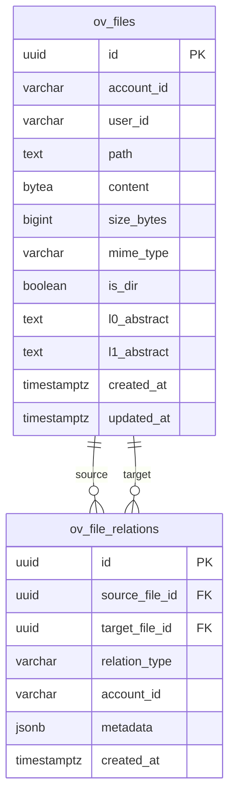

# ov-fs — Data Model

> **Database**: PostgreSQL / SurrealDB (via multi-backend adapter)

## Tables / Collections

### `ov_files` — File Content & Metadata

| Column | Type | Constraints | Description |
|--------|------|-------------|-------------|
| `id` | UUID | PK | File unique identifier |
| `account_id` | VARCHAR(64) | NOT NULL, INDEX | Tenant account |
| `user_id` | VARCHAR(64) | NOT NULL | File owner |
| `path` | TEXT | NOT NULL, UNIQUE(account_id, path) | VikingFS path |
| `content` | BYTEA | NOT NULL | Encrypted file content (OVE1 envelope) |
| `size_bytes` | BIGINT | NOT NULL | Original plaintext size |
| `mime_type` | VARCHAR(128) | | Detected content type |
| `is_dir` | BOOLEAN | NOT NULL DEFAULT false | Directory flag |
| `l0_abstract` | TEXT | | ~100 token summary |
| `l1_abstract` | TEXT | | ~2K token overview |
| `checksum` | VARCHAR(64) | | SHA-256 of plaintext |
| `created_at` | TIMESTAMPTZ | NOT NULL | Creation timestamp |
| `updated_at` | TIMESTAMPTZ | NOT NULL | Last modification |
| `deleted_at` | TIMESTAMPTZ | | Soft delete timestamp |

### `ov_file_relations` — Cross-File References

| Column | Type | Constraints | Description |
|--------|------|-------------|-------------|
| `id` | UUID | PK | Relation ID |
| `source_file_id` | UUID | FK → ov_files | Source file |
| `target_file_id` | UUID | FK → ov_files | Target file |
| `relation_type` | VARCHAR(32) | NOT NULL | `references`, `extracted_from`, `summarizes` |
| `account_id` | VARCHAR(64) | NOT NULL | Tenant isolation |
| `metadata` | JSONB | | Additional relation context |
| `created_at` | TIMESTAMPTZ | NOT NULL | |

## Entity-Relationship Diagram

## Index Strategy

| Index | Columns | Type | Purpose |
|-------|---------|------|---------|
| `idx_files_account_path` | (account_id, path) | UNIQUE | Fast path lookup per tenant |
| `idx_files_account_dir` | (account_id, is_dir) | BTREE | Directory listing |
| `idx_files_updated` | (account_id, updated_at) | BTREE | Recent changes query |
| `idx_relations_source` | (source_file_id) | BTREE | Forward relation lookup |
| `idx_relations_target` | (target_file_id) | BTREE | Backward relation lookup |

## Migration History

| Version | Date | Description |
|---------|------|-------------|
| 1.0.0 | 2026-05-09 | Initial schema — files + relations |
