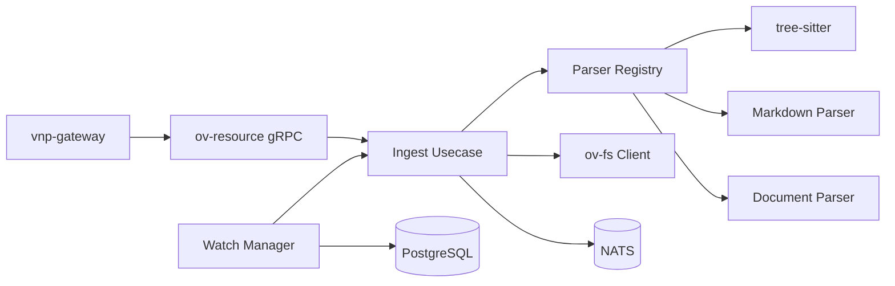

# ov-resource — Service Architecture

> **Group**: OpenViking | **Pattern**: 4-layer Clean Architecture

## Layer Structure

```
services/ov-resource/
├── cmd/server/main.go
├── internal/
│   ├── domain/
│   │   ├── model/
│   │   │   ├── resource.go              # Resource, ResourceType, IngestionResult
│   │   │   ├── chunk.go                 # Chunk, ChunkMetadata, AST node info
│   │   │   ├── watch.go                # WatchTask, WatchEvent, WatchStatus
│   │   │   └── parser.go               # ParserConfig, ParserType enum
│   │   ├── repository/
│   │   │   ├── resource_repo.go         # ResourceRepository interface
│   │   │   └── watch_repo.go            # WatchRepository interface
│   │   ├── event.go                     # ResourceIngested domain event
│   │   └── errors.go                    # UnsupportedFormat, ParseFailed
│   ├── usecase/
│   │   ├── ingest.go                    # Full pipeline: parse → chunk → write → notify
│   │   ├── parse.go                     # Parse-only (returns chunks)
│   │   ├── watch.go                     # Watch manager lifecycle
│   │   ├── refresh.go                   # Re-parse stale resources
│   │   ├── port/
│   │   │   ├── input.go                # IngestUseCase, ParseUseCase, WatchUseCase
│   │   │   └── output.go              # FileWriterPort, ParserPort, EventPublisherPort
│   │   └── dto/
│   ├── adapter/
│   │   ├── grpc/handler.go              # OvResourceService gRPC
│   │   ├── event/publisher.go           # NATS publisher
│   │   ├── parser/
│   │   │   ├── registry.go             # Parser registry (extension → parser)
│   │   │   ├── treesitter.go           # tree-sitter adapter (Code)
│   │   │   ├── markdown.go             # Markdown section parser
│   │   │   └── document.go             # PDF/DOCX page parser
│   │   └── client/
│   │       └── fs_client.go             # ov-fs gRPC client
│   └── infra/
│       ├── persistence/
│       │   ├── resource_repo.go         # PostgreSQL resource repository
│       │   └── watch_repo.go            # Watch task persistence
│       ├── config/config.go
│       └── wire/wire.go
```

## Key Design Decisions

### Parser Registry (from `pkg/parse/registry.go`)

Extension-based routing to parser implementations:

| Extensions | Parser | Details |
|-----------|--------|---------|
| `.go`, `.py`, `.js`, `.ts`, `.rs`, `.java` | tree-sitter | AST-aware: functions, classes, methods |
| `.md`, `.mdx` | Markdown | Section-based by heading level (H1-H6) |
| `.pdf`, `.docx` | Document | Page-based with configurable overlap |
| `.txt`, `.csv`, `.log` | Default | Paragraph-based (double newline) |

### Ingestion Pipeline

```
IngestRequest
  → Detect parser (by extension or force_parser)
  → Parse content → []Chunk
  → Write each chunk to ov-fs (with L0/L1 abstracts)
  → Publish ov.resource.ingested to NATS
  → Return IngestResponse (chunks_count, total_tokens)
```

### Watch Manager (from `watch_manager.py`)

Background goroutine that polls external directories at configurable intervals. Changes detected → auto-ingest. Watch tasks persist in PostgreSQL for restart recovery.

## External Dependencies

- **ov-fs**: Write parsed file content
- **NATS JetStream**: Publish `ov.resource.ingested`
- **PostgreSQL**: Watch tasks, ingestion metadata
- **tree-sitter**: Go bindings for AST parsing

## Component Diagram



## Known Limitations

- tree-sitter bindings require CGo (adds build complexity)
- PDF parsing quality varies; OCR not supported
- Watch manager uses polling (no inotify/fsnotify for remote mounts)
