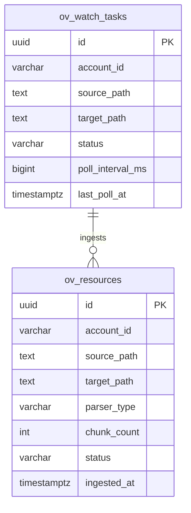

# ov-resource — Data Model

> **Database**: PostgreSQL

## Tables

### `ov_resources`

| Column | Type | Constraints | Description |
|--------|------|-------------|-------------|
| `id` | UUID | PK | Resource ID |
| `account_id` | VARCHAR(64) | NOT NULL, INDEX | Tenant account |
| `source_path` | TEXT | NOT NULL | Original source file path |
| `target_path` | TEXT | NOT NULL | VikingFS destination path |
| `filename` | VARCHAR(256) | NOT NULL | Original filename |
| `mime_type` | VARCHAR(128) | | Detected MIME type |
| `parser_type` | VARCHAR(32) | NOT NULL | treesitter / markdown / document / default |
| `chunk_count` | INT | NOT NULL DEFAULT 0 | Number of chunks produced |
| `total_tokens` | INT | NOT NULL DEFAULT 0 | Total token count |
| `content_hash` | VARCHAR(64) | NOT NULL | SHA-256 of source content |
| `status` | VARCHAR(16) | NOT NULL DEFAULT 'pending' | pending / processing / completed / failed |
| `error_message` | TEXT | | Error details if failed |
| `parse_duration_ms` | INT | | Parse execution time |
| `ingested_at` | TIMESTAMPTZ | | Completion timestamp |
| `created_at` | TIMESTAMPTZ | NOT NULL | |

### `ov_watch_tasks`

| Column | Type | Constraints | Description |
|--------|------|-------------|-------------|
| `id` | UUID | PK | Watch task ID |
| `account_id` | VARCHAR(64) | NOT NULL | Tenant account |
| `source_path` | TEXT | NOT NULL | External directory to watch |
| `target_path` | TEXT | NOT NULL | VikingFS destination |
| `patterns` | JSONB | DEFAULT '["**/*"]' | Glob patterns to include |
| `poll_interval_ms` | BIGINT | DEFAULT 30000 | Polling interval |
| `status` | VARCHAR(16) | NOT NULL DEFAULT 'active' | active / paused / deleted |
| `last_poll_at` | TIMESTAMPTZ | | Last poll timestamp |
| `files_tracked` | INT | DEFAULT 0 | Number of tracked files |
| `created_at` | TIMESTAMPTZ | NOT NULL | |
| `updated_at` | TIMESTAMPTZ | NOT NULL | |

## Entity-Relationship Diagram

## Index Strategy

| Index | Columns | Type | Purpose |
|-------|---------|------|---------|
| `idx_resources_account` | (account_id) | BTREE | Tenant-scoped queries |
| `idx_resources_hash` | (account_id, content_hash) | UNIQUE | Dedup on re-ingest |
| `idx_resources_status` | (status) | BTREE | Processing queue |
| `idx_watch_active` | (status, last_poll_at) | BTREE | Poll scheduler |

## Migration History

| Version | Date | Description |
|---------|------|-------------|
| 1.0.0 | 2026-05-09 | Initial schema — resources + watch tasks |
