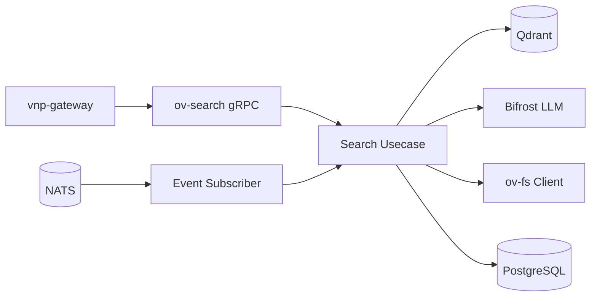

# ov-search — Service Architecture

> **Group**: OpenViking | **Pattern**: 4-layer Clean Architecture

## Layer Structure

```
services/ov-search/
├── cmd/server/main.go
├── internal/
│   ├── domain/
│   │   ├── model/
│   │   │   ├── search_result.go        # SearchResult, Score, MatchedContext
│   │   │   ├── hotness.go              # HotnessScore, DecayConfig
│   │   │   ├── embedding.go            # EmbeddingVector, UpsertPayload
│   │   │   └── context_type.go         # ContextType, QueryPlan, TypedQuery
│   │   ├── repository/
│   │   │   ├── vector_repo.go          # VectorRepository interface (upsert/search/delete)
│   │   │   └── hotness_repo.go         # HotnessRepository interface
│   │   ├── event.go                    # SearchCompleted, HotnessUpdated
│   │   └── errors.go                   # IndexNotFound, EmbeddingFailed
│   ├── usecase/
│   │   ├── hierarchical_search.go      # HierarchicalSearch pipeline (7 steps)
│   │   ├── context_retrieval.go        # RetrieveContext with tiered loading
│   │   ├── hotness.go                  # Hotness scoring + decay
│   │   ├── embedding_ops.go            # UpsertEmbedding, DeleteEmbedding
│   │   ├── port/
│   │   │   ├── input.go               # SearchUseCase, EmbeddingUseCase
│   │   │   └── output.go              # EmbedderPort, FileReaderPort, RerankPort
│   │   └── dto/
│   ├── adapter/
│   │   ├── grpc/handler.go             # OvSearchService gRPC
│   │   ├── event/subscriber.go         # ov.content.written/deleted subscribers
│   │   └── client/
│   │       ├── bifrost_client.go       # Embedding generation via Bifrost
│   │       └── fs_client.go            # ov-fs gRPC client for tiered loading
│   └── infra/
│       ├── persistence/
│       │   ├── qdrant_repo.go          # Qdrant vector repository
│       │   ├── pgvector_repo.go        # pgvector fallback
│       │   └── hotness_repo.go         # PostgreSQL hotness persistence
│       ├── config/config.go
│       └── wire/wire.go
```

## Core Algorithms & Design Decisions

### Hierarchical Search Pipeline (from `hierarchical_retriever.py`)

```
1. Query Intent Analysis (IntentAnalyzer)
2. Dense + Sparse Hybrid Vector Search (Qdrant)
3. Hierarchical Score Propagation (Child → Parent)
4. Hotness Score Integration (Recency/Frequency boost)
5. Convergence Detection (Stop radius expansion when delta < epsilon)
6. Cross-Encoder Reranking
7. Tiered Context Loading (L0 → L1 → L2)
```

### Hierarchical Score Propagation Algorithm

Child file scores bubble up to parent directories. A directory's score = max(child scores) × propagation_factor (default: 0.7). This allows searching at directory level.

### Hotness Scoring & Decay Algorithm

Hotness favors recently accessed/modified files. Uses exponential decay: `H(t) = H_0 * exp(-λ * Δt)`. Boosted by `ov.session.committed` events.

### Intent Analyzer (from `intent_analyzer.py`)

Classifies queries into typed queries: `code`, `documentation`, `memory`, `file_search` to optimize retrieval strategy.

## External Dependencies

- **Qdrant / pgvector**: Vector similarity search
- **Bifrost**: Embedding generation
- **ov-fs**: File content retrieval for tiered loading
- **PostgreSQL**: Hotness scores, search metadata

## Component Diagram



## Known Limitations

- Score propagation requires directory tree structure in memory
- Cross-encoder reranking adds ~100ms latency per query
- Hotness decay calculation is periodic (default: every 5 min)
