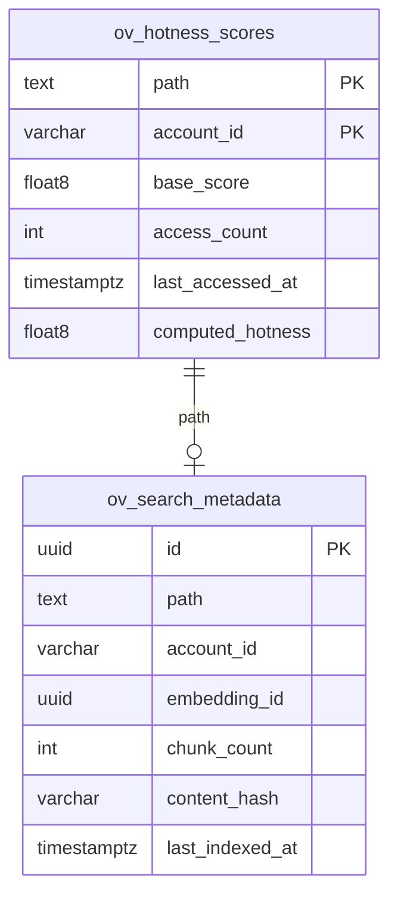

# ov-search — Data Model

> **Database**: Qdrant (vector) + PostgreSQL (metadata, hotness)

## Vector Store (Qdrant)

### Collection: `ov_embeddings`

| Field | Type | Description |
|-------|------|-------------|
| `id` | UUID | Embedding point ID |
| `vector` | float32[1536] | Dense embedding vector (text-embedding-3-large) |
| `sparse_vector` | sparse | BM25 sparse vector for hybrid search |

**Payload fields:**

| Field | Type | Description |
|-------|------|-------------|
| `path` | string | VikingFS file path |
| `account_id` | string | Tenant isolation |
| `user_id` | string | File owner |
| `content_hash` | string | SHA-256 of source content |
| `context_level` | string | L0 / L1 / L2 |
| `chunk_index` | int | Chunk position within file |
| `parent_dir` | string | Parent directory path (for score propagation) |
| `mime_type` | string | Content MIME type |
| `updated_at` | datetime | Last embedding update |

## PostgreSQL Tables

### `ov_hotness_scores`

| Column | Type | Constraints | Description |
|--------|------|-------------|-------------|
| `path` | TEXT | PK, NOT NULL | File path |
| `account_id` | VARCHAR(64) | PK, NOT NULL | Tenant isolation |
| `base_score` | FLOAT8 | NOT NULL DEFAULT 0 | Base relevance score |
| `access_count` | INT | NOT NULL DEFAULT 0 | Total access count |
| `last_accessed_at` | TIMESTAMPTZ | | Last access timestamp |
| `last_modified_at` | TIMESTAMPTZ | | Last content modification |
| `session_ref_count` | INT | NOT NULL DEFAULT 0 | Session reference count (recent) |
| `computed_hotness` | FLOAT8 | NOT NULL DEFAULT 0 | Computed hotness with decay |
| `updated_at` | TIMESTAMPTZ | NOT NULL | Last score computation |

### `ov_search_metadata`

| Column | Type | Constraints | Description |
|--------|------|-------------|-------------|
| `id` | UUID | PK | Metadata entry ID |
| `path` | TEXT | NOT NULL | File path |
| `account_id` | VARCHAR(64) | NOT NULL | Tenant isolation |
| `embedding_id` | UUID | FK → Qdrant point | Qdrant point reference |
| `chunk_count` | INT | NOT NULL | Number of chunks indexed |
| `total_tokens` | INT | NOT NULL | Total token count |
| `last_indexed_at` | TIMESTAMPTZ | NOT NULL | Last indexing timestamp |
| `content_hash` | VARCHAR(64) | NOT NULL | SHA-256 for staleness check |

## Entity-Relationship Diagram



## Index Strategy

| Index | Columns | Type | Purpose |
|-------|---------|------|---------|
| `idx_hotness_account` | (account_id) | BTREE | Tenant-scoped hotness queries |
| `idx_hotness_computed` | (account_id, computed_hotness DESC) | BTREE | Top-N hottest files |
| `idx_metadata_path` | (account_id, path) | UNIQUE | Fast path lookup |
| `idx_metadata_stale` | (last_indexed_at) | BTREE | Staleness detection |

## Qdrant Index Config

```json
{
  "collection": "ov_embeddings",
  "vectors": {
    "size": 1536,
    "distance": "Cosine",
    "on_disk": true
  },
  "sparse_vectors": {
    "bm25": { "modifier": "idf" }
  },
  "hnsw_config": { "m": 16, "ef_construct": 100 },
  "payload_index": ["account_id", "parent_dir"]
}
```

## Migration History

| Version | Date | Description |
|---------|------|-------------|
| 1.0.0 | 2026-05-09 | Initial schema — hotness + search metadata |
