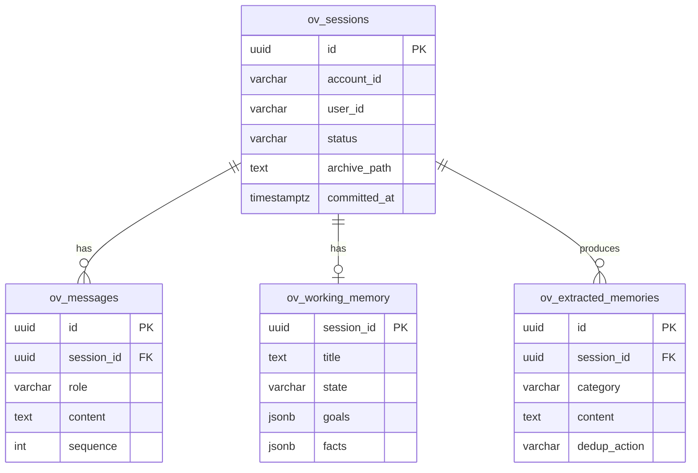

# ov-session — Data Model

> **Database**: PostgreSQL (primary)

## Tables

### `ov_sessions`

| Column | Type | Constraints | Description |
|--------|------|-------------|-------------|
| `id` | UUID | PK | Session ID |
| `account_id` | VARCHAR(64) | NOT NULL, INDEX | Tenant account |
| `user_id` | VARCHAR(64) | NOT NULL | Session owner |
| `agent_id` | VARCHAR(64) | NOT NULL DEFAULT 'default' | Agent identity |
| `title` | TEXT | | Session title |
| `status` | VARCHAR(16) | NOT NULL DEFAULT 'active' | active / committed / archived |
| `archive_path` | TEXT | | VikingFS path to archived conversation |
| `memories_count` | INT | DEFAULT 0 | Extracted memories count |
| `compression_version` | VARCHAR(4) | DEFAULT 'v2' | v1 (legacy) or v2 (template) |
| `metadata` | JSONB | | Custom session metadata |
| `created_at` | TIMESTAMPTZ | NOT NULL | |
| `committed_at` | TIMESTAMPTZ | | Commit timestamp |

### `ov_messages`

| Column | Type | Constraints | Description |
|--------|------|-------------|-------------|
| `id` | UUID | PK | Message ID |
| `session_id` | UUID | FK → ov_sessions, INDEX | Parent session |
| `role` | VARCHAR(16) | NOT NULL | user / assistant / system / tool |
| `content` | TEXT | NOT NULL | Message content |
| `tool_calls` | JSONB | | ToolCall array (if assistant) |
| `token_count` | INT | | Token count (tiktoken) |
| `sequence` | INT | NOT NULL | Message order within session |
| `created_at` | TIMESTAMPTZ | NOT NULL | |

### `ov_working_memory`

| Column | Type | Constraints | Description |
|--------|------|-------------|-------------|
| `session_id` | UUID | PK, FK → ov_sessions | One WM per session |
| `title` | TEXT | | Current task title |
| `state` | VARCHAR(16) | NOT NULL DEFAULT 'ongoing' | ongoing / paused / completed |
| `goals` | JSONB | DEFAULT '[]' | Active goals array |
| `facts` | JSONB | DEFAULT '[]' | Key facts `[{key, value, confidence}]` |
| `errors` | JSONB | DEFAULT '[]' | Errors `[{message, resolved}]` |
| `context` | JSONB | DEFAULT '{}' | Contextual metadata |
| `updated_at` | TIMESTAMPTZ | NOT NULL | Last WM update |

### `ov_extracted_memories`

| Column | Type | Constraints | Description |
|--------|------|-------------|-------------|
| `id` | UUID | PK | Memory ID |
| `session_id` | UUID | FK → ov_sessions | Source session |
| `account_id` | VARCHAR(64) | NOT NULL, INDEX | Tenant |
| `category` | VARCHAR(16) | NOT NULL | fact / preference / skill / procedure / tool_skill |
| `content` | TEXT | NOT NULL | Memory content |
| `confidence` | FLOAT8 | DEFAULT 1.0 | Extraction confidence |
| `dedup_action` | VARCHAR(8) | NOT NULL | CREATE / MERGE / SKIP / ARCHIVE |
| `fs_path` | TEXT | | VikingFS path where memory is stored |
| `created_at` | TIMESTAMPTZ | NOT NULL | |

## Entity-Relationship Diagram

## Index Strategy

| Index | Columns | Type | Purpose |
|-------|---------|------|---------|
| `idx_sessions_account_user` | (account_id, user_id) | BTREE | User session listing |
| `idx_sessions_status` | (account_id, status) | BTREE | Active session lookup |
| `idx_messages_session_seq` | (session_id, sequence) | BTREE | Ordered message retrieval |
| `idx_memories_account_cat` | (account_id, category) | BTREE | Memory by category |

## Migration History

| Version | Date | Description |
|---------|------|-------------|
| 1.0.0 | 2026-05-09 | Initial schema — sessions, messages, WM, memories |
