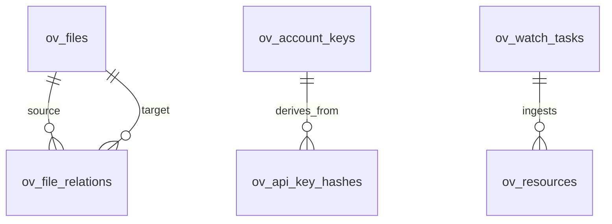

# ov-storage — Data Model

> **Service**: `ov-storage`  
> **Database**: PostgreSQL 17

---

## Tables / Collections

### File System (`ov-fs` origin)

#### `ov_files` — File Content & Metadata
| Column | Type | Constraints | Description |
|--------|------|-------------|-------------|
| `id` | UUID | PK | File unique identifier |
| `account_id` | VARCHAR(64) | NOT NULL, INDEX | Tenant account |
| `path` | TEXT | NOT NULL, UNIQUE(account, path) | VikingFS path |
| `content` | BYTEA | NOT NULL | Encrypted file content (OVE1 envelope) |
| `is_dir` | BOOLEAN | NOT NULL DEFAULT false | Directory flag |
| `l0_abstract` | TEXT | | ~100 token summary |
| `l1_abstract` | TEXT | | ~2K token overview |

#### `ov_file_relations` — Cross-File References
| Column | Type | Constraints | Description |
|--------|------|-------------|-------------|
| `id` | UUID | PK | Relation ID |
| `source_file_id` | UUID | FK → ov_files | Source file |
| `target_file_id` | UUID | FK → ov_files | Target file |
| `relation_type` | VARCHAR(32) | NOT NULL | `references`, `extracted_from`, `summarizes` |

### Cryptography (`ov-crypto` origin)

#### `ov_account_keys`
| Column | Type | Constraints | Description |
|--------|------|-------------|-------------|
| `id` | UUID | PK | Key entry ID |
| `account_id` | VARCHAR(64) | NOT NULL, INDEX | Account (tenant) |
| `key_version` | INT | NOT NULL DEFAULT 1 | Key version (increments on rotation) |
| `provider_type` | VARCHAR(16) | NOT NULL | local / vault / aws_kms |

#### `ov_api_key_hashes`
| Column | Type | Constraints | Description |
|--------|------|-------------|-------------|
| `id` | UUID | PK | Key ID |
| `account_id` | VARCHAR(64) | NOT NULL, INDEX | Account scope |
| `key_hash` | BYTEA | NOT NULL | Argon2id hash of raw API key |
| `role` | VARCHAR(16) | NOT NULL | root / admin / user / agent |

### Resource Ingestion (`ov-resource` origin)

#### `ov_resources`
| Column | Type | Constraints | Description |
|--------|------|-------------|-------------|
| `id` | UUID | PK | Resource ID |
| `source_path` | TEXT | NOT NULL | Original source file path |
| `target_path` | TEXT | NOT NULL | VikingFS destination path |
| `parser_type` | VARCHAR(32) | NOT NULL | treesitter / markdown / document |
| `status` | VARCHAR(16) | NOT NULL | pending / processing / completed |

#### `ov_watch_tasks`
| Column | Type | Constraints | Description |
|--------|------|-------------|-------------|
| `id` | UUID | PK | Watch task ID |
| `source_path` | TEXT | NOT NULL | External directory to watch |
| `poll_interval_ms` | BIGINT | DEFAULT 30000 | Polling interval |
| `status` | VARCHAR(16) | NOT NULL | active / paused |

## Entity-Relationship Diagram

