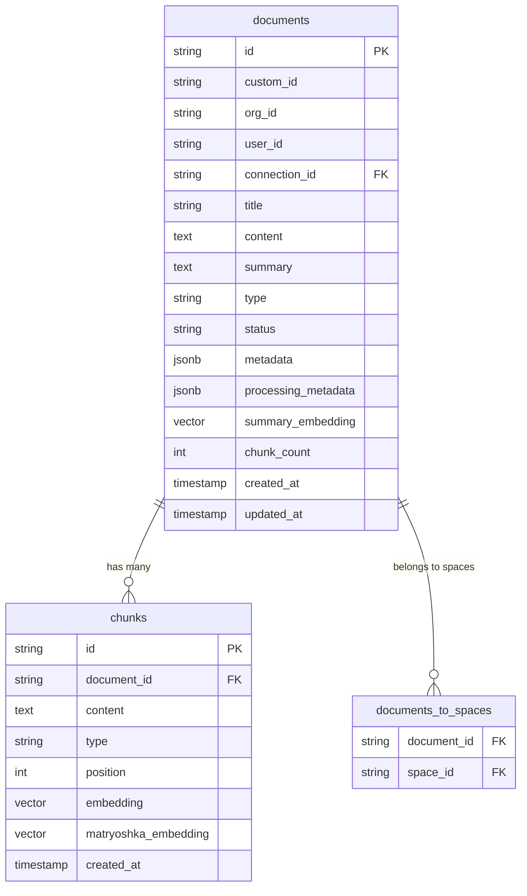

# sm-document — Data Model

> **Database**: PostgreSQL + pgvector

## Tables

### documents

| Column | Type | Constraints | Description |
|--------|------|-------------|-------------|
| id | VARCHAR(26) | PK | NanoID |
| custom_id | VARCHAR(255) | UNIQUE(org_id, custom_id) | External system ID |
| content_hash | VARCHAR(64) | | SHA-256 hash for dedup |
| org_id | VARCHAR(36) | NOT NULL, INDEX | Organization isolation |
| user_id | VARCHAR(36) | NOT NULL | Document owner |
| connection_id | VARCHAR(36) | FK → connections | Source connection |
| title | TEXT | | Extracted/provided title |
| content | TEXT | | Raw content or URL |
| summary | TEXT | | LLM-generated summary |
| url | TEXT | | Source URL |
| source | VARCHAR(50) | | Origin: web, api, connector |
| type | VARCHAR(20) | NOT NULL, DEFAULT 'text' | text/pdf/tweet/google_doc/image/video/notion_doc/webpage/onedrive |
| status | VARCHAR(20) | NOT NULL, DEFAULT 'unknown' | Processing FSM status |
| metadata | JSONB | | User-defined key-value |
| processing_metadata | JSONB | | Pipeline step tracking |
| raw | BYTEA | | Original binary content |
| og_image | TEXT | | Open Graph image URL |
| token_count | INT | | Content token count |
| word_count | INT | | Content word count |
| chunk_count | INT | DEFAULT 0 | Number of chunks |
| average_chunk_size | INT | | Mean chunk token size |
| summary_embedding | VECTOR(1536) | | Document-level embedding |
| summary_embedding_model | VARCHAR(100) | | Model used for embedding |
| created_at | TIMESTAMPTZ | NOT NULL, DEFAULT NOW() | |
| updated_at | TIMESTAMPTZ | NOT NULL, DEFAULT NOW() | |

### chunks

| Column | Type | Constraints | Description |
|--------|------|-------------|-------------|
| id | VARCHAR(26) | PK | NanoID |
| document_id | VARCHAR(26) | FK → documents, ON DELETE CASCADE | Parent document |
| content | TEXT | NOT NULL | Chunk text content |
| embedded_content | TEXT | | Optimized text for embedding |
| type | VARCHAR(10) | DEFAULT 'text' | text or image |
| position | INT | NOT NULL | Order within document |
| metadata | JSONB | | Chunk-level metadata |
| embedding | VECTOR(1536) | | Primary embedding |
| embedding_model | VARCHAR(100) | | Model version |
| matryoshka_embedding | VECTOR(256) | | Compact embedding for fast filtering |
| matryoshka_embedding_model | VARCHAR(100) | | Model version |
| created_at | TIMESTAMPTZ | NOT NULL, DEFAULT NOW() | |

### documents_to_spaces

| Column | Type | Constraints | Description |
|--------|------|-------------|-------------|
| document_id | VARCHAR(26) | FK → documents | |
| space_id | VARCHAR(26) | FK → spaces (sm-project) | |
| | | PK(document_id, space_id) | Composite key |

## Entity-Relationship Diagram

## Index Strategy

| Index | Columns | Type | Purpose |
|-------|---------|------|---------|
| idx_doc_org | org_id | B-tree | Tenant isolation |
| idx_doc_org_status | (org_id, status) | B-tree | Processing queue |
| idx_doc_custom_id | (org_id, custom_id) | B-tree UNIQUE | Dedup by custom ID |
| idx_doc_connection | connection_id | B-tree | Connector lookups |
| idx_doc_created | (org_id, created_at DESC) | B-tree | List pagination |
| idx_chunk_doc | document_id | B-tree | Chunk lookup |
| idx_chunk_embedding | embedding | HNSW (pgvector) | Vector search |
| idx_chunk_matryoshka | matryoshka_embedding | HNSW (pgvector) | Fast pre-filtering |
| idx_doc_summary_emb | summary_embedding | HNSW (pgvector) | Document-level search |
| idx_doc_metadata | metadata | GIN | Metadata filter queries |

## Migration History

| Version | Date | Description |
|---------|------|-------------|
| 1.0.0 | 2026-05-09 | Initial schema: documents, chunks, documents_to_spaces |
| 1.1.0 | 2026-05-10 | Add matryoshka embeddings, content_hash, processing_metadata |
