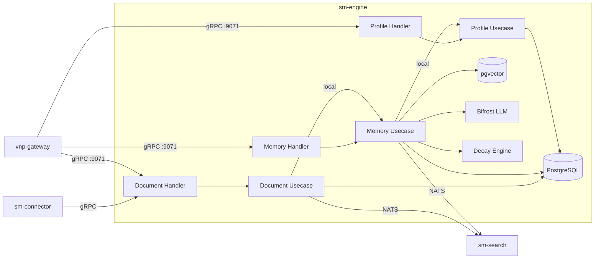

# sm-engine — Architecture

> **Pattern**: Functional Merge (Linear Chain: Document → Memory → Profile → Single Binary)

---

## Internal Layer Structure

```
services/sm-engine/
├── cmd/server/main.go
├── internal/
│   ├── domain/
│   │   ├── document/   # Document, Chunk, ContentExtraction, SourceType
│   │   ├── memory/     # Memory, Relation, ForgettingCurve, DecayFunction
│   │   └── profile/    # Profile, StaticPreference, DynamicTrait, TraitCategory
│   ├── usecase/
│   │   ├── document/   # CreateDocument (triggers memory extraction LOCALLY)
│   │   │               # GetChunks, DeleteDocument, UpdateDocument
│   │   ├── memory/     # CreateMemory (triggers profile update LOCALLY)
│   │   │               # ForgetMemory (Ebbinghaus decay), CreateRelation
│   │   └── profile/    # GetProfile, UpdateProfile, GetDynamicTraits
│   ├── adapter/
│   │   ├── grpc/
│   │   │   ├── document_handler.go   # SmDocumentService (proto unchanged)
│   │   │   ├── memory_handler.go     # SmMemoryService (proto unchanged)
│   │   │   └── profile_handler.go    # SmProfileService (proto unchanged)
│   │   ├── repository/
│   │   │   └── postgres/   # Documents, chunks, memories, relations, profiles
│   │   └── event/nats/
│   │       └── publisher.go   # sm.engine.document.created, sm.engine.memory.created,
│   │                          # sm.engine.memory.forgotten
│   └── infra/
│       ├── config/config.go
│       ├── server/grpc.go     # Register 3 gRPC services on :9071
│       ├── llm/bifrost.go     # Memory extraction, trait inference
│       ├── decay/ebbinghaus.go # Forgetting curve implementation
│       └── wire/wire.go
```

## Key Design Decisions

1. **Linear chain becomes local**: `CreateDocument → extract memories → update profile` previously required 3 NATS hops across 3 services. Now single in-process workflow.
2. **Forgetting curve preserved**: Ebbinghaus decay calculation unchanged — memories have strength that decays over time. Background worker periodically recalculates.
3. **External events for search**: `sm.engine.document.created` and `sm.engine.memory.created` → sm-search for index updates. `sm.engine.memory.forgotten` → sm-search for index removal.
4. **sm-connector interface**: sm-connector creates documents via SmDocumentService gRPC — interface unchanged.

## External Dependencies

| Dependency | Purpose |
|-----------|---------|
| PostgreSQL + pgvector | Documents, chunks, memories, profiles, embeddings |
| Redis | Profile cache, decay calculation cache |
| NATS | Engine events → sm-search, sm-connector |
| Bifrost (LLM) | Memory extraction from documents, profile trait inference |

## Component Diagram



## Known Limitations

- Forgetting curve decay requires periodic background recalculation — dedicated goroutine
- LLM-bound memory extraction needs bulkhead isolation from CRUD operations
- Profile trait categories are engine-specific — may not be compatible across engines
