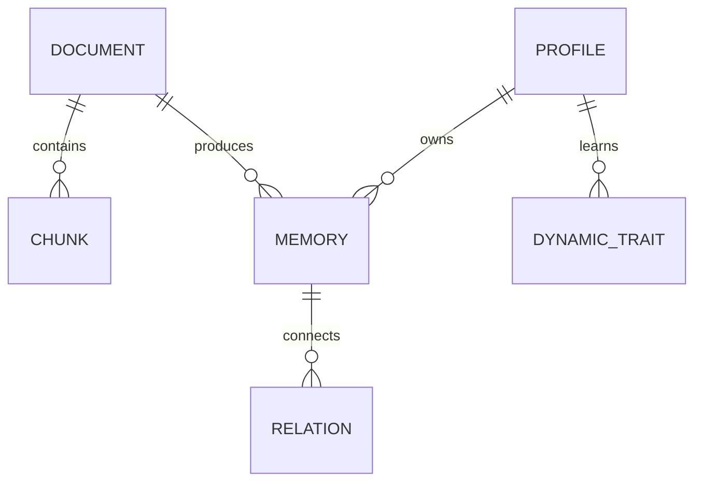

# sm-engine — Data Model

> **Service**: `sm-engine`  
> **Status**: Ready

---

## Tables / Collections

`sm-engine` manages data across the Document, Memory, and Profile domains, stored together in a single PostgreSQL database to support the local workflow.

### Document Domain
- `documents`: Stores document metadata (id, source_type, created_at) and extracted metadata.
- `chunks`: Stores format-aware text chunks (id, document_id, content) and pgvector embeddings.

### Memory Domain
- `memories`: Stores extracted facts (id, document_id, content, access_count, relevance_score, last_accessed_at, strength). Used by the Ebbinghaus Decay worker.
- `relations`: Stores knowledge graph edges between memories (id, memory_id_1, memory_id_2, relation_type).

### Profile Domain
- `profiles`: Stores core user profile identity and static preferences.
- `dynamic_traits`: Stores inferred traits over time based on memory events (id, profile_id, category, value, confidence_score).

## Entity-Relationship Diagram

## Index Strategy

- `documents(id)`
- `chunks(document_id)`
- `chunks(embedding) vector_cosine_ops` (pgvector HNSW)
- `memories(last_accessed_at)` (for decay worker scanning)
- `dynamic_traits(profile_id)`

## Migration History

| Version | Date | Description |
|---------|------|-------------|
| 001 | 2026-05-11 | Initial consolidated schema for sm-engine |
