# sm-memory — Data Model

> **Database**: PostgreSQL + pgvector

## Tables

### memory_entries

| Column | Type | Constraints | Description |
|--------|------|-------------|-------------|
| id | VARCHAR(26) | PK | NanoID |
| memory | TEXT | NOT NULL | Memory content |
| space_id | VARCHAR(26) | FK → spaces | Scope container |
| org_id | VARCHAR(36) | NOT NULL, INDEX | Org isolation |
| user_id | VARCHAR(36) | | Memory owner |
| version | INT | DEFAULT 1 | Version in chain |
| is_latest | BOOL | DEFAULT true | Latest in chain |
| parent_memory_id | VARCHAR(26) | FK → memory_entries | Previous version |
| root_memory_id | VARCHAR(26) | FK → memory_entries | Chain root |
| memory_relations | JSONB | DEFAULT '{}' | map[id] → relation_type |
| source_count | INT | DEFAULT 1 | Number of source documents |
| is_inference | BOOL | DEFAULT false | System-generated |
| is_forgotten | BOOL | DEFAULT false | Decayed by forgetting curve |
| is_static | BOOL | DEFAULT false | Exempt from forgetting |
| forget_after | TIMESTAMPTZ | | Explicit expiry |
| forget_reason | TEXT | | Reason for forgetting |
| memory_embedding | VECTOR(1536) | | Primary embedding |
| metadata | JSONB | | User metadata |
| created_at | TIMESTAMPTZ | NOT NULL | |
| updated_at | TIMESTAMPTZ | NOT NULL | |

### memory_document_sources

| Column | Type | Constraints | Description |
|--------|------|-------------|-------------|
| memory_entry_id | VARCHAR(26) | FK → memory_entries | |
| document_id | VARCHAR(26) | FK → documents | Source document |
| relevance_score | INT | DEFAULT 100 | 0-100 relevance |
| metadata | JSONB | | Link metadata |
| added_at | TIMESTAMPTZ | NOT NULL | |
| | | PK(memory_entry_id, document_id) | Composite |

## Entity-Relationship Diagram

```mermaid
erDiagram
    memory_entries ||--o{ memory_document_sources : "sourced from"
    memory_entries ||--o| memory_entries : "parent of"
    memory_entries {
        string id PK
        text memory
        string space_id FK
        string org_id
        int version
        bool is_latest
        string parent_memory_id FK
        string root_memory_id FK
        jsonb memory_relations
        bool is_forgotten
        bool is_static
        vector memory_embedding
        timestamp created_at
    }
    memory_document_sources {
        string memory_entry_id FK
        string document_id FK
        int relevance_score
        timestamp added_at
    }
```

## Index Strategy

| Index | Columns | Type | Purpose |
|-------|---------|------|---------|
| idx_memory_org_space | (org_id, space_id, is_latest, is_forgotten) | B-tree | List queries |
| idx_memory_root | root_memory_id | B-tree | Version chain traversal |
| idx_memory_parent | parent_memory_id | B-tree | Parent lookup |
| idx_memory_embedding | memory_embedding | HNSW | Similarity search / dedup |
| idx_memory_source_doc | document_id (on memory_document_sources) | B-tree | Source lookups |

## Migration History

| Version | Date | Description |
|---------|------|-------------|
| 1.0.0 | 2026-05-09 | Initial schema |
| 1.1.0 | 2026-05-10 | Add forgetting curve fields, version chain, memory_relations |
