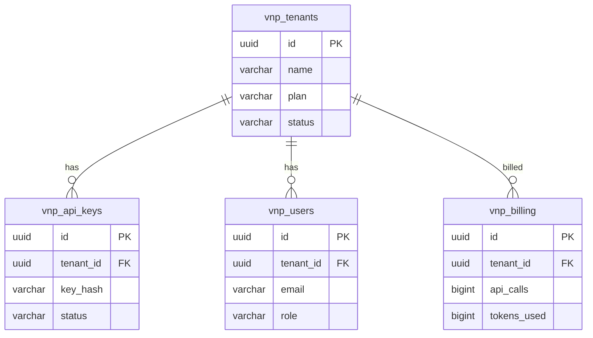

# vnp-admin — Data Model

> **Database**: PostgreSQL

## Tables

### `vnp_tenants`

| Column | Type | Constraints | Description |
|--------|------|-------------|-------------|
| `id` | UUID | PK | Tenant ID |
| `name` | VARCHAR(256) | NOT NULL, UNIQUE | Tenant name |
| `slug` | VARCHAR(64) | NOT NULL, UNIQUE | URL-safe identifier |
| `plan` | VARCHAR(32) | NOT NULL DEFAULT 'free' | free / pro / enterprise |
| `config` | JSONB | DEFAULT '{}' | Tenant-level config overrides |
| `max_users` | INT | DEFAULT 10 | Max users per tenant |
| `storage_quota_mb` | BIGINT | DEFAULT 1024 | Storage quota |
| `status` | VARCHAR(16) | NOT NULL DEFAULT 'active' | active / suspended / deleted |
| `created_at` | TIMESTAMPTZ | NOT NULL | |
| `updated_at` | TIMESTAMPTZ | NOT NULL | |

### `vnp_api_keys`

| Column | Type | Constraints | Description |
|--------|------|-------------|-------------|
| `id` | UUID | PK | Key ID |
| `tenant_id` | UUID | FK → vnp_tenants | Owning tenant |
| `key_hash` | VARCHAR(128) | NOT NULL | SHA-256 hash of raw key |
| `key_prefix` | VARCHAR(8) | NOT NULL, INDEX | First 8 chars for lookup |
| `label` | VARCHAR(128) | | Human-readable label |
| `scopes` | JSONB | DEFAULT '["*"]' | Allowed API scopes |
| `rate_limit` | INT | DEFAULT 1000 | Requests per minute |
| `status` | VARCHAR(16) | NOT NULL DEFAULT 'active' | active / revoked |
| `last_used_at` | TIMESTAMPTZ | | |
| `created_at` | TIMESTAMPTZ | NOT NULL | |
| `expires_at` | TIMESTAMPTZ | | |

### `vnp_users`

| Column | Type | Constraints | Description |
|--------|------|-------------|-------------|
| `id` | UUID | PK | User ID |
| `tenant_id` | UUID | FK → vnp_tenants | Parent tenant |
| `email` | VARCHAR(256) | NOT NULL | User email |
| `name` | VARCHAR(256) | | Display name |
| `role` | VARCHAR(16) | NOT NULL DEFAULT 'user' | admin / user |
| `status` | VARCHAR(16) | NOT NULL DEFAULT 'active' | active / suspended |
| `created_at` | TIMESTAMPTZ | NOT NULL | |

### `vnp_billing`

| Column | Type | Constraints | Description |
|--------|------|-------------|-------------|
| `id` | UUID | PK | Billing entry ID |
| `tenant_id` | UUID | FK → vnp_tenants | Billing tenant |
| `period_start` | DATE | NOT NULL | Billing period start |
| `period_end` | DATE | NOT NULL | Billing period end |
| `api_calls` | BIGINT | DEFAULT 0 | Total API calls |
| `tokens_used` | BIGINT | DEFAULT 0 | LLM tokens consumed |
| `storage_used_mb` | BIGINT | DEFAULT 0 | Storage used |
| `status` | VARCHAR(16) | DEFAULT 'active' | active / invoiced / paid |

## Entity-Relationship Diagram

## Index Strategy

| Index | Columns | Type | Purpose |
|-------|---------|------|---------|
| `idx_keys_prefix` | (key_prefix) | BTREE | Fast key prefix scan |
| `idx_keys_tenant` | (tenant_id, status) | BTREE | Active keys per tenant |
| `idx_users_tenant` | (tenant_id) | BTREE | Users per tenant |
| `idx_billing_period` | (tenant_id, period_start) | BTREE | Billing lookup |
