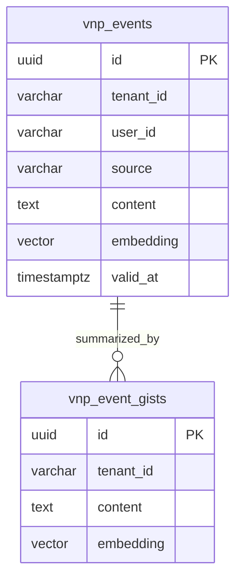

# vnp-event — Data Model

> **Database**: PostgreSQL + pgvector

## Tables

### `vnp_events`

| Column | Type | Constraints | Description |
|--------|------|-------------|-------------|
| `id` | UUID | PK | Event ID |
| `tenant_id` | VARCHAR(64) | NOT NULL, INDEX | Tenant isolation |
| `user_id` | VARCHAR(64) | NOT NULL | Event owner |
| `source` | VARCHAR(32) | NOT NULL | MEMOBASE / GRAPHITI / COGNEE / OPENVIKING |
| `event_type` | VARCHAR(64) | NOT NULL | Domain-specific event type |
| `content` | TEXT | NOT NULL | Event content / summary |
| `tags` | TEXT[] | DEFAULT '{}' | Searchable tags |
| `embedding` | vector(1536) | | pgvector embedding for semantic search |
| `metadata` | JSONB | DEFAULT '{}' | Source-specific metadata |
| `valid_at` | TIMESTAMPTZ | | Temporal validity start |
| `invalid_at` | TIMESTAMPTZ | | Temporal validity end |
| `created_at` | TIMESTAMPTZ | NOT NULL | Event creation |

### `vnp_event_gists`

| Column | Type | Constraints | Description |
|--------|------|-------------|-------------|
| `id` | UUID | PK | Gist ID |
| `tenant_id` | VARCHAR(64) | NOT NULL, INDEX | Tenant isolation |
| `user_id` | VARCHAR(64) | NOT NULL | |
| `content` | TEXT | NOT NULL | Summarized gist |
| `source_event_ids` | UUID[] | | Source events |
| `embedding` | vector(1536) | | Semantic search embedding |
| `created_at` | TIMESTAMPTZ | NOT NULL | |

## Entity-Relationship Diagram

## Index Strategy

| Index | Columns | Type | Purpose |
|-------|---------|------|---------|
| `idx_events_tenant_user` | (tenant_id, user_id) | BTREE | User event listing |
| `idx_events_source` | (tenant_id, source) | BTREE | Events by source engine |
| `idx_events_time` | (tenant_id, created_at DESC) | BTREE | Timeline query |
| `idx_events_embedding` | (embedding) | HNSW (cosine) | Semantic event search |
| `idx_events_tags` | (tags) | GIN | Tag-based filtering |
| `idx_gists_embedding` | (embedding) | HNSW (cosine) | Semantic gist search |
