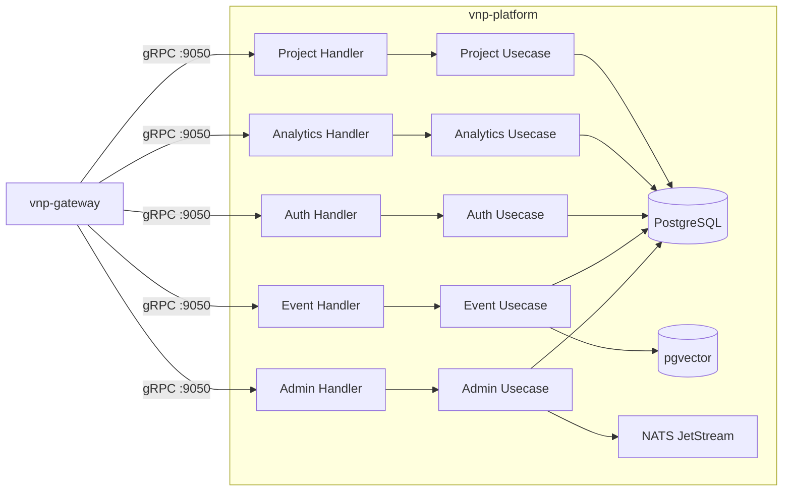

# vnp-platform — Architecture

> **Service**: `vnp-platform` | **Pattern**: Gateway + Domain Services, Clean Architecture

---

## Internal Layer Structure

```
services/vnp-platform/
├── cmd/server/main.go              # Entry point, Wire injection
├── internal/
│   ├── domain/                     # Layer 1: ZERO external imports
│   │   ├── admin/                  #   Tenant, User, APIKey entities
│   │   ├── event/                  #   UserEvent, Timeline, EventGist
│   │   ├── auth/                   #   JWT Claims, RBAC Policy, Organization
│   │   ├── analytics/              #   UsageRecord, TokenEconomics
│   │   └── project/                #   Space, ContainerTag, Membership
│   ├── usecase/                    # Layer 2: imports domain only
│   │   ├── admin/                  #   Tenant CRUD, User CRUD, APIKey lifecycle
│   │   ├── event/                  #   Event creation, timeline, search
│   │   ├── auth/                   #   JWT validation, API key auth, RBAC check
│   │   ├── analytics/              #   Usage tracking, report generation
│   │   ├── project/                #   Space CRUD, tag management
│   │   └── port/                   #   Input/Output port interfaces
│   ├── adapter/                    # Layer 3: implements ports
│   │   ├── grpc/                   #   7 gRPC service handlers
│   │   │   ├── admin_handler.go    #     VnpAdminService
│   │   │   ├── event_handler.go    #     VnpEventService
│   │   │   ├── ov_admin_handler.go #     OvAdminService (projected from ov-admin)
│   │   │   ├── zep_admin_handler.go#     ZepAdminService (projected from zep-admin)
│   │   │   ├── auth_handler.go     #     SmAuthService (projected from sm-auth)
│   │   │   ├── analytics_handler.go#     SmAnalyticsService
│   │   │   └── project_handler.go  #     SmProjectService
│   │   ├── repository/
│   │   │   └── postgres/           #     All admin/event/auth tables
│   │   └── event/
│   │       └── nats/               #     NATS publisher/subscriber
│   └── infra/                      # Layer 4: Frameworks & Drivers
│       ├── config/config.go
│       ├── server/grpc.go          #   Register ALL 7 gRPC services on :9050
│       └── wire/wire.go
├── Dockerfile
└── README.md
```

## Key Design Decisions

1. **7 gRPC services, 1 binary**: All admin-related proto services registered on same gRPC server. Proto definitions unchanged — backward compatible.
2. **Sub-domain isolation**: Each domain (admin, event, auth, analytics, project) has its own domain/usecase packages. No cross-domain imports at domain layer.
3. **Unified PostgreSQL**: All tables in single PostgreSQL database with schema-level isolation.
4. **NATS events**: Publishes `admin.tenant.created`, `admin.tenant.deleted` → all services subscribe for cascade operations.

## External Dependencies

| Dependency | Purpose |
|-----------|---------|
| PostgreSQL | Tenants, Users, API Keys, Events, Analytics, Projects |
| pgvector | Event embedding search |
| Redis | Recent events cache, rate limit state |
| NATS JetStream | Tenant lifecycle events, event timeline sync |
| Bifrost (LLM) | Event gist summarization (optional) |

## Component Diagram



## Known Limitations / Technical Debt

- Engine-specific admin metadata (ov-admin Account/Agent model, zep-admin Project model) projected into unified schema — may need engine-specific tables
- Analytics service is lightweight — may need dedicated time-series DB for high-volume tracking
