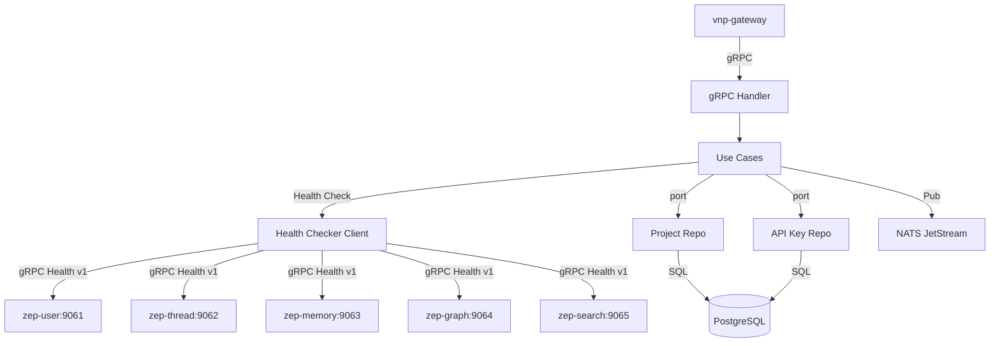

# zep-admin — Service Architecture

> **Group**: Zep | **Pattern**: 4-layer Clean Architecture | **Role**: Cross-cutting Admin

## Layer Structure

```
services/zep-admin/
├── cmd/server/main.go
├── internal/
│   ├── domain/
│   │   ├── project.go             # Project entity (tenant unit)
│   │   ├── api_key.go             # APIKey entity (hash, prefix, scopes)
│   │   ├── health.go              # ServiceHealth, AggregatedHealth, HealthStatus
│   │   ├── telemetry_config.go
│   │   ├── event.go               # ProjectCreated, ProjectDeleted
│   │   └── errors.go
│   ├── usecase/
│   │   ├── create_project.go, list_projects.go, delete_project.go
│   │   ├── create_api_key.go, validate_api_key.go, revoke_api_key.go
│   │   ├── aggregated_health.go   # Parallel health checks
│   │   ├── migrate_schema.go
│   │   └── port/ + dto/
│   ├── adapter/
│   │   ├── grpc/handler.go, mapper.go
│   │   ├── repository/postgres/project_repo.go, api_key_repo.go
│   │   ├── client/health_checker.go   # gRPC Health v1 client
│   │   └── event/publisher.go
│   └── infra/
```

## Component Diagram



## External Dependencies

| Service | Protocol | Purpose |
|---------|----------|---------|
| zep-user, thread, memory, graph, search | gRPC Health v1 | Aggregated health |
| PostgreSQL | SQL | Projects, API keys |
| NATS JetStream | Pub | Project lifecycle events |
