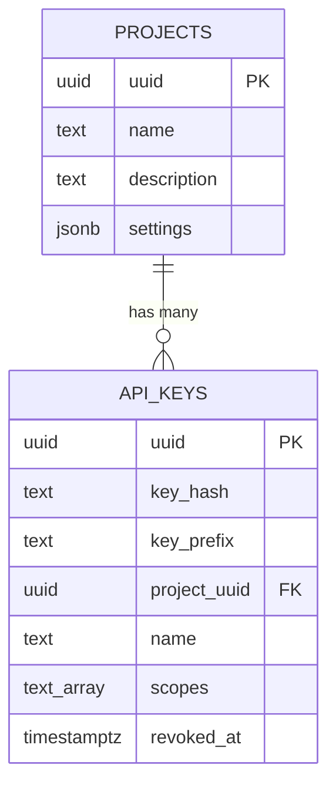

# zep-admin — Data Model

> **Database**: PostgreSQL

## Tables

### projects

| Column | Type | Constraints | Description |
|--------|------|-------------|-------------|
| `uuid` | UUID | PK, DEFAULT gen_random_uuid() | Project identifier |
| `name` | TEXT | NOT NULL, UNIQUE | Project name |
| `description` | TEXT | nullable | Description |
| `organization_id` | TEXT | nullable | Organization association |
| `settings` | JSONB | DEFAULT '{}' | ProjectSettings JSON |
| `created_at` | TIMESTAMPTZ | NOT NULL, DEFAULT now() | Creation timestamp |
| `updated_at` | TIMESTAMPTZ | NOT NULL, DEFAULT now() | Last update |
| `deleted_at` | TIMESTAMPTZ | nullable | Soft delete |

### api_keys

| Column | Type | Constraints | Description |
|--------|------|-------------|-------------|
| `uuid` | UUID | PK, DEFAULT gen_random_uuid() | Key identifier |
| `key_hash` | TEXT | NOT NULL, UNIQUE | SHA-256 hash of raw key |
| `key_prefix` | TEXT | NOT NULL | First 8 chars for identification |
| `project_uuid` | UUID | NOT NULL, FK → projects | Associated project |
| `name` | TEXT | NOT NULL | Human-readable key name |
| `scopes` | TEXT[] | DEFAULT '{"read","write"}' | Permission scopes |
| `expires_at` | TIMESTAMPTZ | nullable | Expiration time |
| `last_used_at` | TIMESTAMPTZ | nullable | Last usage timestamp |
| `created_at` | TIMESTAMPTZ | NOT NULL, DEFAULT now() | Creation time |
| `revoked_at` | TIMESTAMPTZ | nullable | Revocation timestamp |

## Entity-Relationship Diagram



## Index Strategy

```sql
CREATE INDEX api_key_hash_idx ON api_keys(key_hash) WHERE revoked_at IS NULL;
CREATE INDEX api_key_project_idx ON api_keys(project_uuid) WHERE revoked_at IS NULL;
```

## API Key Validation Flow

```
1. Receive raw key from request header
2. SHA-256 hash the raw key
3. Query api_keys WHERE key_hash = hash AND revoked_at IS NULL
4. Check expires_at (if set)
5. Update last_used_at
6. Return project_uuid + scopes
```
