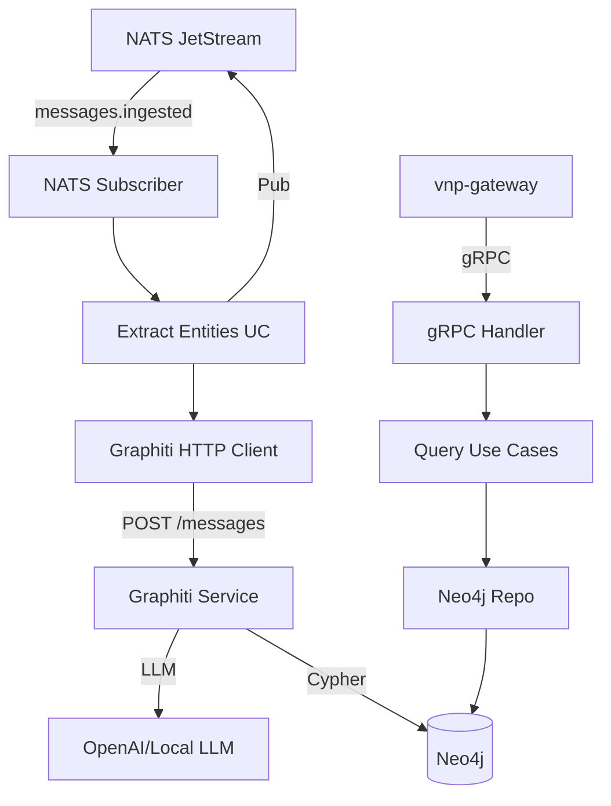

# zep-graph — Service Architecture

> **Group**: Zep | **Pattern**: 4-layer Clean Architecture | **Role**: Graph Intelligence

## Layer Structure

```
services/zep-graph/
├── cmd/server/main.go
├── internal/
│   ├── domain/
│   │   ├── node.go                # EntityNode (9 types)
│   │   ├── edge.go                # EntityEdge (Fact with temporal)
│   │   ├── episode.go             # Episode (temporal event/message)
│   │   ├── fact.go                # Fact entity
│   │   ├── ontology.go            # NodeOntology, EdgeOntology, priority hierarchy
│   │   ├── group.go               # GroupID, prefix strategy
│   │   ├── temporal.go            # TemporalAnnotation
│   │   ├── event.go               # ExtractionCompleted, FactCreated, FactInvalidated
│   │   └── errors.go
│   ├── usecase/
│   │   ├── extract_entities.go    # NATS consumer: messages → Graphiti → Neo4j
│   │   ├── put_memory.go          # Forward to Graphiti PutMemory
│   │   ├── get_fact.go, delete_fact.go, add_node.go, add_graph_data.go
│   │   ├── set_ontology.go, delete_group.go
│   │   ├── get_user_nodes.go, get_user_edges.go, get_episodes.go  # MCP queries
│   │   ├── get_node.go, get_edge.go, get_episode.go, get_node_edges.go
│   │   ├── get_episode_mentions.go
│   │   └── port/ + dto/
│   ├── adapter/
│   │   ├── grpc/handler.go, mapper.go
│   │   ├── repository/neo4j/ (node_repo, edge_repo, episode_repo)
│   │   ├── client/graphiti_client.go    # HTTP → Graphiti
│   │   └── event/publisher.go, subscriber.go  # NATS
│   └── infra/
```

## Key Design Decisions

| Decision | Rationale |
|----------|-----------|
| Graphiti as HTTP sidecar | Leverage existing LLM extraction pipeline |
| Async extraction via NATS | 10-20s processing time unacceptable for sync path |
| Dual-group extraction | User-linked sessions extract to both session and user graphs |
| Episode UUID prefixing | Namespace episodes with groupID for cross-group dedup |
| 9-type ontology hierarchy | Structured classification improves fact quality |

## Component Diagram



## Graphiti HTTP Client Endpoints

| Operation | HTTP Method | Endpoint |
|-----------|-------------|----------|
| PutMemory | POST | `/messages` |
| GetMemory | POST | `/get-memory` |
| Search | POST | `/search` |
| AddNode | POST | `/entity-node` |
| GetFact | GET | `/entity-edge/{uuid}` |
| DeleteFact | DELETE | `/entity-edge/{uuid}` |
| DeleteGroup | DELETE | `/group/{id}` |
| DeleteEpisode | DELETE | `/episode/{uuid}` |

## External Dependencies

| Service | Protocol | Purpose |
|---------|----------|---------|
| Graphiti | HTTP | LLM entity extraction engine |
| Neo4j | Bolt | Graph database for nodes, edges, episodes |
| NATS JetStream | Sub/Pub | Async extraction pipeline |
